+++
title = "Animate your drawings in After Effects"
date = 2021-01-14
draft = false
+++

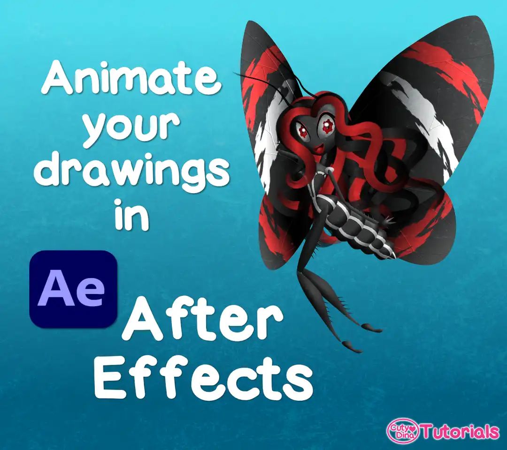
  
Hello! A long time since my last tutorial. I have been very busy lately with much work and projects. Anyway, I wanted to write this tutorial a time ago, so here it is. I really enjoyed learning **Adobe After Effects**, and it took more time to get used to use it, specially when I came from **Adobe Animate**, but at the end it's nothing more that to get use to a new tool, and final result is a lot better.



### 1.Preparing your drawing for animation

The first step for this is preparing your drawing/character/logo etc... for animation. In this case I will use this illustration so you can see the structure you need it, if you are using another drawing program instead of **Adobe Photoshop**, you have to export it to **PSD**, so **After Effects** can read all the layers. Also, if parts are in individual folders, is better to save as a new **PSD** version with all layers rasterized, there are many ways to import to **After Effects**, but I will show here the easier one for me.

Also, If you don´t want to use a **PSD** file, you can also export each part separately in **PNG** and arrange them manually, but its a little more tedious.

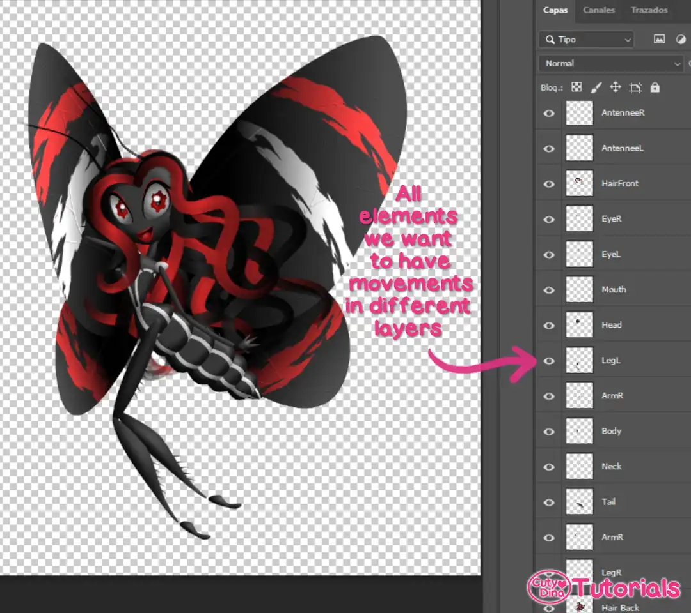

### 2. Importing our character to After Effects
Now you can close your character in **PSD** and open **After Effects**, and when its open, just create a new project. Then we go to File Import and select our **PSD** File. For this Tutorial we are gonna select **Composition → Preserve layers size**, also select Editable Layers.
When the file is imported correctly, you will see that **After Effects ** created one folder with all layers and a new composition. If you double click on it you will see our composition open (don't pay attention at the fact that my software is in Spanish, tools are the same).

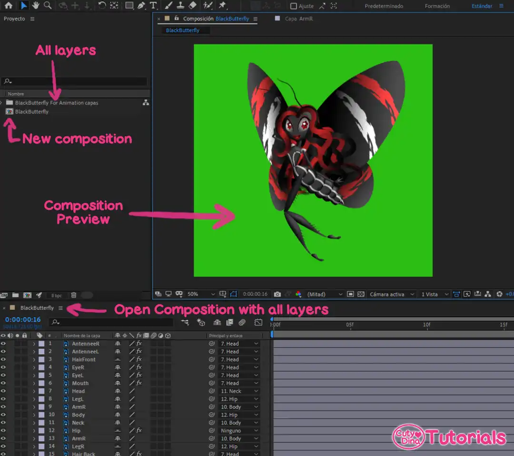

3. Preparing Layers for Animation
Now is time to link our body parts. At the right of the Spiral icon, we just select the body part where each layer will be attached to. So when you move or rotate, elements will move with it. If you have rigged a character in the past, this will see you very familiar, in this character we are gonna use the hip as main layer. You can also link layers with the spiral icon, just dragging the spiral to the attached body part, its your choice.

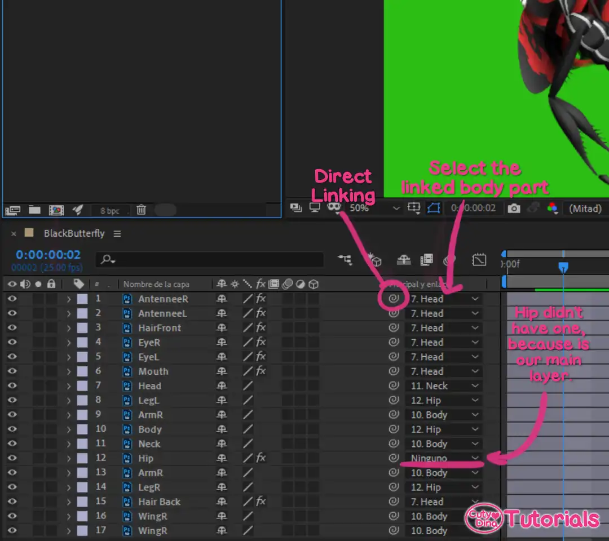
    
You can test if all links work well selecting the main layer (in this case the hip) and trying to move or rotate it. If it works well, all character will be moving with it, if this is ok, you can continue to fix pivot points and add puppets points.

### 4. Puppet points VS Pivot Point movements

Ok, now we are gonna fix our layers one by one so they will be ready for animation. This is the last step for rigging our character. For selecting each one of the layers we just have to double click on the layer name we want to modify.
For default we have a black background for our file, and in some cases (as the one in this tutorial) our characters contains a lot of black and we need another color for background. That's very easy to change, you just need to enter in **Composition → Composition settings**, and at the bottom you just select background color to one is better for you.

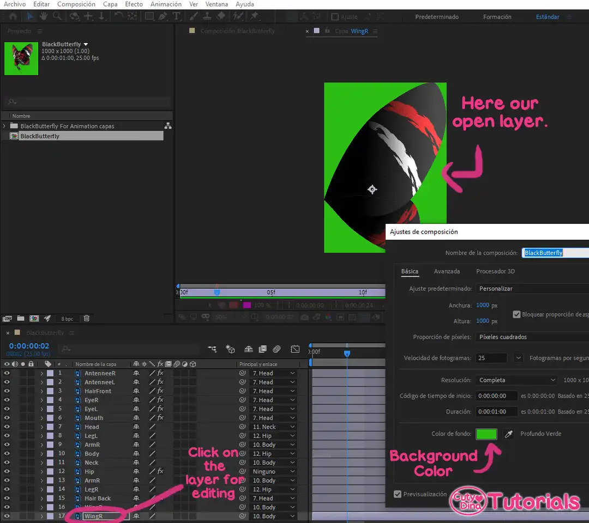

Now we have to select the pan tool so when we moved our pivot points our character don't move from their original position. In this case, the wing come from the back so the point it stick the wing to the body is the perfect point for our pivot. This wing will not have puppet points because we just need to rotate them, so we just fix the pivot point in this layer.

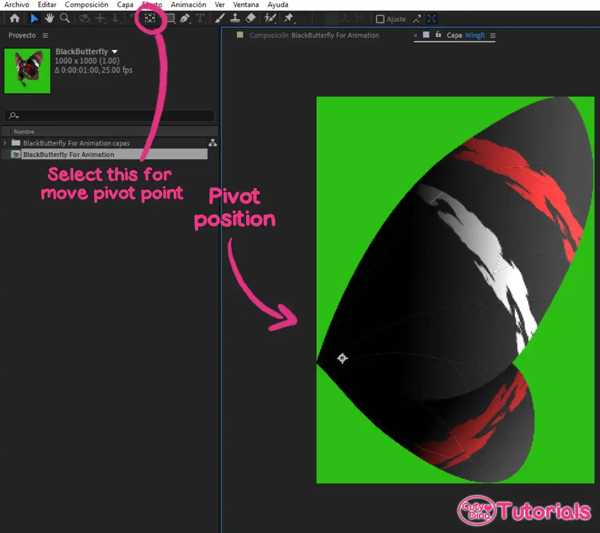

We just need to adjust pivot points to layers we just need to rotate or move. In other hand, the puppet points will deform our drawing and in some cases they help to give more life and flexibility to our character. For example, in my case I will just add puppet points to the hair, mouth and antennae's. Sometimes we get exited with this new tool, but you will see you will not need this for every movement. Anyway, you can add more puppet points later if you want to give more movement in the future.
For adding puppets points you just need to select the **puppet selection tool** and start adding **puppet points**, yes, just like that. You can also test them in the layer preview, so you can see if the movement in correctly for this body part. Test and add as many puppet points as you need, but not too many, because animating can became a mess in our timeline. When this is done, we are ready to start animating.

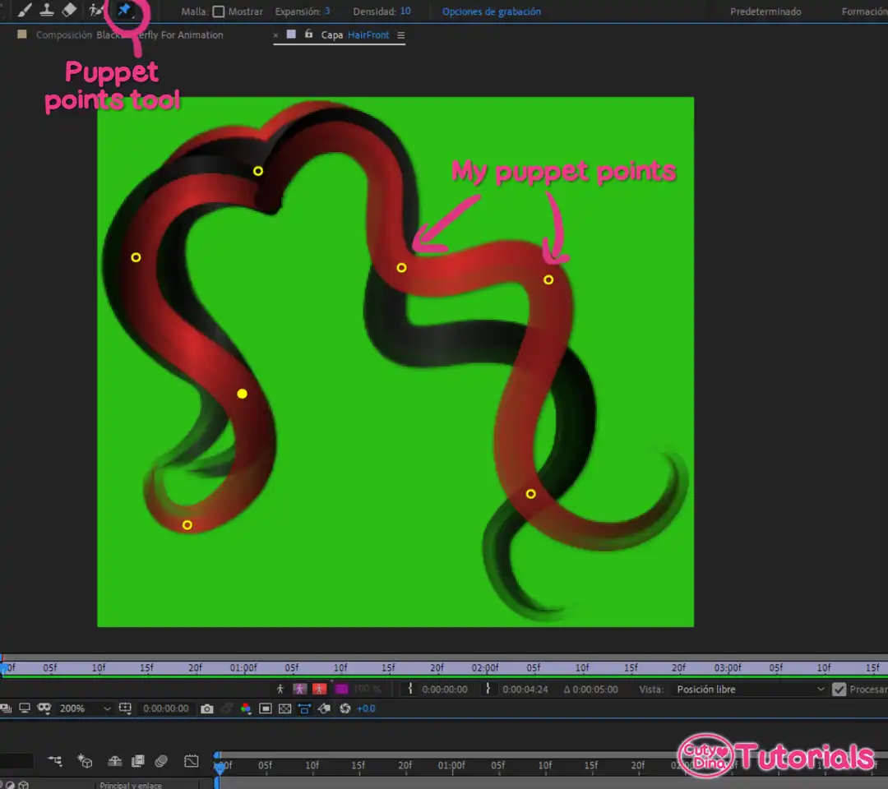

### 5. Animating our character

If we want to make a loop animation, we just need to make one time loop. After I will tell you how to maintain the looping as long as you want. But for now, we are just gonna make our butterfly flapping her wings. So we are gonna set our time for this movement. Now we go back to timeline settings and decide the duration for this loop, in my case I want one second duration.

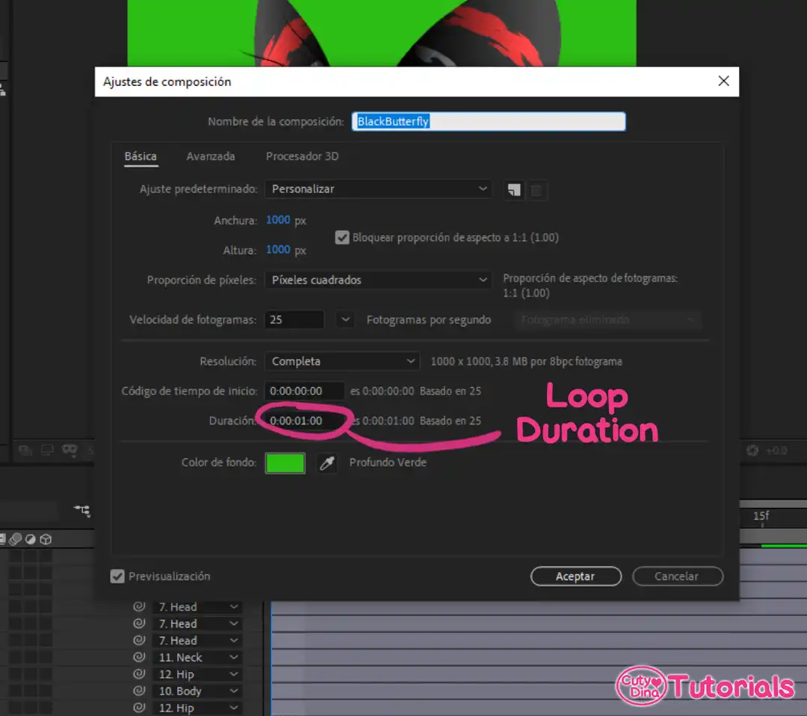

If you have animated before, you will just know that animation came first from outside movements and then we make inside movements. In my case, we are gonna animate the wings and body and then we will add all the details, such as head, hair, and legs.
For wings and body we are just gonna use Rotation and Position movements. Keyboard Shortcuts are **P** for position, and **R** for rotation. So now we select our main layer (hip layer) and just press **P** with the keyboard so we can change the position of our character.

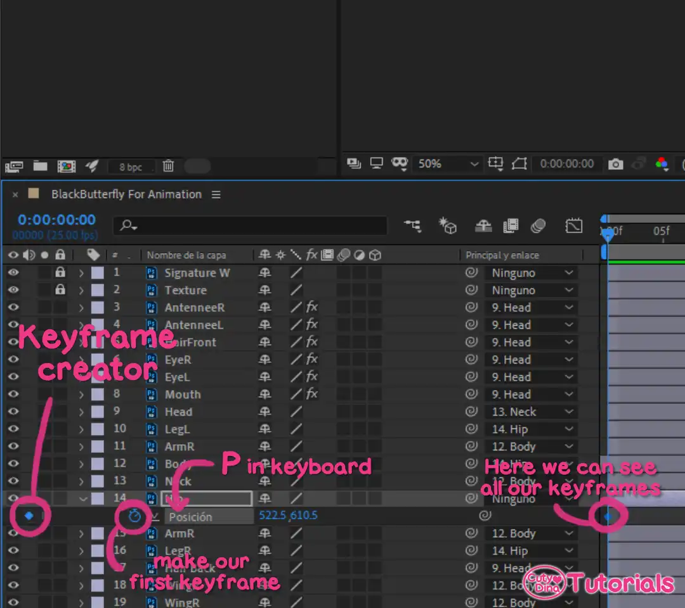

In my case as it will be a loop we will need that the animation begin and end in same position, so before animating we settle first position and then select the keyframe and press **Ctrl+C** and go to the last frame position and paste your frame with** Ctrl+V**. Now we make the movements we want in the middle of them, in my case, I will just add one more keyframe in the middle.
Now for wings, we just need to press R in keyboard so we can just rotate them. Also select rotation tool in the tool panel. I will do the movement in the same keyframe so our boucle works fine with wings movement, but you can animate your loop as you wish. You can continue with all simple movements with this tools.
  
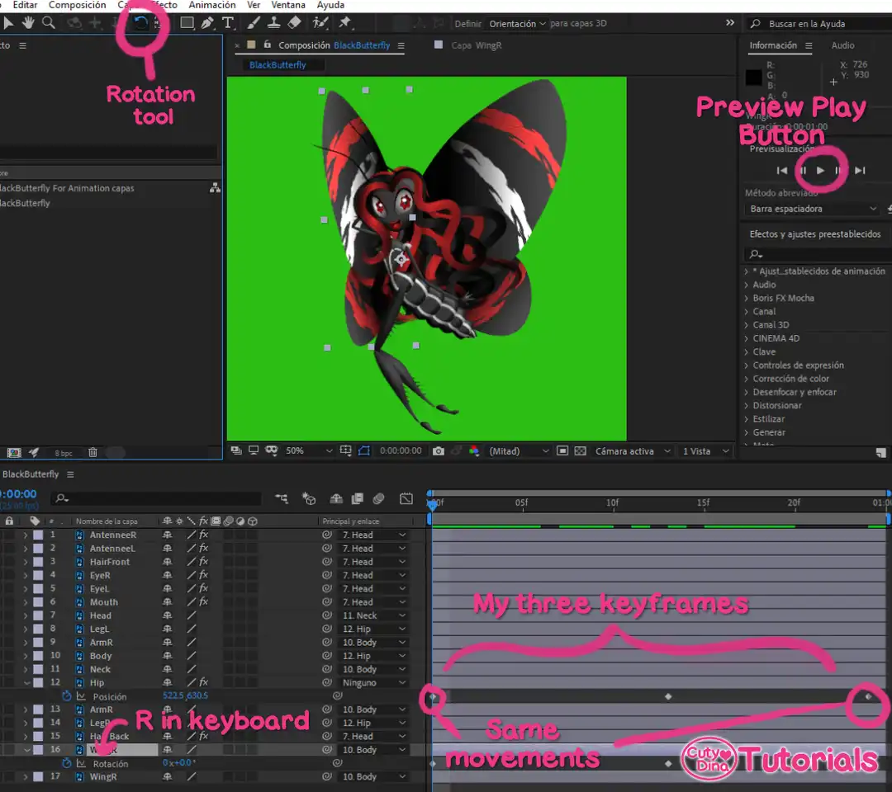

Now we are gonna detail our animation. You will see that your timeline will be a little messy in the next steps. But no worries, you can use the shy tool to clean up a little. When shy tool is activated all layers selected as shy layers will be hidden in our timeline, so its just switch on an off for having control in our timeline.

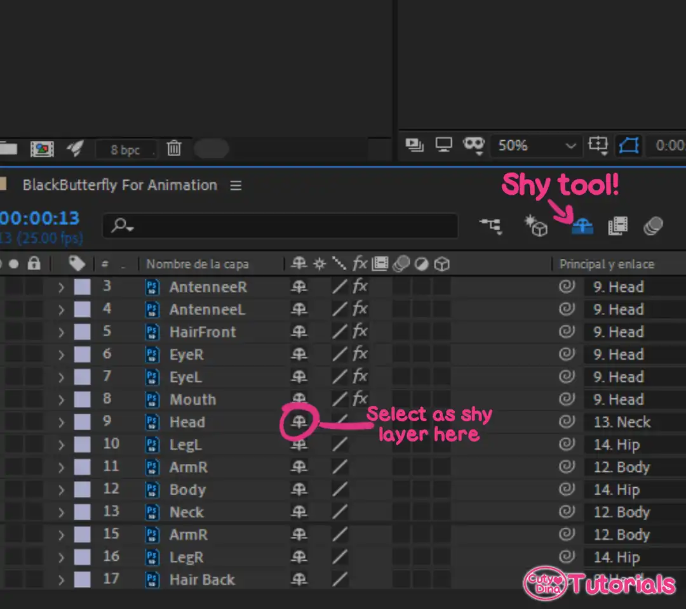

Now we are gonna animate the hair, so we need to animate all the puppet points we have. For this we will select the layer we want to modify and then we are gonna press **U** in keyboard, that will open all puppet layers. I recommend animate layer one by one, so it won't be too messy.

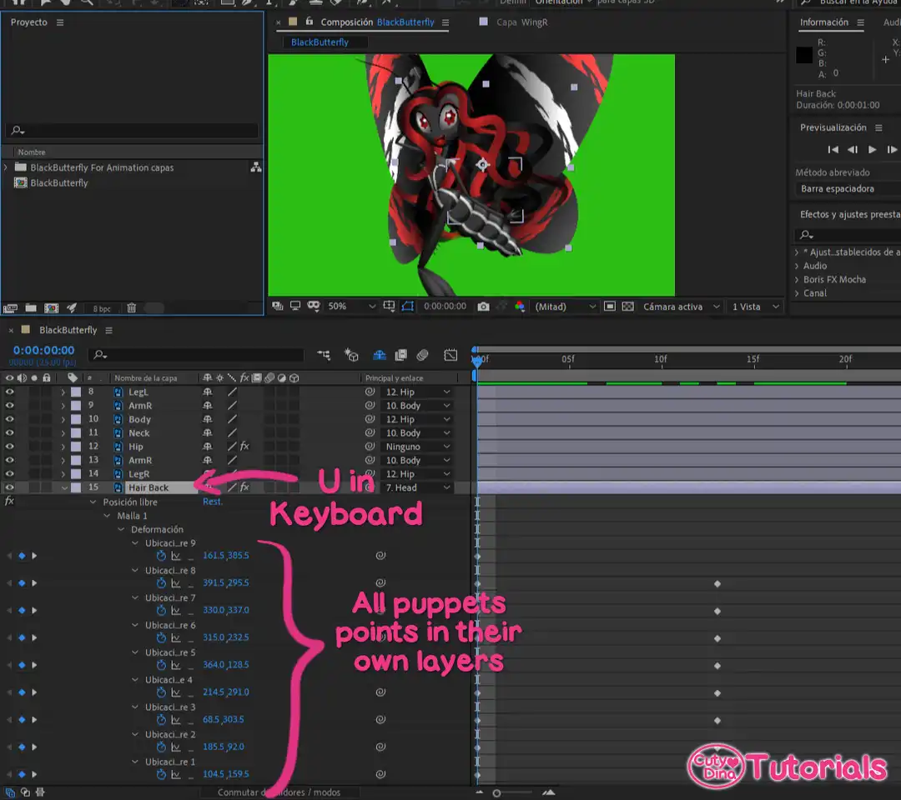
  
Now is time to set up all details for our loop animation. And when we finished we can make it longer as we need need and also add some effects.

### 6. Making loops and adding more details to our animation

Ok, now we are gonna make a new composition so we can manage our animation better. So just click on** Composition**** → **** New Composition**. This new composition will have same configuration as last one, but now I want that the composition will be ready for YouTube, so I will select the **HDV 1080 25** Preset and give it a duration of 10 seconds, but if you want another settings feel free to test them.
  
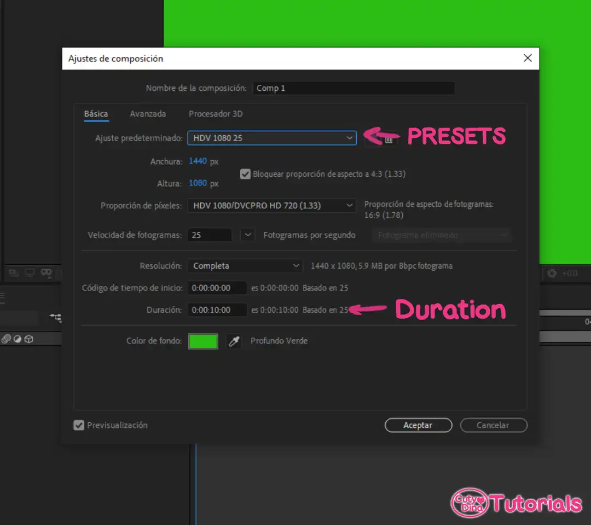

Now I will add a background to my animation. In this case I will use a solid background. So I right click in my timeline and select New Solid. That will add a solid color to our background. I want to be a gradient background so I add an effect for that. I will add it by selecting Effect Generate Ramp (Spanish will be **Gradación de Degradado**), there we select our colors and can play with the effect options.

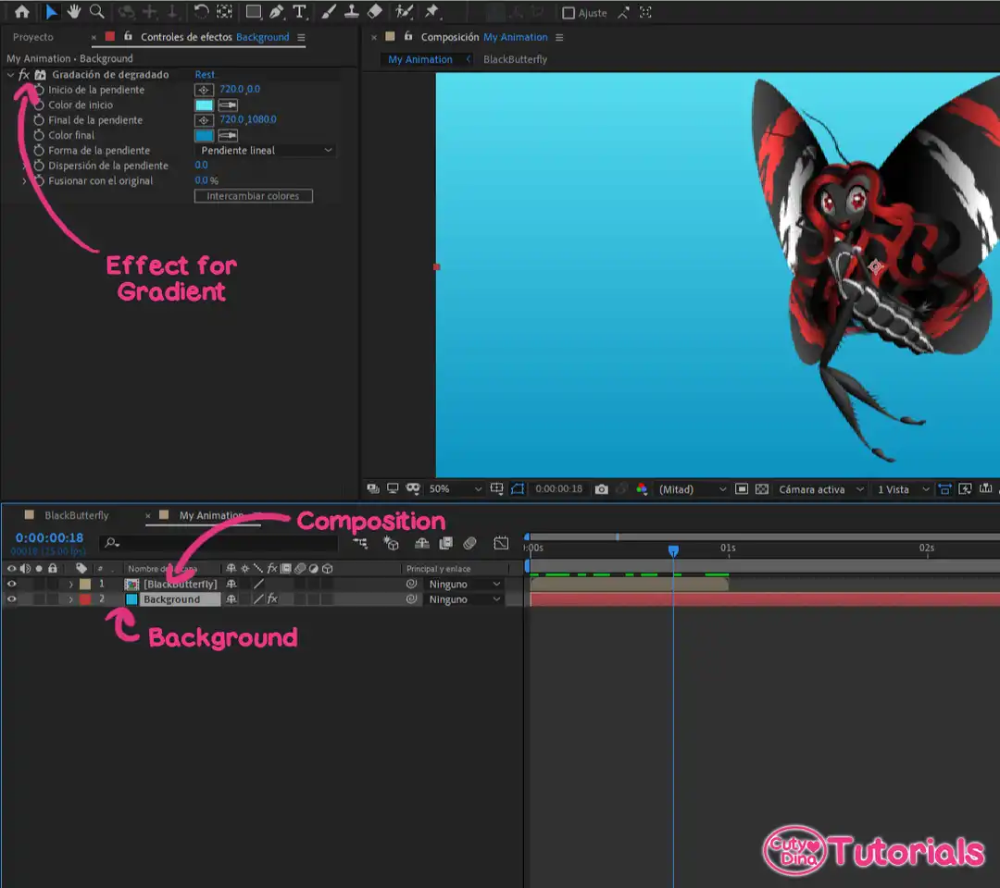

Ok, now the loop part is a little complicated, but once you have done it for the first time, next ones will be easier. For the animation became looping all the time we have to go to **Layer → Time → Enable Time Remapping**, that will create two keyframes at the beginning and at the end, now you just have to create a new keyframe before last one. Now on the last keyframe we are gonna change the time to zero.

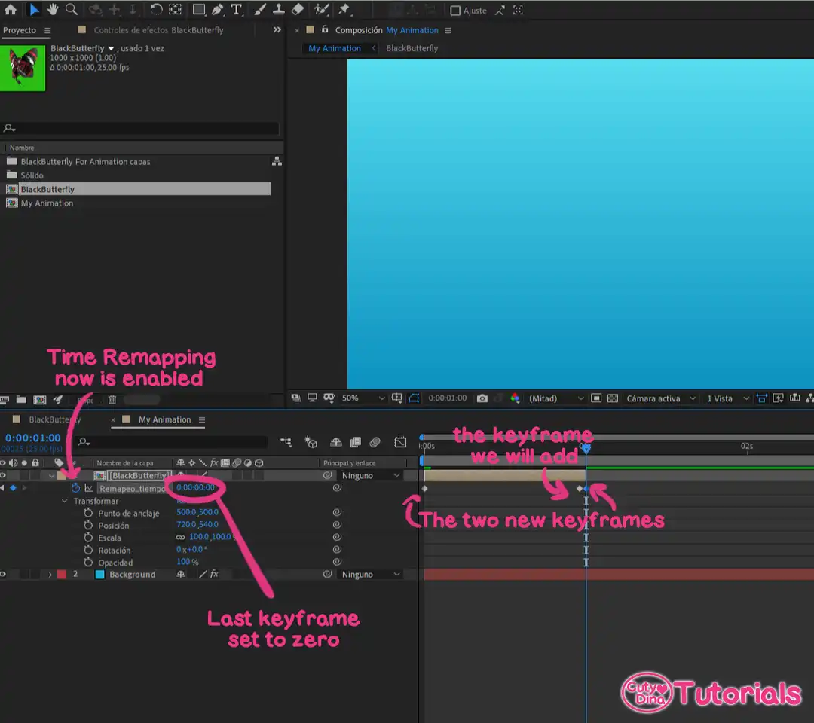

Now we delete our last keyframe. Now we are gonna select the Time remapping layer and open in main menu **Animation → Add Expression**. You will see that can add expressions now. Click on the menu Expression language and open and select** Property → LoopOut(Type="Cycle", numKeyframes = 0)**, and now it will be shown in the text box. Now is ready, you just have to make your layer longer, in this case, as long as the composition.

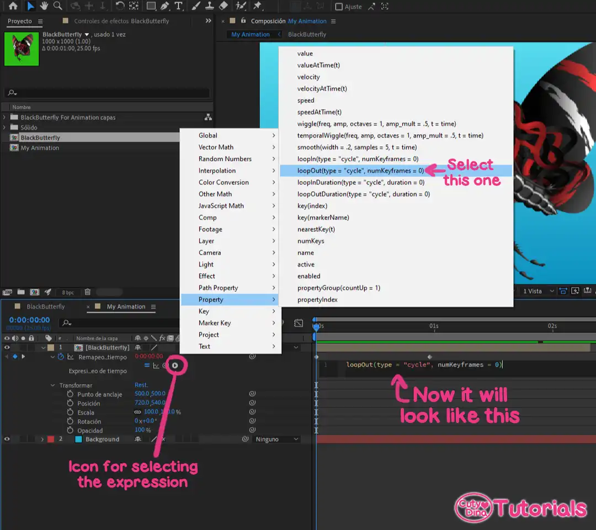
        
Now its all settle here. You can now take a look to your loop and see if you want to add more compositions, details or effects to it. You can always enter to the other compositions and modify them, and all this changes will be shown in your final composition. You cad add as many sub compositions you want. In this case, we are just gonna add some effects and then export the animation.
        
### 7.Adding some effects
  
For adding extra effects we are just gonna right click on our composition and then select New Settings Layer. And now as easy to test and select the effect that work better in our animation. In my case I'm gonna select Noise and Grain → Add Grain, so animation has some texture on it.
  
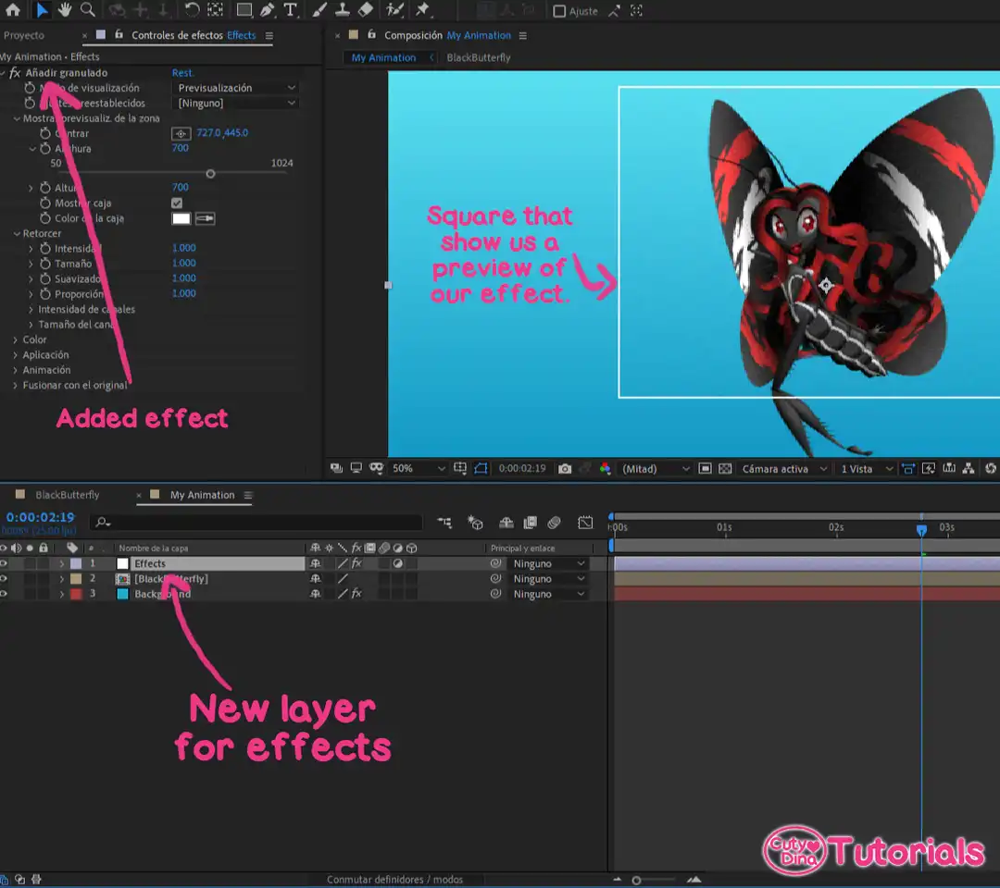
        
### 8. Exporting your animation
 
Now that our animation is ready is time to export for our Social media. That's an easy step, just click on **File → Export → Add to render queue**. In this case everything is correct, but you can modify the extension and folder options in the **Exit Mode**.
         
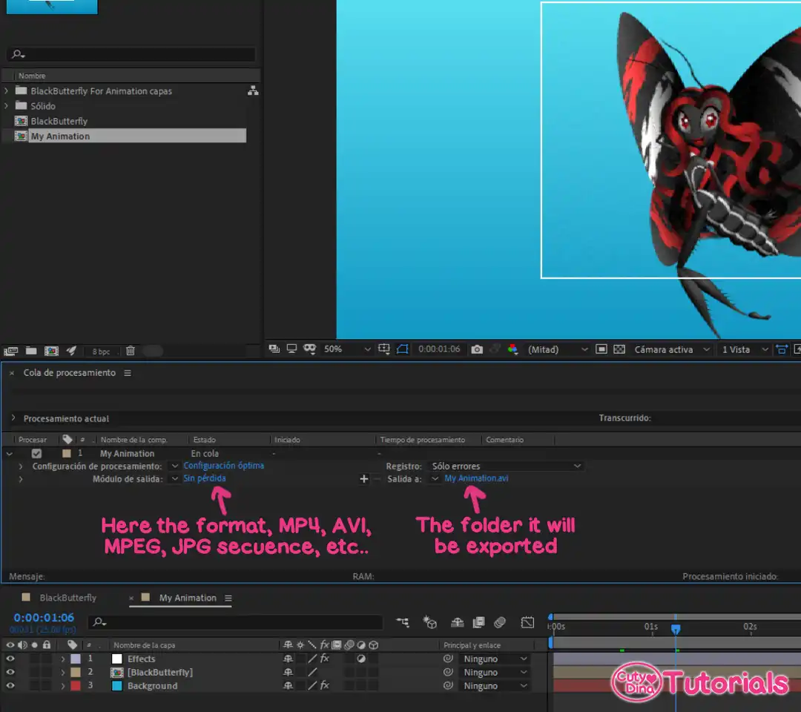