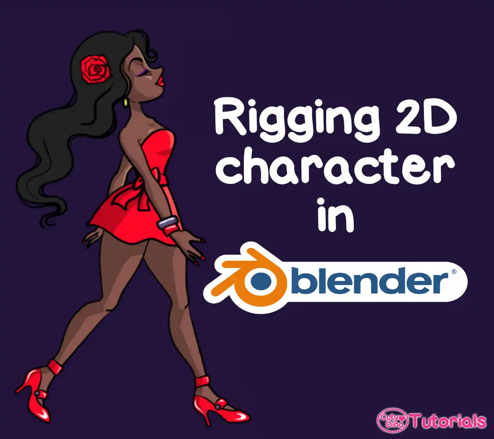
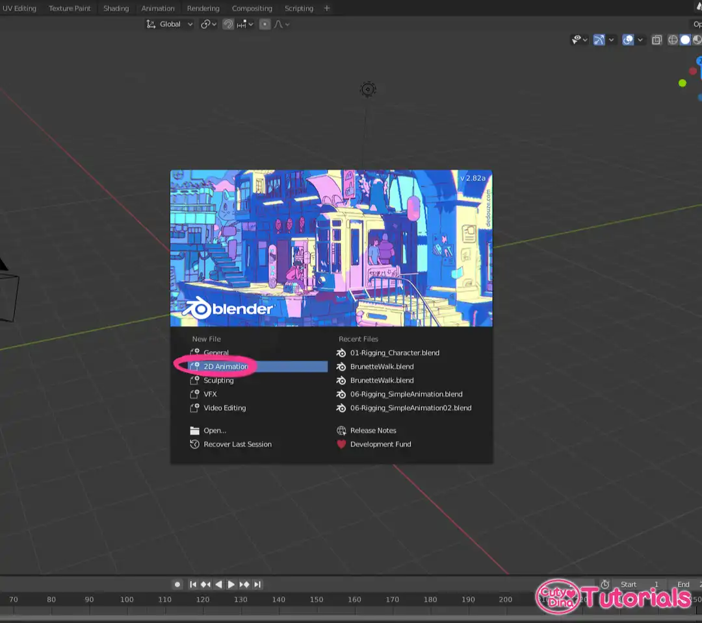
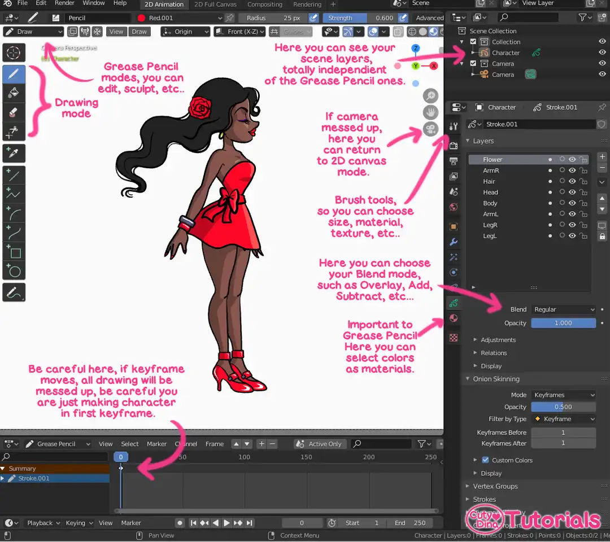
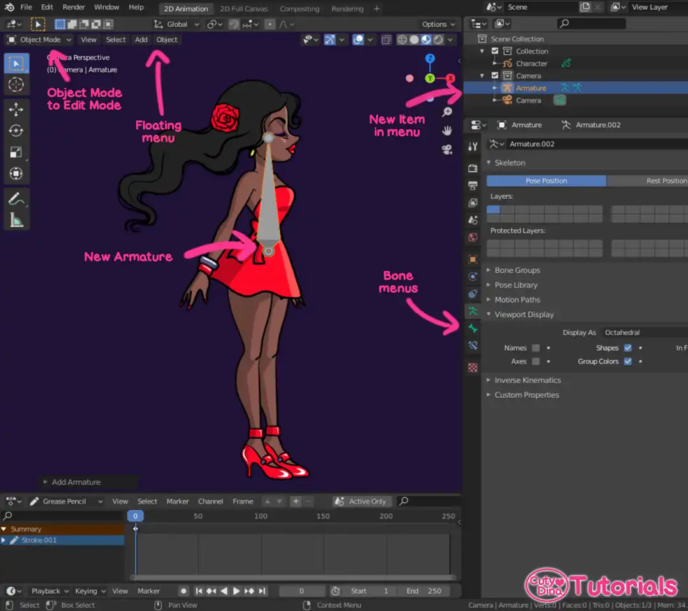
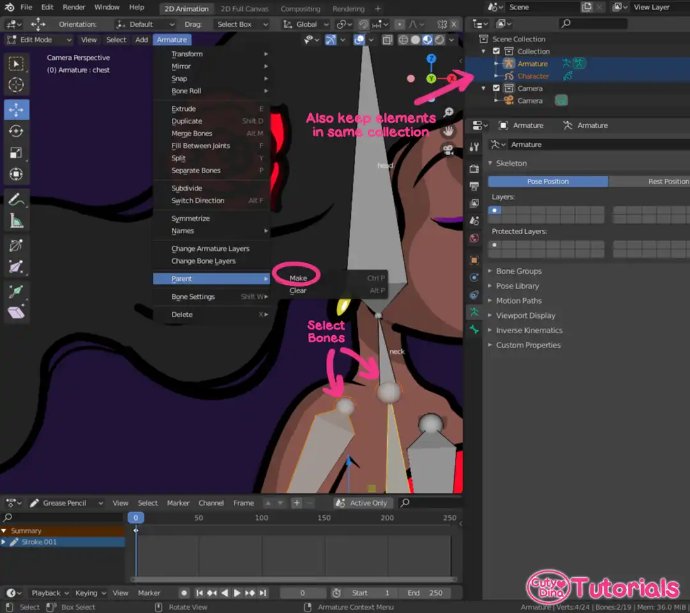
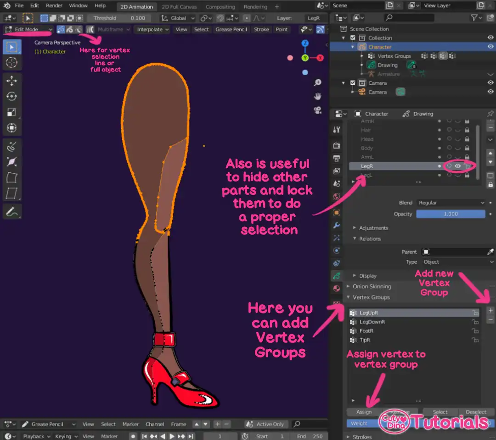
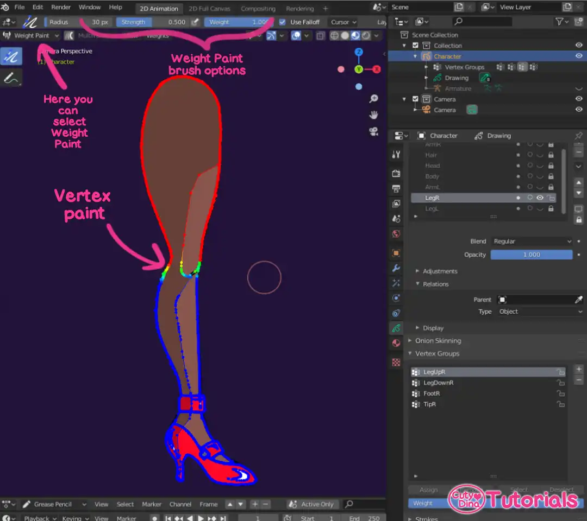
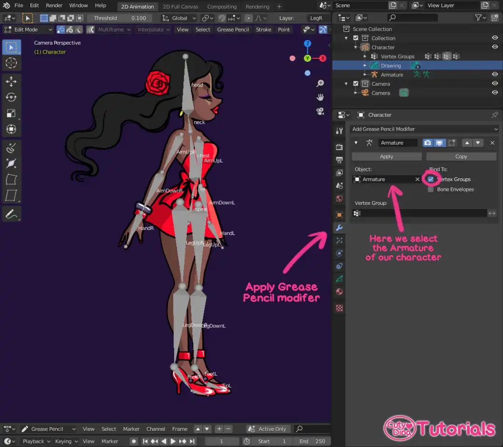
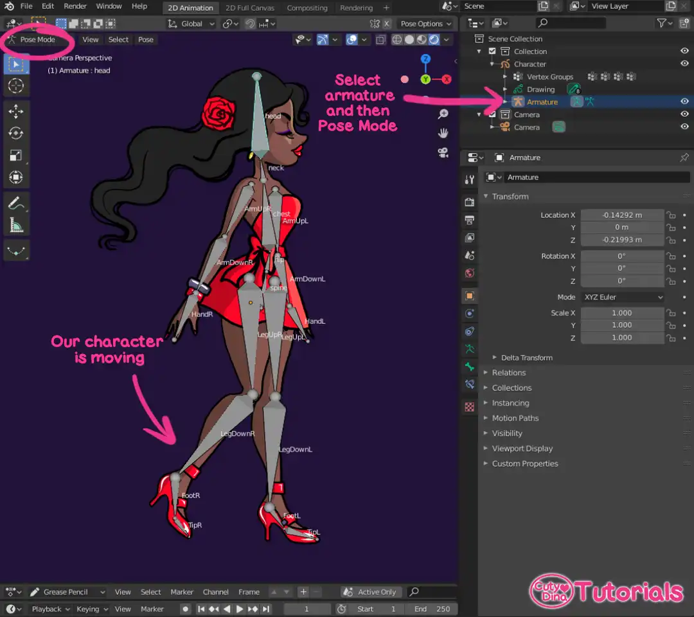
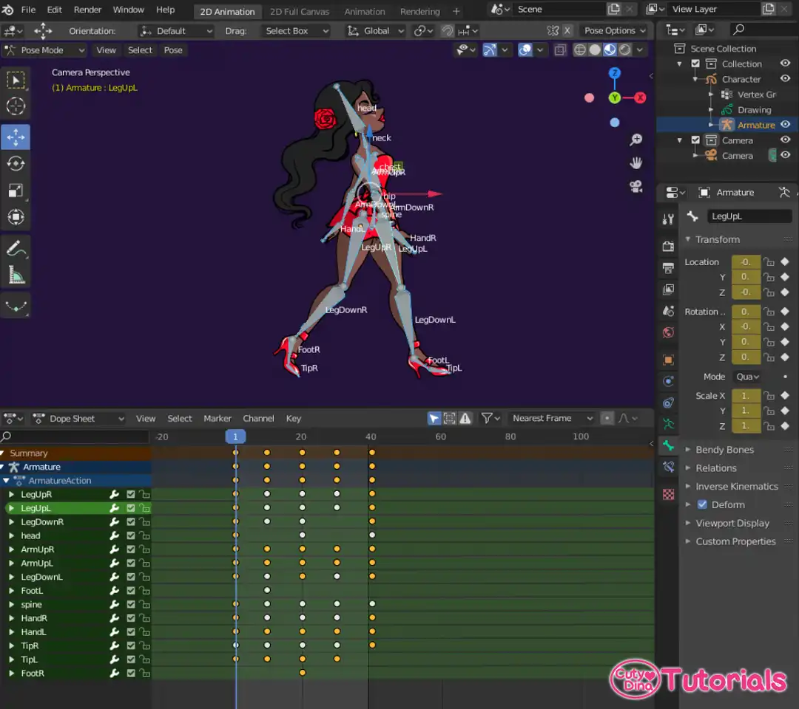

+++
title = "Rigging 2D character in Blender 2.82"
date = 2020-04-14
draft = false
+++

Hello! I have recently started working on ** <a href="https://www.blender.org/download/" target="_blank">Blender 2.82</a> **and I have to admit that is a very powerful software that I think have a great future, starting with the fact that is an **OpenSource** software and its innovation in what Animation 2D stuff. 



A few days ago I did this experiment via **Blender**, recollecting a lot of various different online tutorials, such of YouTube, Art-Station and Blog Entries around the internet. So I wanted to do a summary of all the knowledge I got from those tutorials and make a simpler one so its not so hard to start animating in Blender.

### 1. Interface

Well, let's begin with the basic, fortunately Blender have now the option of starting a new file directly for 2D Animation, so just the startup program give us this option easily.

  
### 2.Drawing our character
So, once our interface is running, is as easy than start drawing in our canvas. Also see that you have to know some basic stuff before drawing.
First of all, you can see that I had drawn my character in different layers such as head, arms, torso, etc.., so later we don't have problems with the bones assignation. And also in a base pose ready for animation. This time I didn't take the time on thinking on hair animation, but also is something I will want to deepen in the future. Also, some tools are explained in the image below.
About shadows, there are two ways of drawing them, manually as I do in here, or making a new layer with drawn shadows and just using an Overlay in **Blend Mode**.

*If you need to know shortcuts for any tool, you just need to hover over the tool and the shortcut will be revealed if there is any.
  
### 3. Create Bones/Rigging
Now our character is ready for rigging. Or in this case, ready to create our Armature for the character. If you know how to make bones in Blender, you can skip this step.
For this part we need to go change to **Object Mode** in the **Upper Left Menu**, and then click on the **Float Menu → Add → Armature**. When you do this it will appear a new bone in our Scene Collections.
We also change the background color so we can see the bones names. You can also do this in the World's panel. Its important to rename bones properly so we don't have any issue with our mesh in the future. You can play with the bones options, such as change shapes, show names, etc.. For start adding bones, you should change to **Edit Mode** selecting our new Armature, so now is time to put our bones in the right place.
  

  
For extrude bones, you only need to click **Shift+E** to extrude a new one, and if you want to create an unrelated bone, just click **Shift+A** to create a new bone limb. If you need to relate a bone limb with another, just click above in the **Armature** window and then click on **Parent → Make**.
  

  
### 4. Associate bones to Grease Pencil
Ok, now the magic comes. Here I had a lot of issues in get to the quicker way to do this without loosing my mind in the process. So, I will tell what feels more easy and quick for me.
So, now we have to return a **Object Mode** in the **Upper Left Menu**. Then we select the **Armature** and **Grease Pencil** object at the same time, you can select two items by pressing **Shift** while selecting. And then go to **Floating Menu** to **Object → Parent → With Automatic Weights**.
And now our two collection items are joined and now it's time to assign the heights to the**Grease Pencil**.
  

    
Well, first of all we need to select our character Grease Pencil object and then enter in **Edit Mode** so we can start to adding **Vertex Groups**. I advice you first to hide the Armature and other layers and also lock them to start selection. You have to make one vertex group per bone, and you also you need to assign a name just as the one we give our bone. If you don't do this properly this will not work.
I also recommend select parts and then adjust them via Weight Paint, or you can just go direct to Weight Paint selecting it in the **Upper Left Menu**. Here you have a brush so you can start making the heights of the bones.

Now is time to assign our modifier, you can do this before or after the assigning, if you want to preview bones, I recommend to do before. For previewing bone heights you need to go to **Pose Mode** after assigning the modifier. So, here we are gonna select in the Modifier panel, Add **Grease pencil Modifier → Armature**. Now we assign as an object our Armature and Bind it to Vertex Groups.

Now we return to **Object mode** and selecting our **Armature** we go to **Pose Mode**, there the bone and **Grease Pencil** now have to be linked.

Now we can begin to animate our character, hoping this quick tutorial help to start drawing and animating. If you have any question or my tutorial isn't clear enough, you can write me and I can add more details, I just want this to be as easy as anyone can start animating in this amazing tool.

