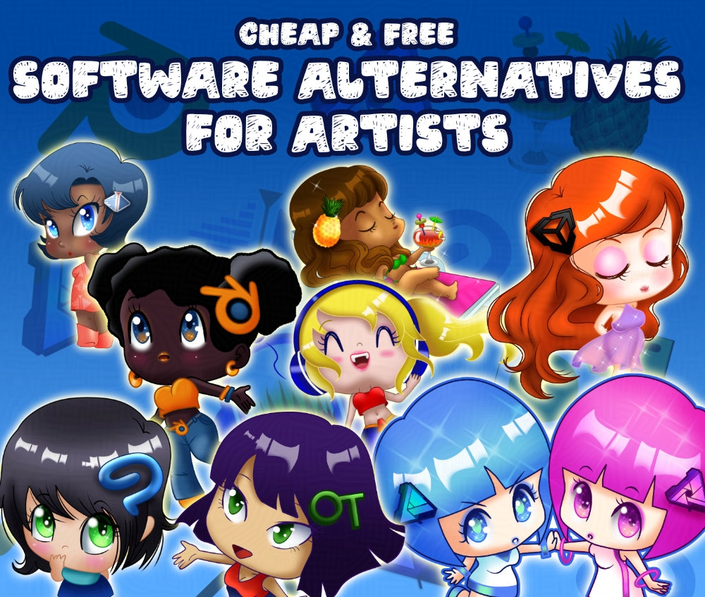
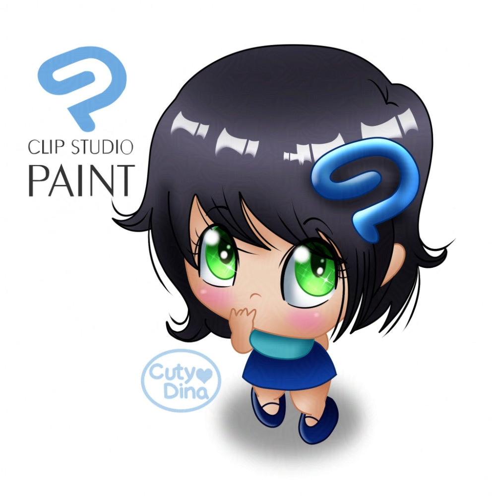
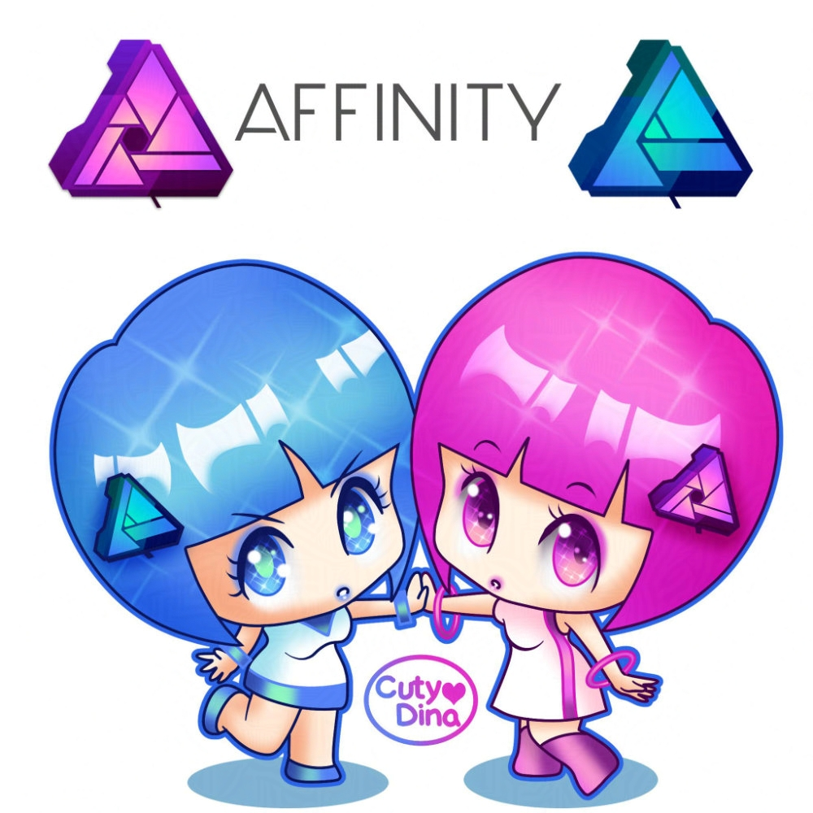
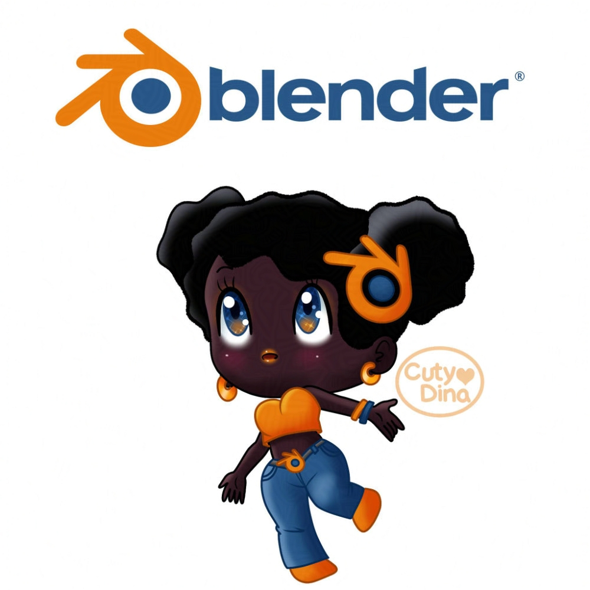
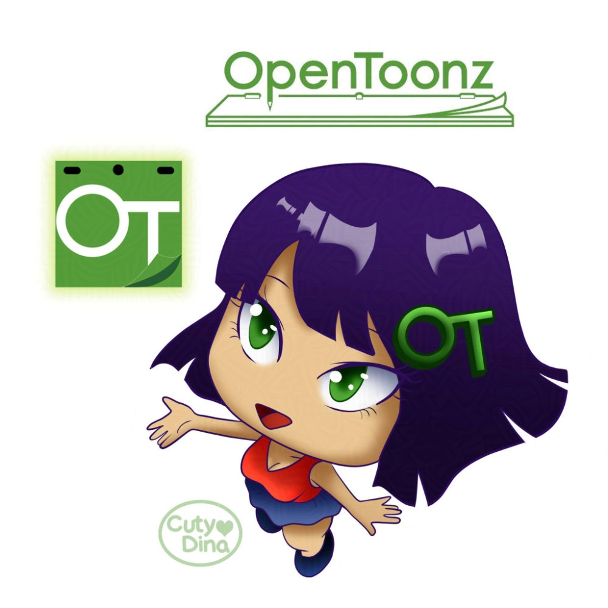
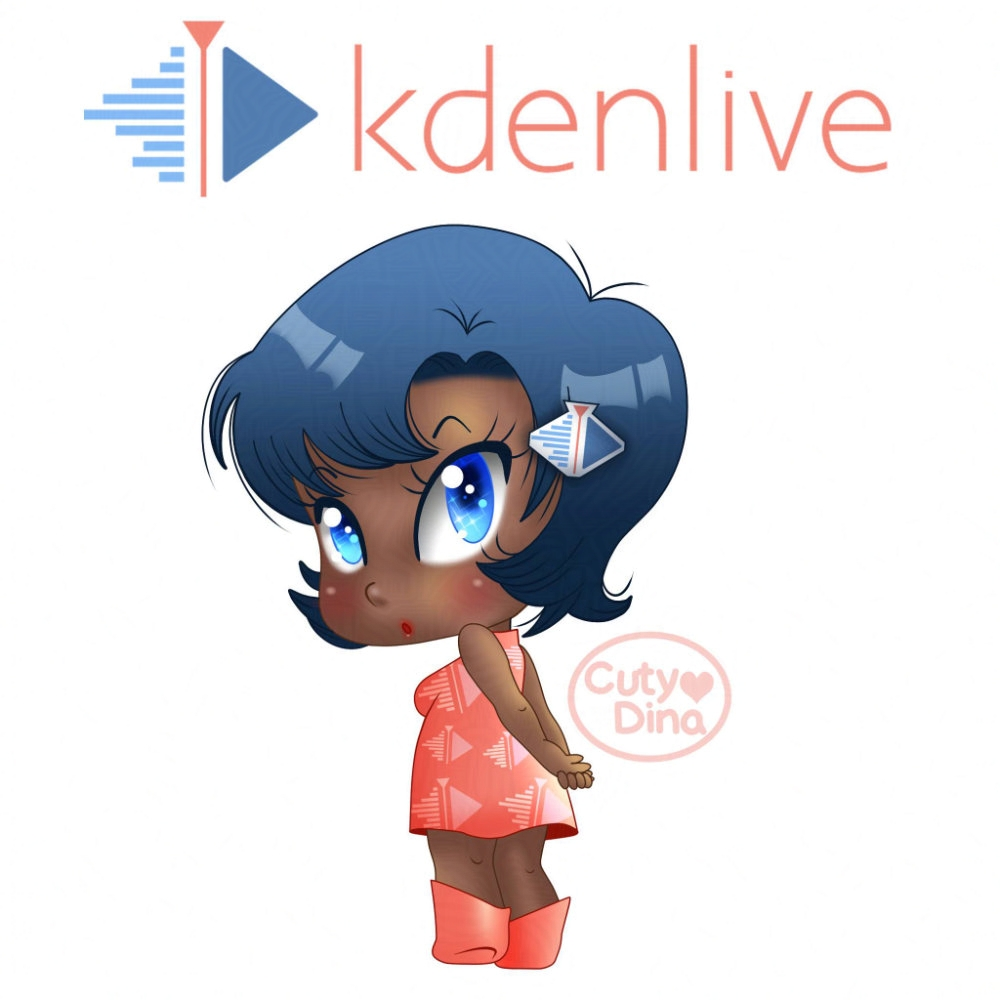
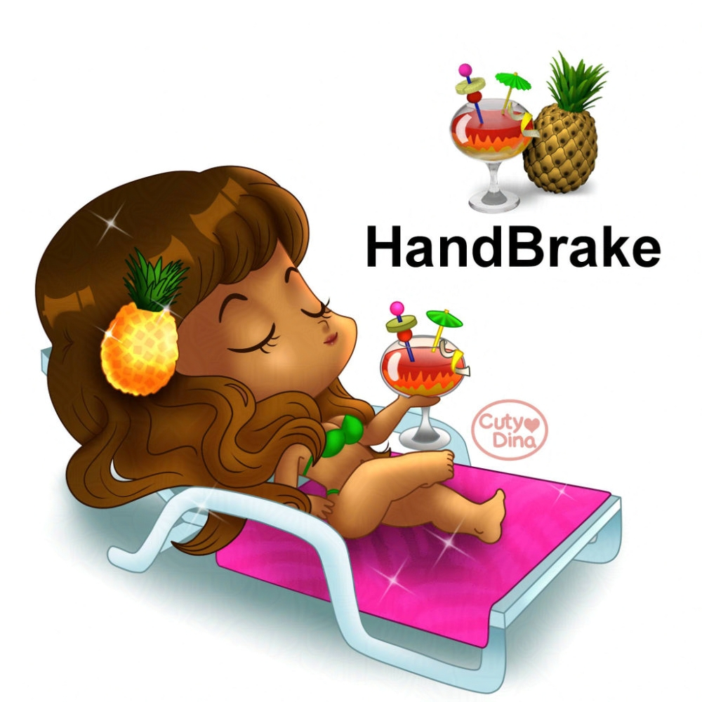
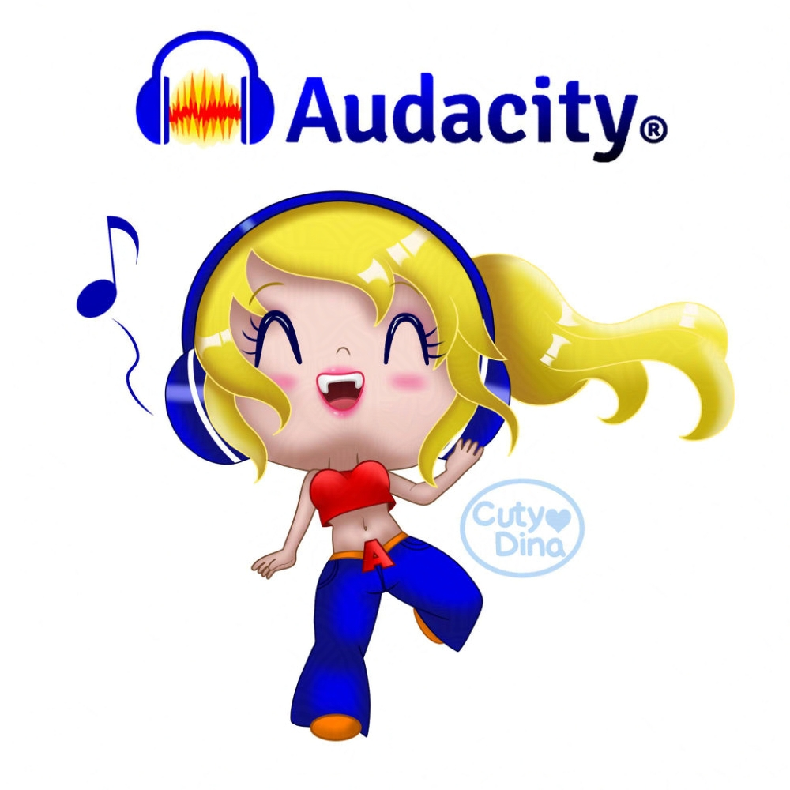
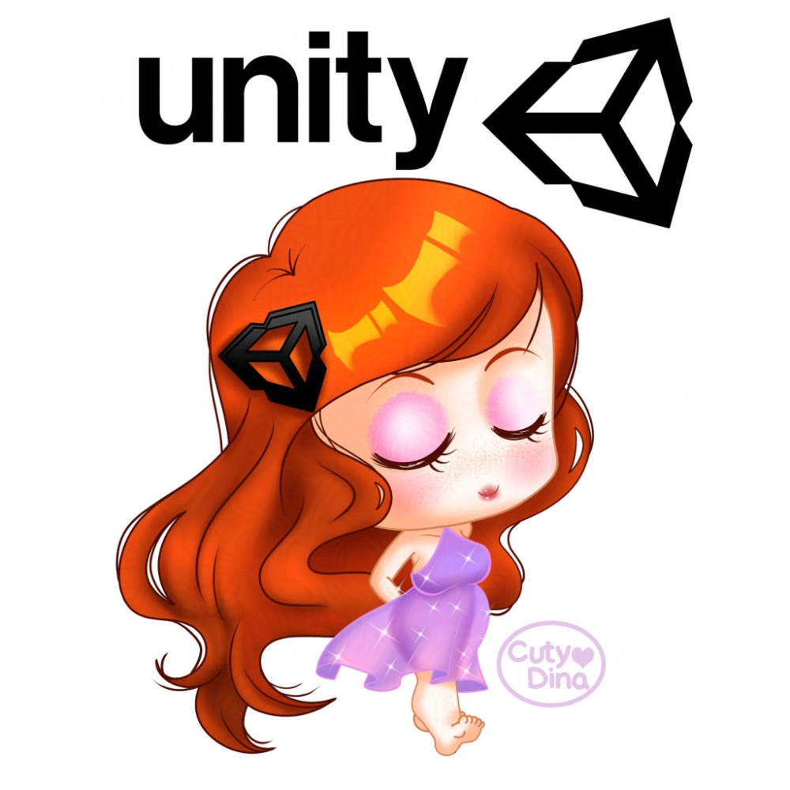

+++
title = "Software alternatives for artists"
date = 2021-02-25
draft = false
+++

Hello everyone, I have recently thinking on making a blog entry about the software I use and about the best alternatives to **Adobe CS**, more than anything because it became very expensive since last decade. So, in the pass of time I have been testing and discovering some programs and I decided to make a blog entry about the best alternatives to some of them, selecting the best cheaper and free ones. Also, I just want to say that's its just my personal opinion, but I hope this small list helps you in your artist journey.

### Clip Studio Paint (One time payment)  

I will begin with one of my favorites, because is a program that makes drawing a similar way than when you draw in paper. Its a very powerful tool that has a lot of brushes, assets and also a great community, with a lot of contests and extra stuff. I used to paint with **Paint Tool Sai** when I wanted to draw as the way I do with pencils and paint, but it failed when you want to do something more complex, such as comics or add text and shapes, so I looked for an alternative not as expensive as Photoshop or complicate as **GIMP.** And that's when  discovered **Clip Studio Paint**, it was easy to learn and a great upgrade at the time to draw, and also with lot of similarities with **SAI**. It also have an animator timeline tool for a Frame by Frame animation, tools for comics and some useful filters for amazing effects, so if you use Photoshop for drawing, moving to **Clip Studio Paint** will be your best option.

This one isn't free but its price is so affordable that you will not regret the money you invest on it. You can download for a free trial at their website or also buy the **PRO** version for **$50 USD** and the **EX** version for **$220 USD**, the difference is that the **EX** version is more focused on animation version and export full comics. For just making single comic pages and digital illustration, or just a quick GIF animation (up to 24 frames), **PRO** version will be enough. Also you can take advantage of the Black Friday for buying it for the half his price, that's what I did at the time. 

[Clip Studio Paint Website](https://www.clipstudio.net/en/dl/)

### Affinity Designer and Photo (One time payment)

This has been a recent find and one of the best I had, I discover this software at the end of 2019, I tried the free month and I get in love with them. It has three amazing software's and extra tools, but for my work I fell in love with **Affinity Designer** (an alternative to Adobe Illustrator) and **Affinity Photo** (an alternative to Adobe Photoshop), they also have **Affinity Publisher** (an alternative to Adobe InDesign) that I know that it has to be great, but its not my industry.
As I said before **Affinity Designer** is like Adobe Illustrator, it has amazing vector tools for doing great works. With Illustrator I usually get lost and not comfortable when I need to draw, so when I switched to  **Affinity Designer** I really got in love for the intuitive menus and his way of work, also I remember when I drew the first time in it with my drawing tablet that I felt this software a lot smoother and better visually.
Changing now to **Affinity Photo**, I have to say that is pretty the same as Adobe Photoshop. After 8 years using Photoshop, I thought that the learning curve would be difficult when I started using this software, but the truth has seemed even easier to learn and find all their tools. As **Affinity Designer**, has a great interface and I must admit that I did not miss anything from Adobe tools.
Also is a lot affordable than Adobe, for only **$50 USD** each one of their programs, you can have a great software not having to pay the highly monthly rates of Adobe. Also you can take advantage of the Black Friday for buying this tool for the half of their price.   

[Affinity Store](ttps://affinity.serif.com/es/store/)

### Blender (Open Source)

Now we are entering to the free zone. And we going to start with one of the bests, **Blender**. It begun as just a 3D modeling tool, but\ since **Blender 2.8** this software has begun playing with **2D animation**. I have to admit that it's not the best alternative for 2D animation right now, it still lacks many tools to match other software such as Animate or After Effects, as drawing tools and symbols, but I think this will become the future for 2D and 3D animation, because it can combine both and also is an Open Source software, and has a lot of tools and its always growing. If you are interested in test this software, you can see my <a href="https://www.cutydina.com/2020/04/2dcharacters-blender2.8.html" target="_blank">tutorial</a> of how to animate a character in this program, so you can begin playing with it.

[Blender Download](https://www.blender.org/download/)
 
### Open Toonz (Open Source)  

2D Animation software Winner on this list. This software became famous a few years ago because it is what Studio Ghibli uses, and in 2016 it was given away so that anyone could use it for free. I've gone through a lot of tutorials and reviews, and I see that it has a lot of similarities to Toon Boom, except for the price, because **Open Toonz** is totally free.
The learning curve is a little messy, but once you understand the main concept and its way of working, working with it begin to be more easy.
If I compare with Adobe Suite, I see that it has similar tools to Adobe Animate and After Effects, so its a good choice to leave for good this tools if you are just looking for a 2D animation software.

[OpenToonz Download](https://opentoonz.github.io/)

### Kdenlive (Open Source)    

I have tested many versions of free software for leaving Adobe Premiere for good. And after been fighting with a lot of them I finally felt comfortable with **KdenLive**. It has the basics for making a good video composition, and also has a lot of extra features and plugins for advance video edition that you can download from their page. A good choice for start migrating from Adobe Premiere. Perhaps somewhat different distribution, but it's all a matter of watching a tutorial to adapt to their visual environment.

[Kdenlive Download](https://kdenlive.org/en/download/)

### Handbrake (Open Source)

I don't have much to say for this tool , its just a powerful tool similar Media Encoder, works for almost the same. It can convert files in any format without losing quality. Its very useful for professional purposes. It really hel me with moments when you need to deliver an animation in other format and the software doesn't offer that option, but in this times, its had difficult having that issue. In any case, is really useful on those cases.

[Handbrake Website](https://handbrake.fr/)

### Audacity (Open Source)  

Really no much difference between **Audacity** and **Adobe Audition**. Quite similar I would say... Well, different menus and keyboard shortcuts, so maybe you should have to look at the manual first, but just to get used to it, the software has very powerful tools and you just can change the interface so it doesn't look so outdated. No much to say, I really use it for some audio modifications, so for more complicate stuff I really can't comment so deeply.

[Audacity Website](https://www.audacityteam.org/)

### Unity (Free and Paid Plans)

I have played recently with videogames programming, as a illustrator and animator I have been looking for a game software that is more visual than coding, so that's when I discovered **Unity**. At first sight it was a very different software as the ones I had used before, but after watching some online tutorials, I really felt comfortable using it, maybe is complicate at the beginning, but after working with it some time, it starts to make sense and you discover that this software has great tools.
The **2D Animation** tool is really amazing in this software, you can work with bones and loops, so maybe is a good tool to start migrating from **Adobe Animate**, but not as simple to use, because you have to combine timelines with animation and you suffer a lot at the beginning, I'm still not get fully use to it, but for videogames is great not having to use another software when making games, so I'm really happy with their animation tool. I'm really exited to know what new tools will bring Unity for 2D in the future.

[Unity Website](https://unity.com/)