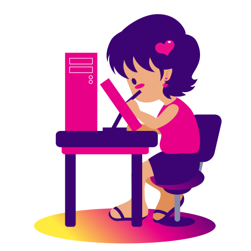

+++
title = "Commissions"
date = 2026-04-13
draft = false
+++

Hello, I'm open to any kind of commission regarding my skills, and here is a list of my rules when I work on commissions. Feel free to read it carefully and contact me to <a href="mailto:info@cutydina.com">info@cutydina.com</a> if you need an estimate for your project. I'm also on work pages, such as <a href="https://www.peopleperhour.com/freelancer/design/geraldina-sierra-children-s-book-illustration-2d-xqvzva" target="_blank">PeoplePerHour</a> and <a href="https://www.upwork.com/freelancers/~012db025f362d520e0" target="_blank">UpWork</a> work plaform, but right now I'm focusing more on <a href="https://vgen.co/cutydina/"target="_blank" >VGen</a>, there you can see some estimates for my most common commissions.

### Commission Rules

- Payments will be upfront, and can be done trough Paypal, Payoneer, Wire tranfer or Cryptocurrency.
- I'm open to **NSFW** illustration/animations as long as it's not an illegal topic, and samples of this kind of work will not be shown at my website.
- **Source Files** delivery will have an extra fee.
- I **will not** work under pressure, if you have a deadline, please let me know before start so I can tell you if I can deliver for that date.
- Paid commissions includes **Commercial use**, and if you don't want me to upload to my website later, please tell me when finished. However, the use of the illustrations for generative AI training is not allowed. It's a tool that violates copyright, and I'm totally against it.

- Payment can also be done via **cryptocurrency**, but because all SCAM in that field, I don't make responsable of any lost on this kind of payment. I can provide my wallet adress, but payment is at your own risk.

### About Cryptocurrencies

Because all SCAM in that field, I don't make responsable of any lost on this kind of payment. I can provide my wallet address, but payment is at your own risk.

### About Source Files

Source files have an aditinal fee of **$30 USD**. Also is important you to know that, despite having studied Adobe software, it is not software that I like to use. So if you want the source file you should know I usually use [Inkscape](https://inkscape.org/), [Clip Studio Paint](https://www.clipstudio.net/) and [OpenToonz](https://opentoonz.github.io/e/index.html) for my professional work. If you need the source file in **Adobe Suite** format (Illustrator, Photoshop, InDesign, etc..), please tell me before starting, if not, I don't respond if the file has some issues in this software. I will usually provide EPS or PSD file as source file, but if you have any of the software I use, please tell me and I have no problem on send it in that format with the aditional fee. 