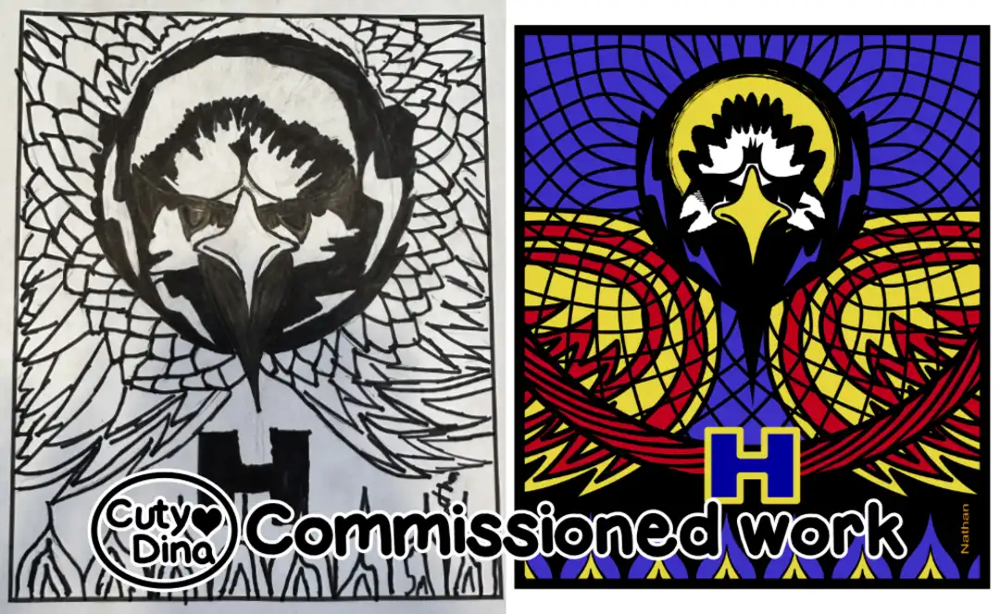
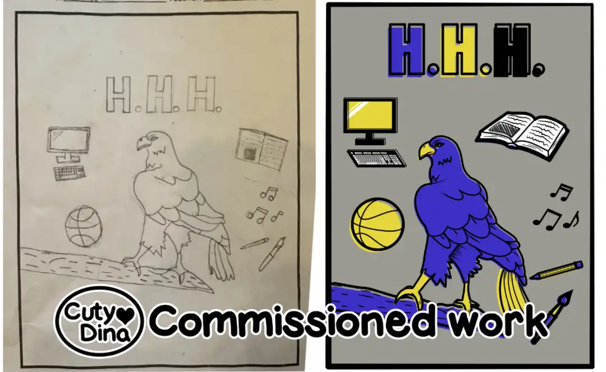
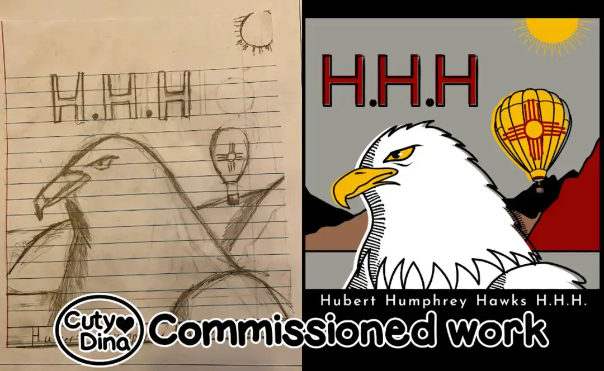
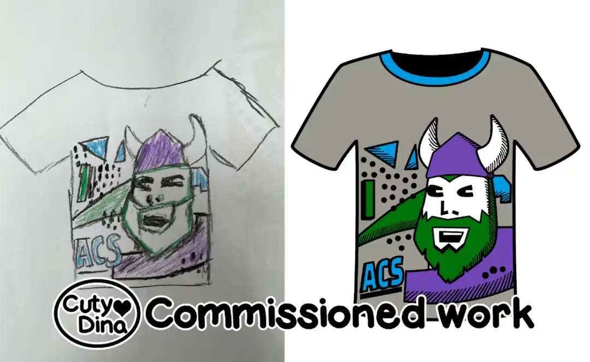
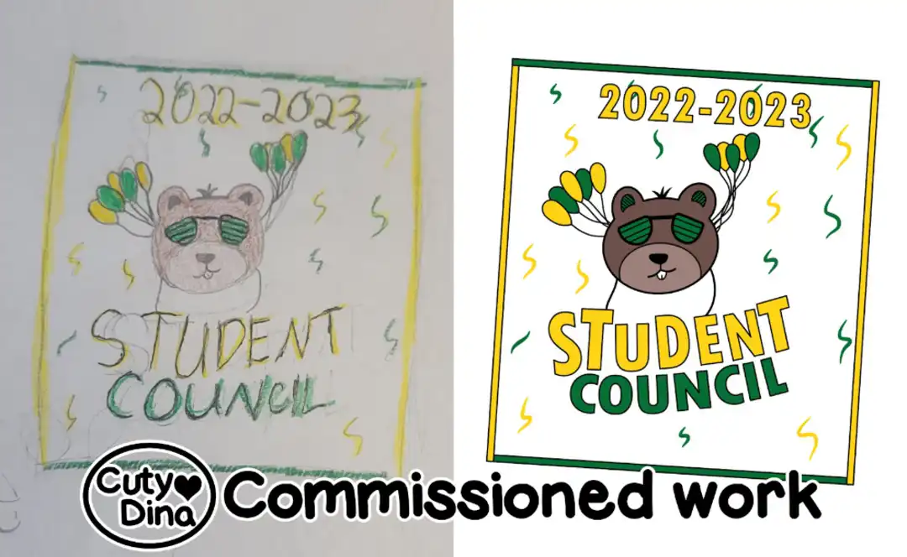
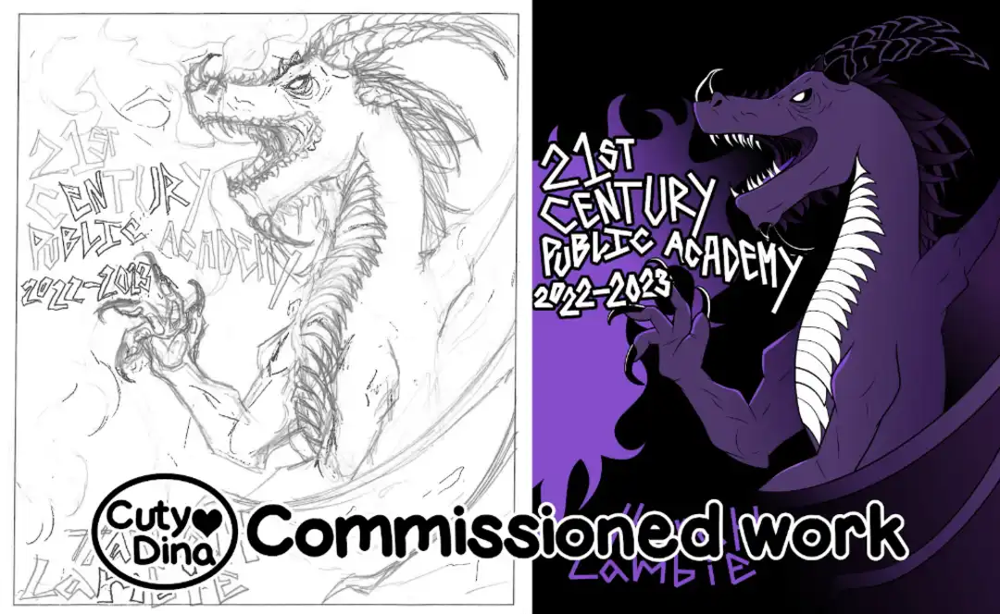

+++
title = "Children's Drawings to Vectorial"
date = 2023-07-16
draft = false
+++

One of the last commissions I've been working on lately. A contest for students of a school in which the winner is made a t-shirt with their drawing. In this project they send me the child's illustration and I'm in charge of vectorizing the drawings and adapting them to t-shirt designs with a limit of 4 colors, of course following the client's guidelines and the colors that are chosen for each one. I really enjoy trying to get the children idea and create it a cute and colorful illustration. <i class="heart-animation"></i>

These are some samples of the projects in which I was in charge of the vectorization.

  
  

  

