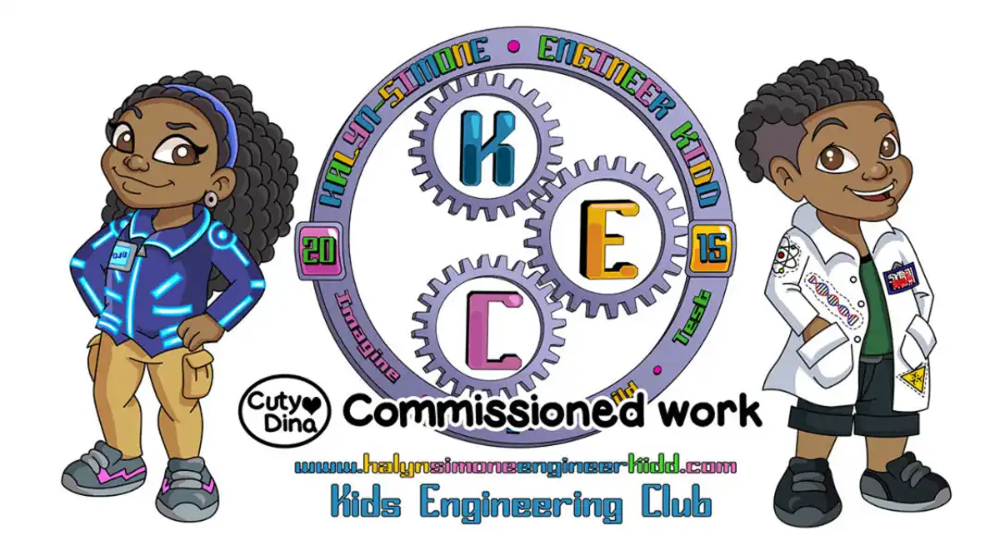
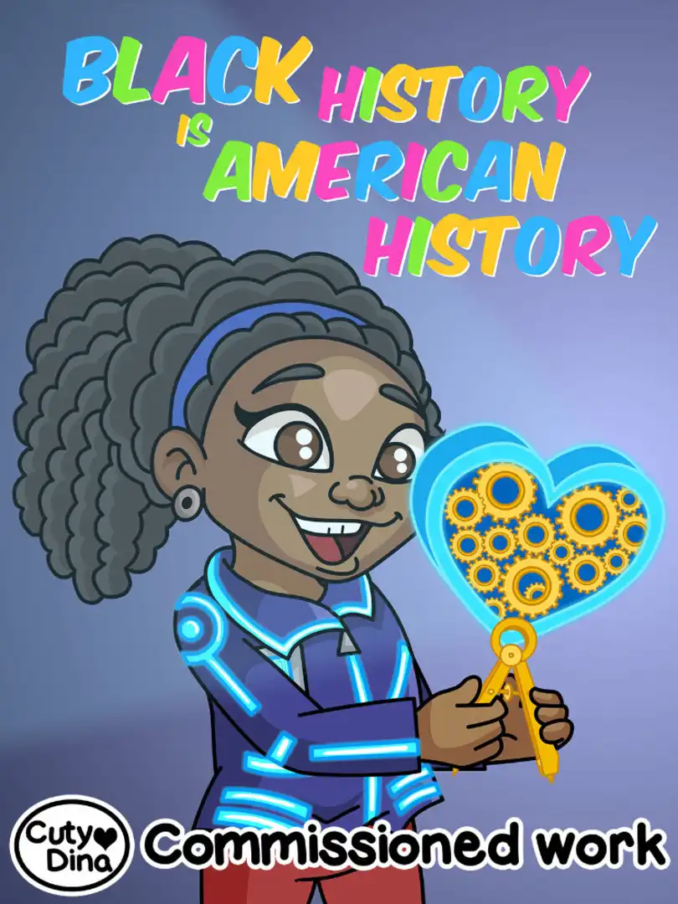
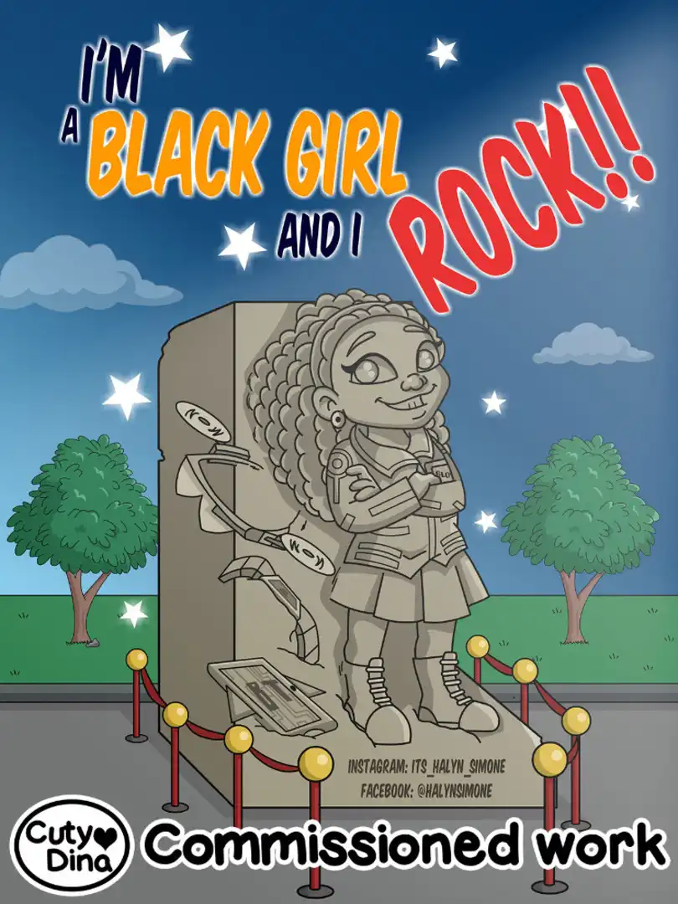
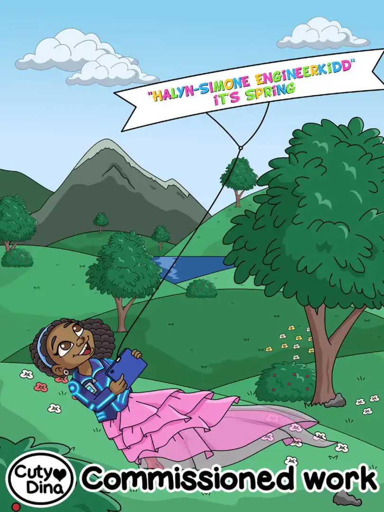
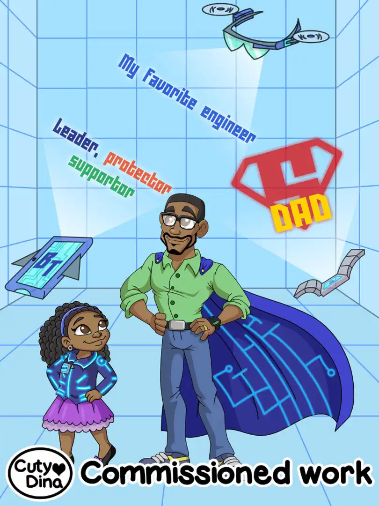
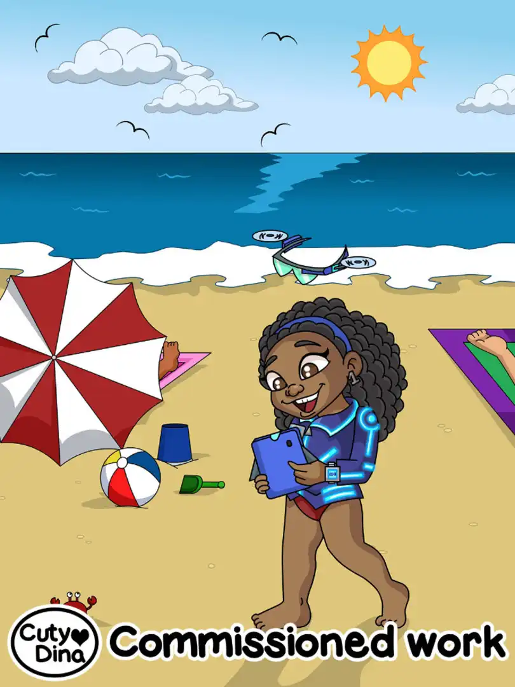
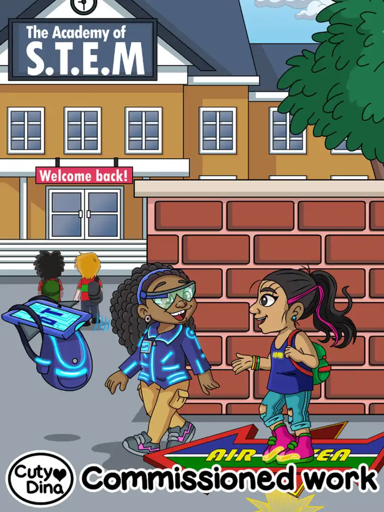
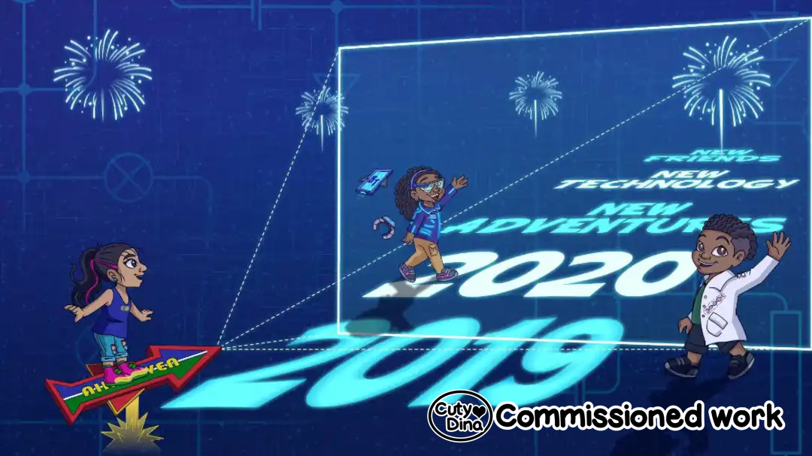
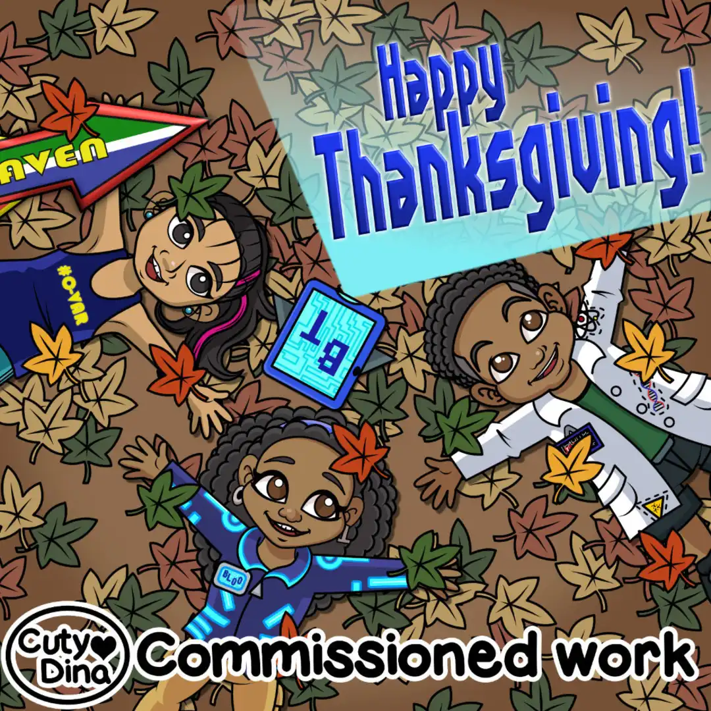

+++
title = "Halyn Simone Engineer Kidd"
date = 2020-11-27
draft = false
+++

Children's illustrations for [Halyn Simone](https://www.halynsimoneengineerkidd.com/) children's book. Illustrations based on an already designed character. Copying the same style as the original illustrations for their first children's book, I've working doing some holidays and special illustrations for their social networks.

> "Technology is knowledge learned and applied to make all your dreams turn BLOO...

> What is so special about <b>Halyn-Simone</b> is not the fact she is considered a genius, it is her desire to use her imagination and knowledge to create technology to make the world a better place, especially for her family.

