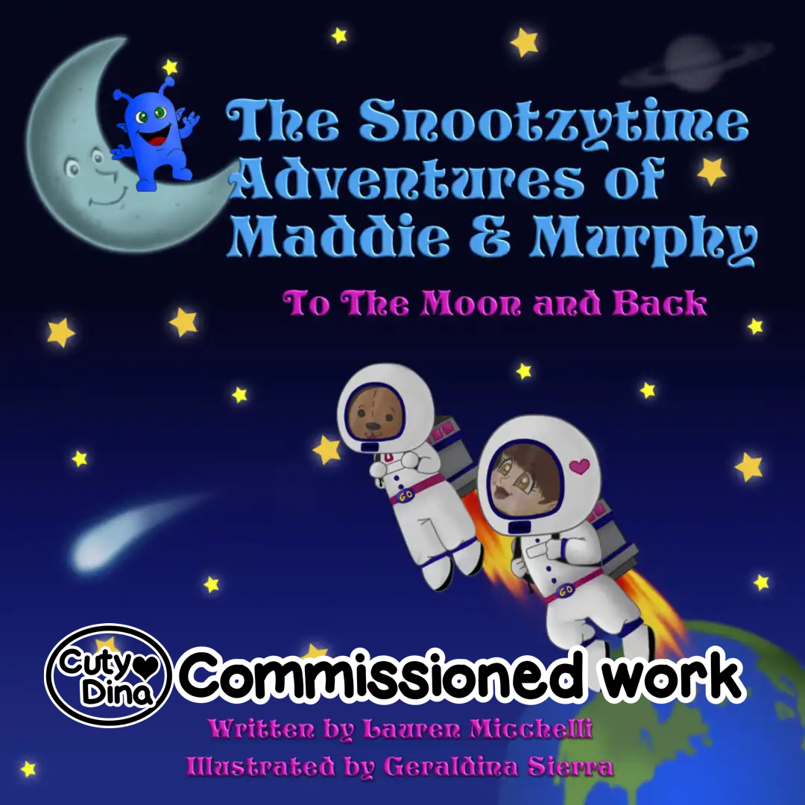
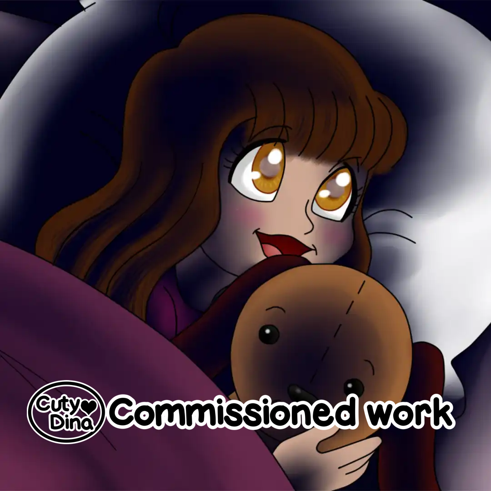
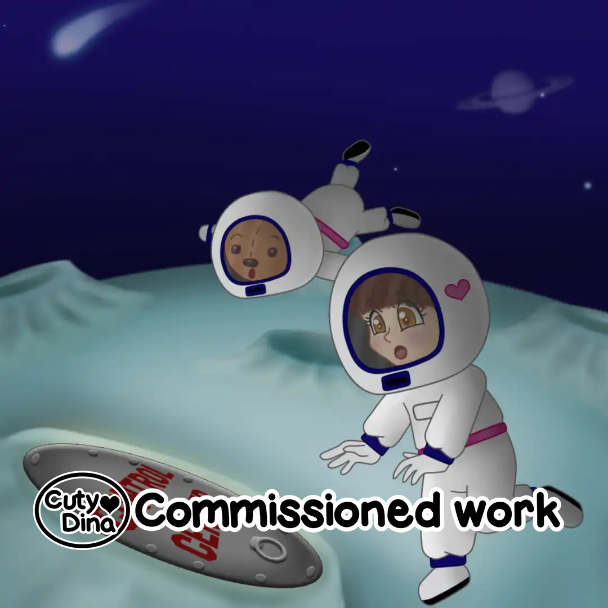
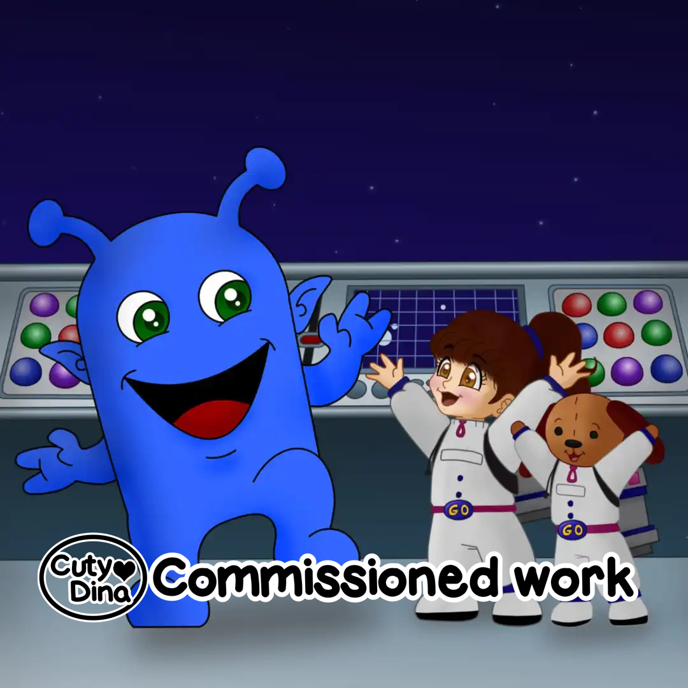
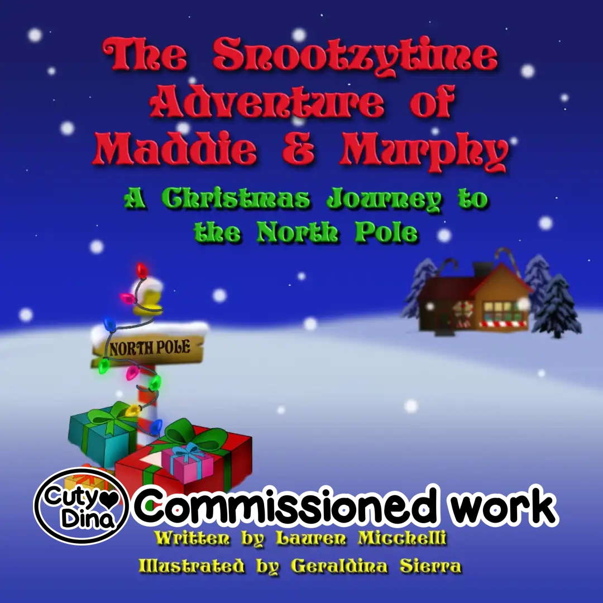
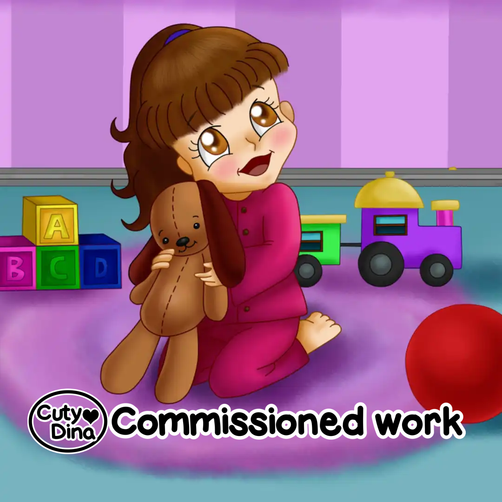
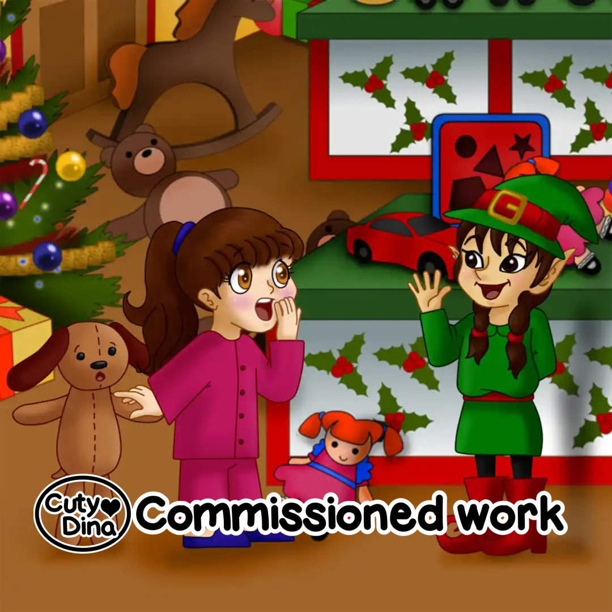
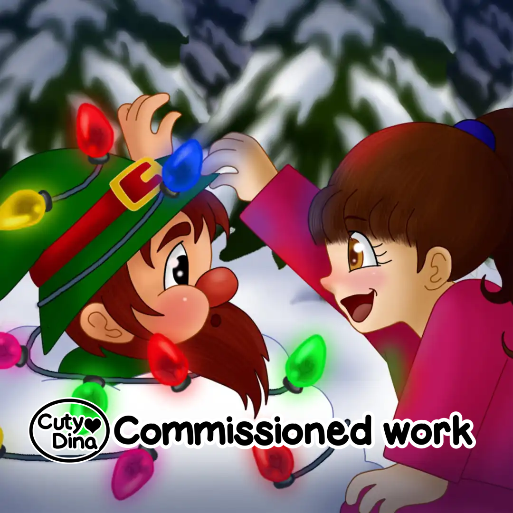

+++
title = "The Snoozytime Adventures of Maddie and Murphy"
date = 2015-06-25
draft = false
+++

My first series of children's books. A project that I really enjoyed illustrating, since the story was endearing, and the characters were quite fun to draw. 

###  The Snoozytime Adventures of Maddie and Murphy: To the moon and back

> "Maddie gazes out her window at the moon and stars. As Maddie's bedtime arrives, Mom tells Maddie a secret that a wish on a star could come true! Excited by the possibility, Maddie makes her wish – to go to the moon. Maddie drifts off to sleep and when she opens her eyes she discovers that she's not in her room..."

[Buy Now](https://www.amazon.com/Snootzytime-Adventures-Maddie-Murphy-Moon-ebook/dp/B00X09L2NM/)

### Look inside

###  The Snoozytime Adventures of Maddie and Murphy: A christmas journey to the North Pole

> "It's Christmas Eve and Maddie eagerly awaits Santa's arrival. As Maddie's bedtime arrives mom and dad remind Maddie that Santa will only visit the houses of sleeping children, and they spark her imagination with the notion that her dreams can become her nighttime adventures..."

[Buy now](https://www.amazon.com/gp/product/1622877640/)

### Look inside

