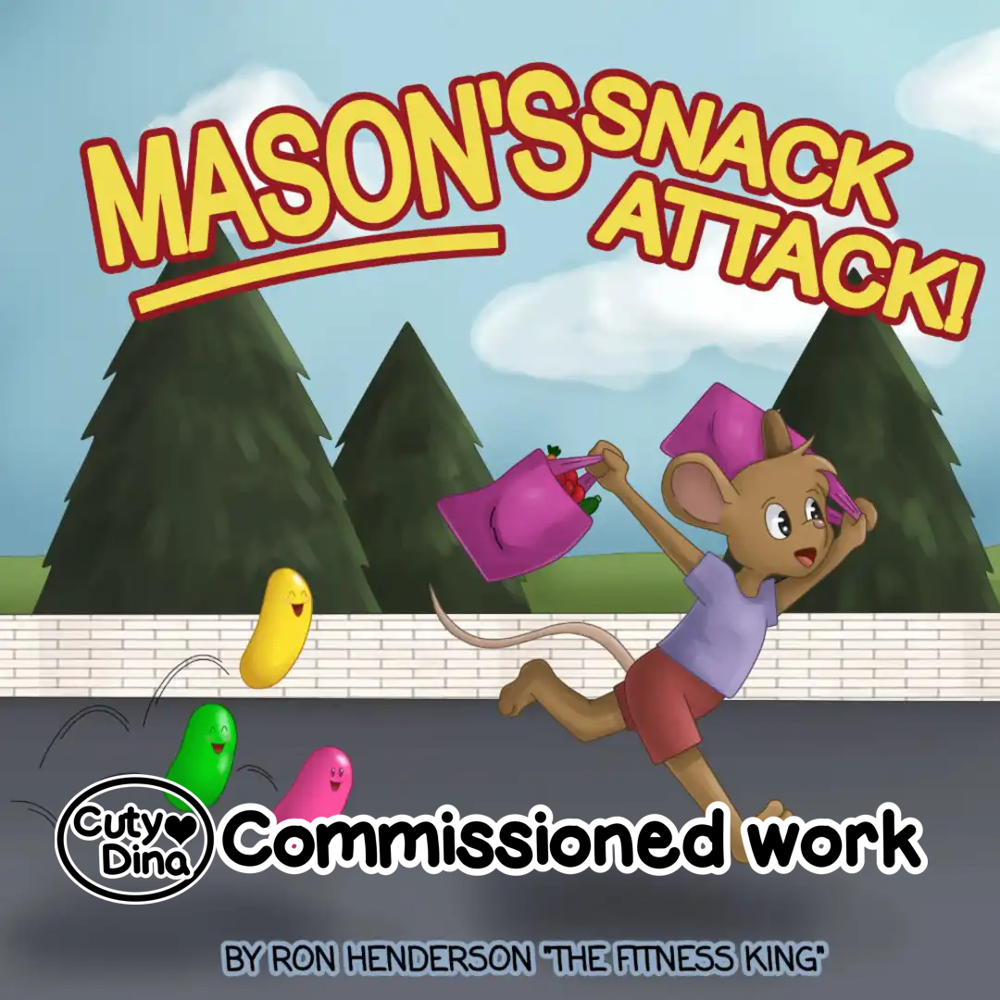
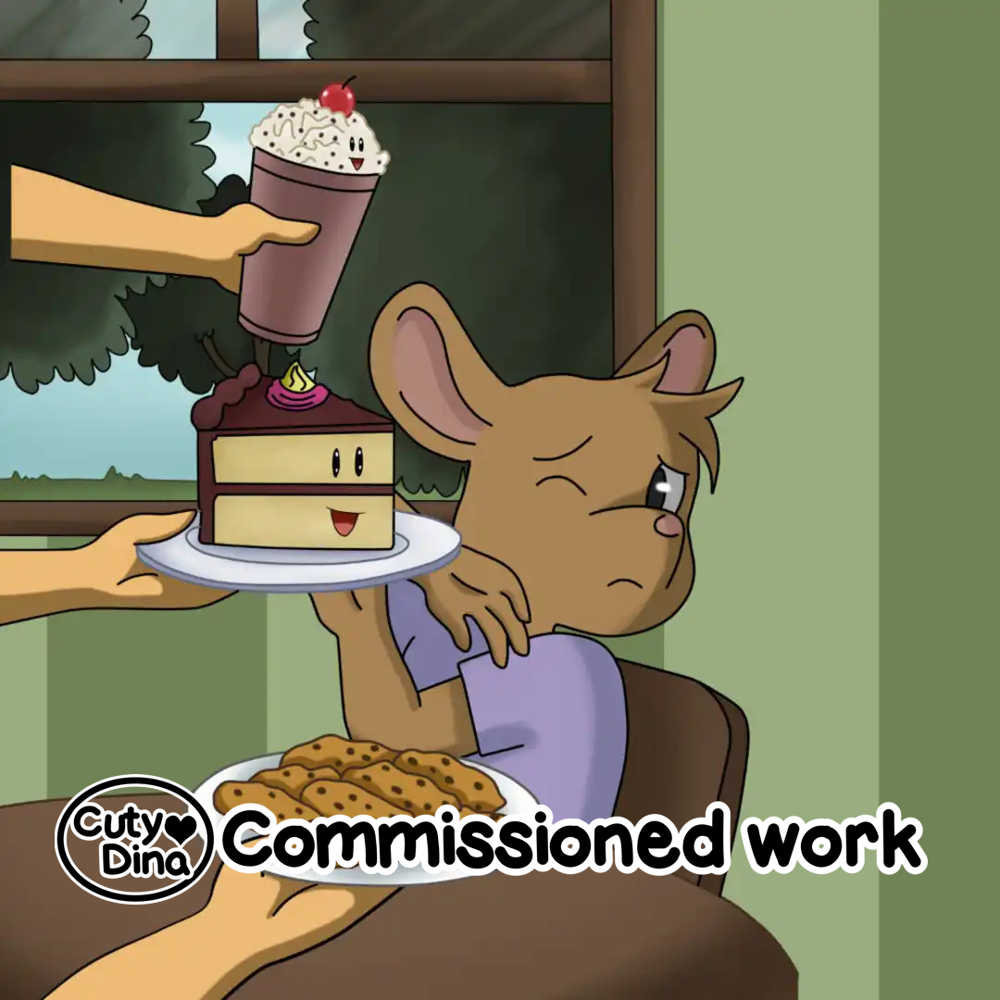
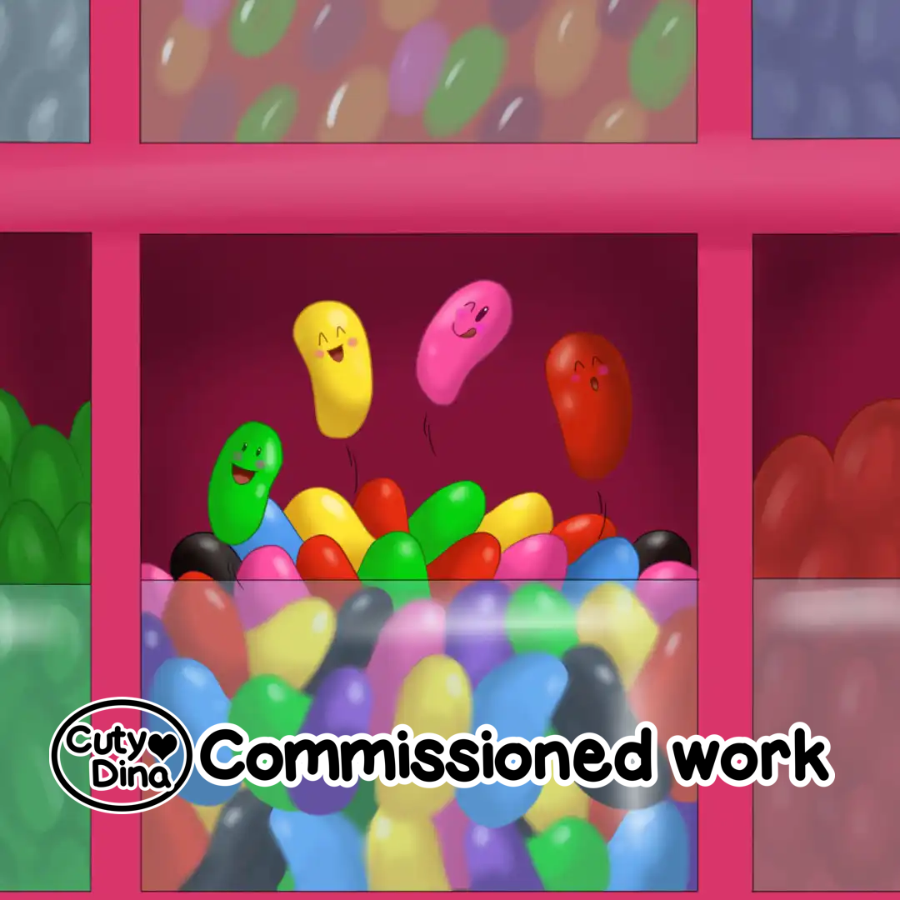
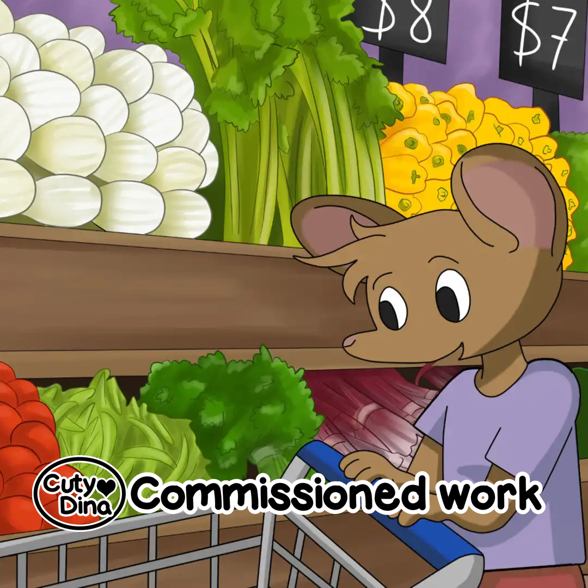

+++
title = "Mason's Snack attack"
date = 2015-10-07
draft = false
+++

Commissioned book with an already designed [character](https://www.amazon.com/gp/product/B00WONOFOI/). In this project I dedicated to adapt my illustrations to an existing style, despite not having designed the character, it is a good way to gain more fluency. 

> "MASON'S SNACK ATTACK by Ron Henderson "The Fitness King" This book series originated over 22 years ago with a dream to publish a children's book series about a Mouse that decides to get fit and eat right along with his animal friends..."

### Look inside

