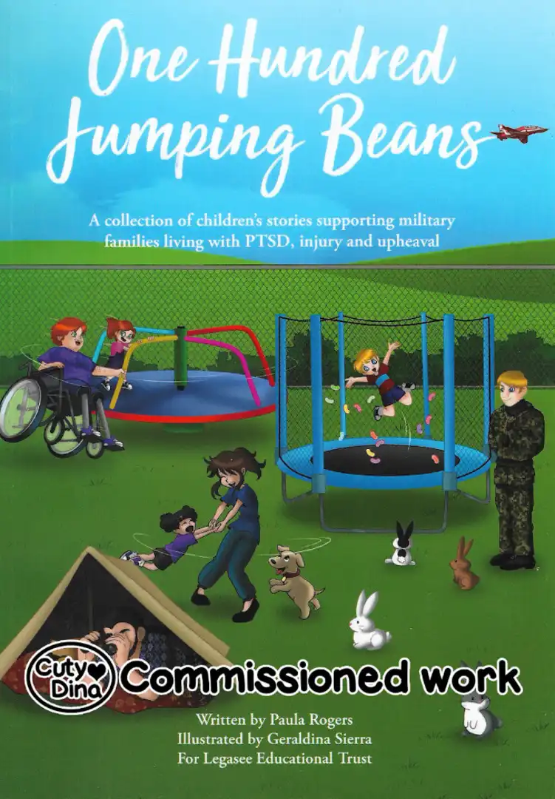
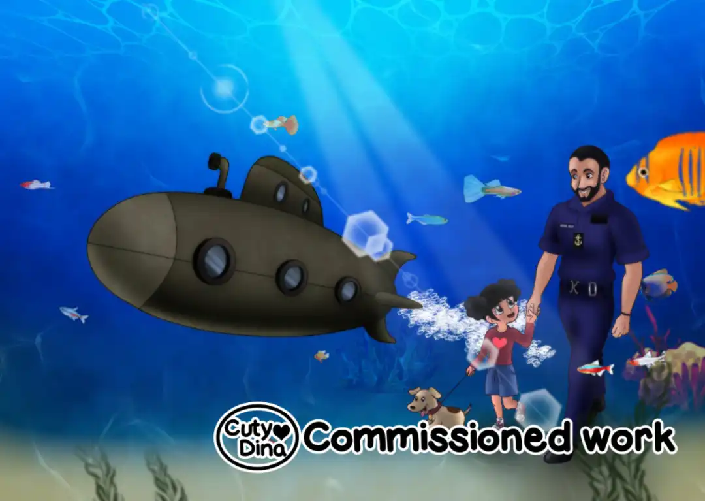
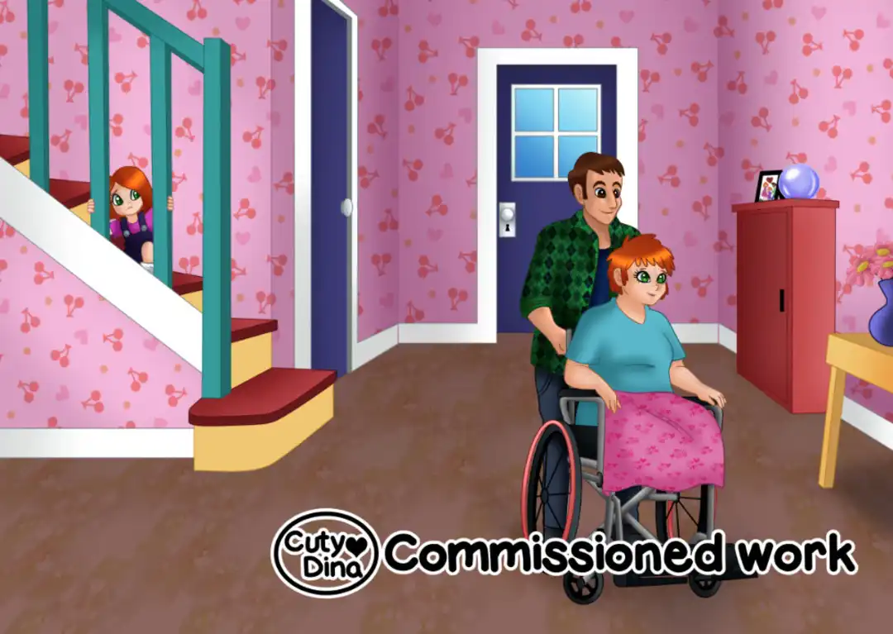
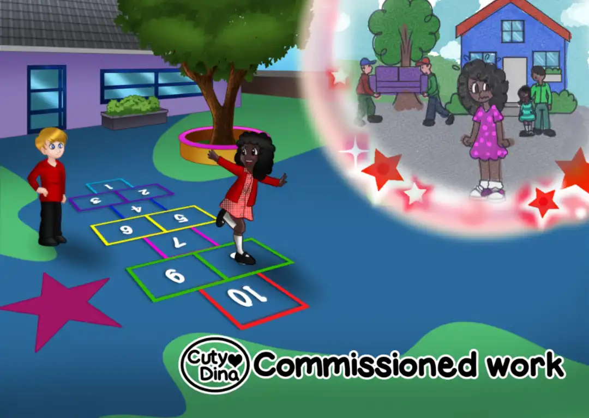

+++
title = "One hundred beans"
date = 2021-01-09
draft = false
+++

Commissioned children's book cover and inside illustrations. In this commission, the author wanted to represent in a visual and easy-to-understand way what the children of parents who went to war feel. A somewhat unknown topic for many but unfortunately there are still actually cases. I really enjoyed doing the illustrations, I especially enjoy the analogies between the text and the illustrations. 

> "Working with Le Cateau school in Catterick,  we created some KS1 learning sessions to accompany the book which help young pupils understand the lives of their military friends. Ollie’s dad is in the Army, Ruby’s mum is in the RAF, and Sam’s dad is in the Navy..."

[Buy now](https://www.amazon.co.uk/One-Hundred-Jumping-Beans-collection/dp/1838537805/)

### Look inside

