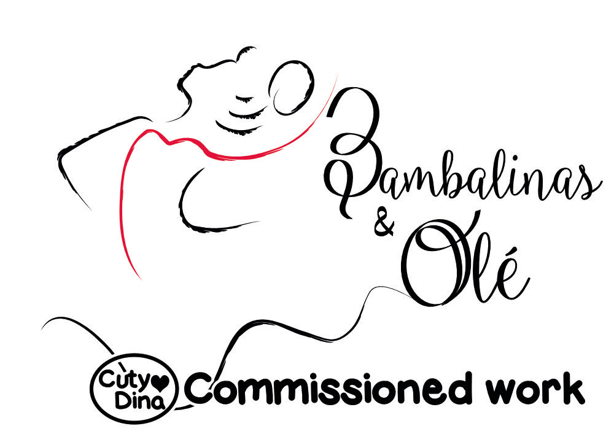
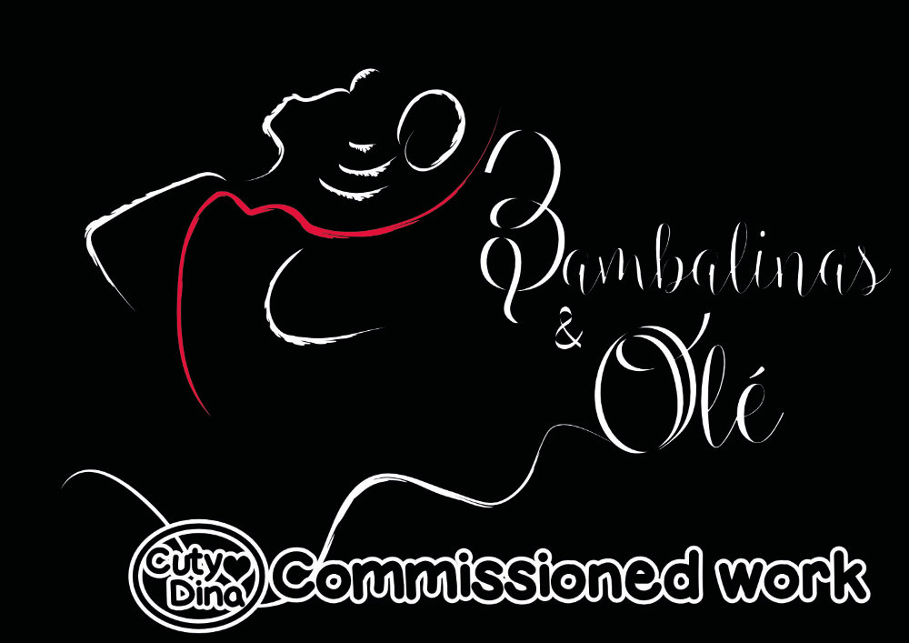

+++
title = "Bambalinas y Ole"
date = 2017-06-24
draft = false
+++

Descripción de Bambalinasyole.I usually don't make logos, but a friend recommended me to one of his friends who had just opened a dance school called Bambalinas y Olé in Madrid. Despite not being my specialty, I dedicated myself to looking for a product that the client would like, and after a lot of trial and error, this was the final result for her company bussiness, and I'm glad that she was happy with the final result.

And as an extra, this other Logo they ask me later based on a cute flamenco cat.

