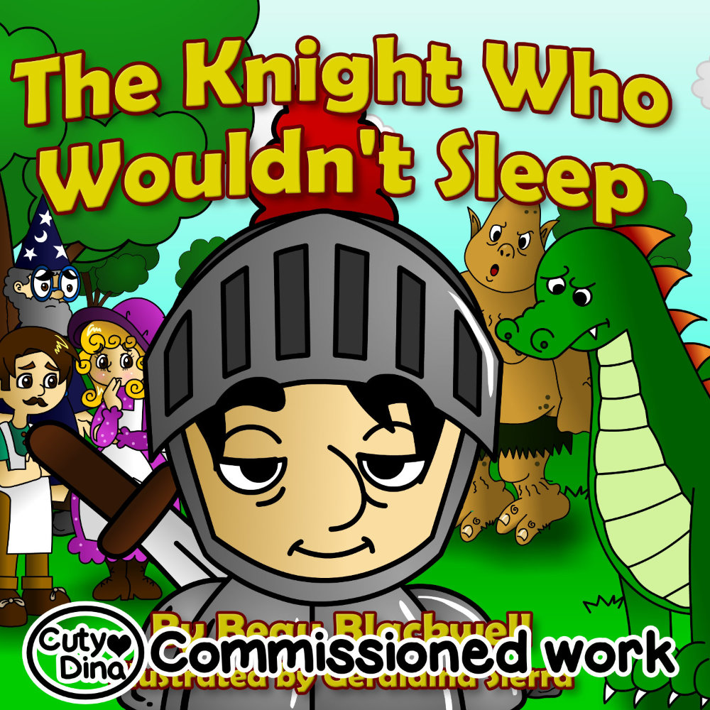
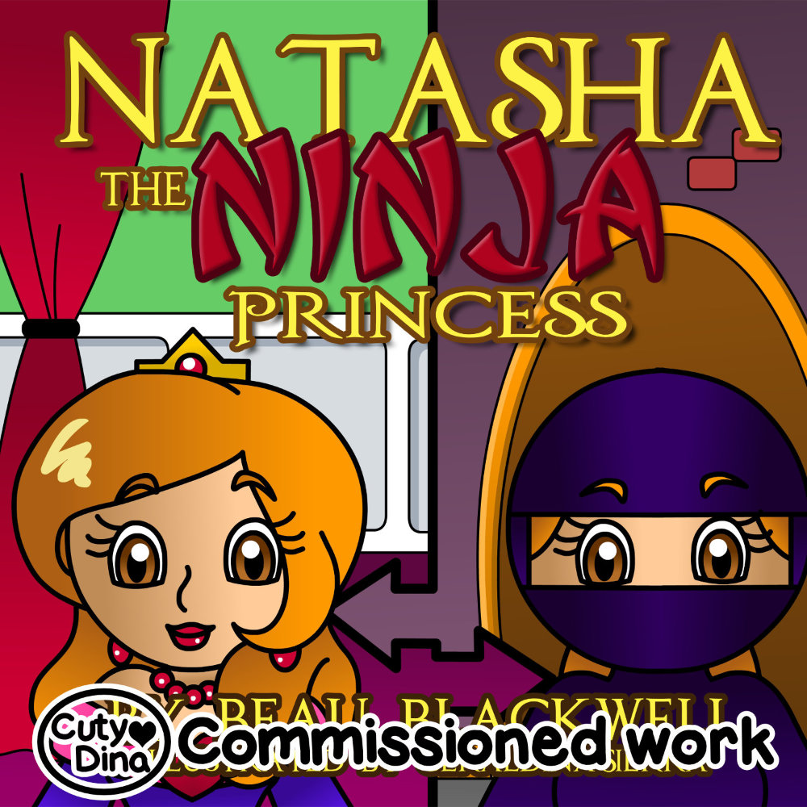
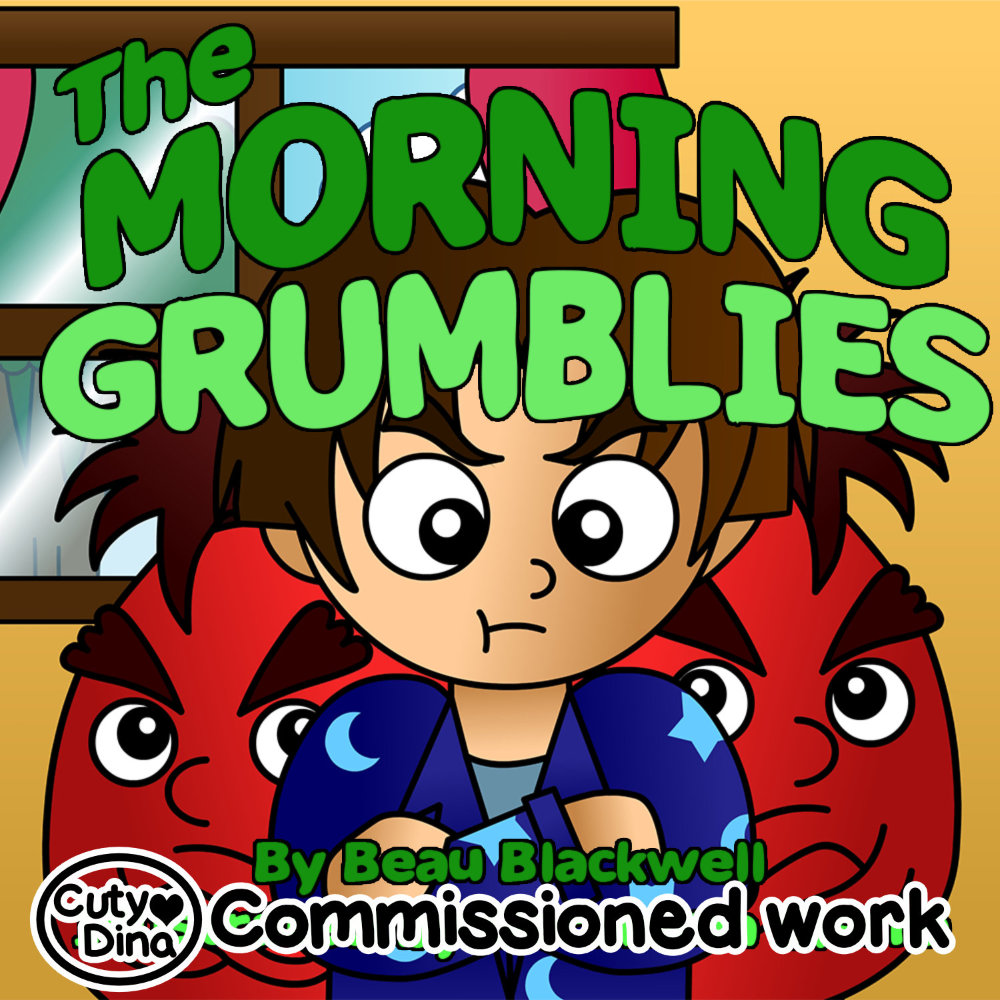

+++
title = "Beau Blackwell Children Books"
date = 2013-06-25
draft = false
+++

My first commissions for children's books! I was very happy to experience working for this specific audience for the first time, I know that the illustrations are very simple, but it was a small budget and I had to adapt to it. However, I keep these illustrations very fondly.

### The knight who couldn't sleep

> "A cute, rhyming bedtime book for toddlers, preschoolers, and kids ages 2-7 who don't want to go to sleep!
>Our fun-loving knight fights a nightly battle- he fights the urge to go to sleep! As you can imagine, this ends up causing him all kinds of problems until he gets some good advice from his friend the wise wizard..."

### Natasha the ninja princess

> "Natasha isn't your average princess... instead of doing ballet or being rescued by the handsome prince, she likes to dress up as a ninja and save the day!
> In this fun, spunky book for girls or boys ages 3-8, Princess Natasha uses her secret identity, wits, and courage to save the day when a thief tries to ruin her friend's big day..."

### The morning grumblies

>"We all wake up on the wrong side of the bed sometimes! But even if we wake up in a grumpy mood, we can always turn our day around.
>In this cute, col-lg-6orful picture book, children are introduced to the imaginary "bumblies" and "grumblies" that can make you wake up in a good or bad mood...."

### Christmas on the farm

> "It's Christmas on the farm, and the animals know that Christmas isn't just about presents- it's about friendship, family, generosity, and love! 
>Your kids will love this bright, col-lg-6orful rhyming picture book, and you'll love that it reminds them of what the Christmas season is really all about..."