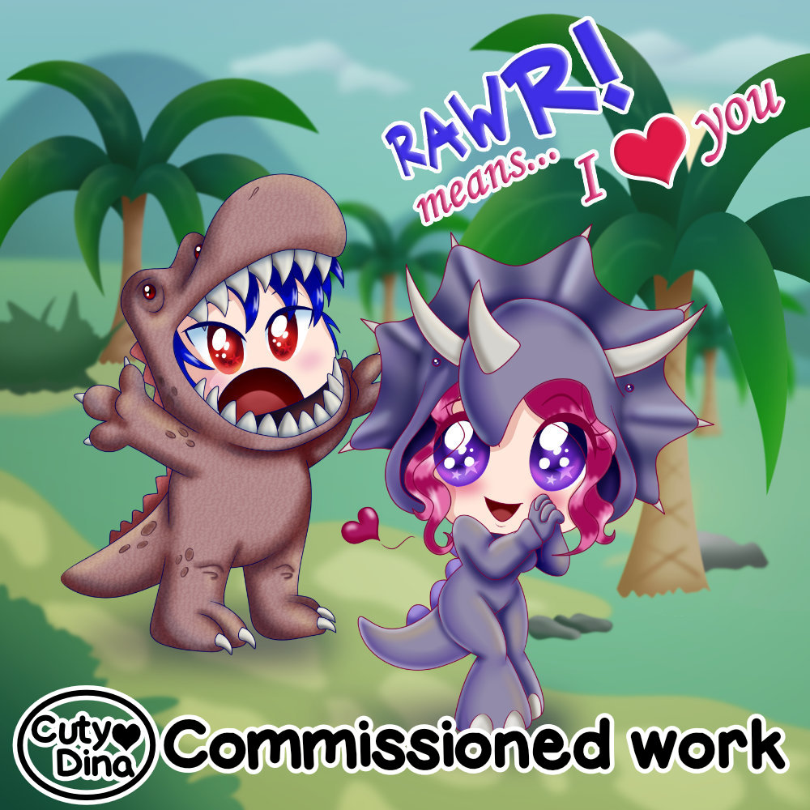
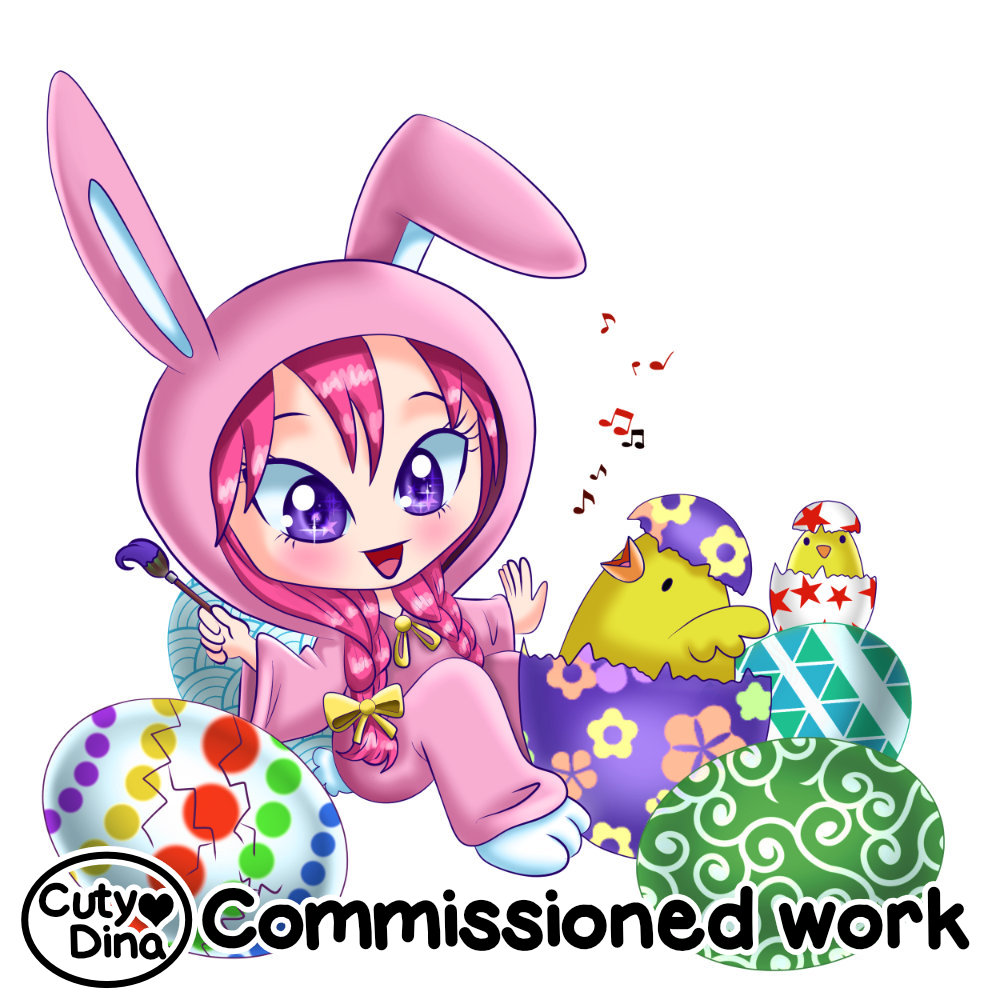
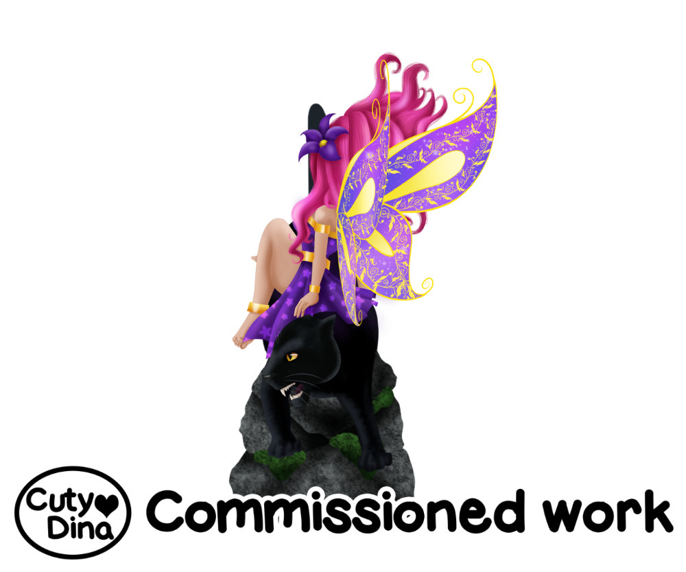
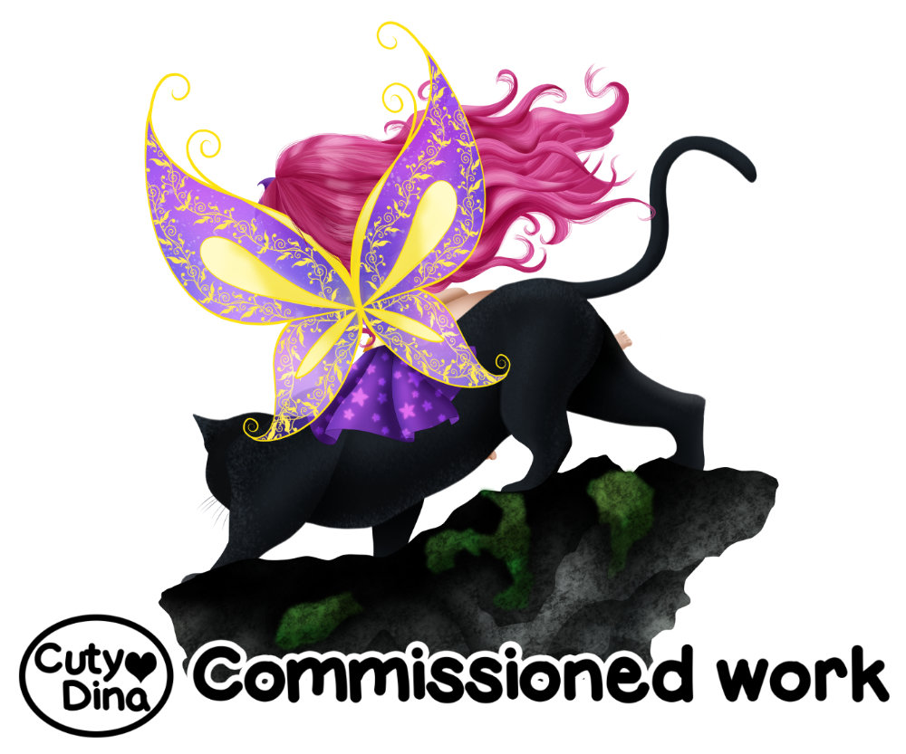

+++
title = "Chaserz Emporium Illustrations"
date = 2019-04-19
draft = false
+++

Chibi portraits and designs for [Chaserz Emporium](https://www.chaserzemporium.com). Very happy with this client, her requests have always been clear and therefore it has not been difficult for me to understand what she was looking for. Also, I have always enjoyed the Chibi style in common and making these cute and colorful illustrations was very satisfying.

Leaving a bit of the chibi design, this was one of the designs that I most enjoyed creating for her, besides that I love the detail in digital painting, creating an illustration in different angles was a great challenge that was satisfying to achieve.

