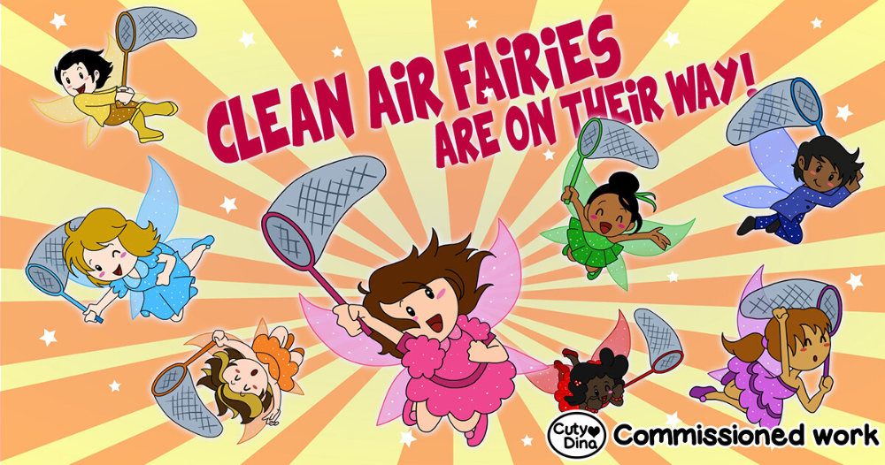
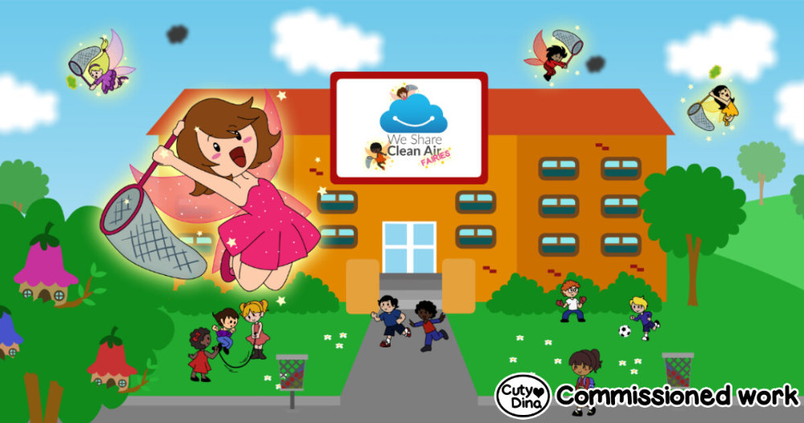
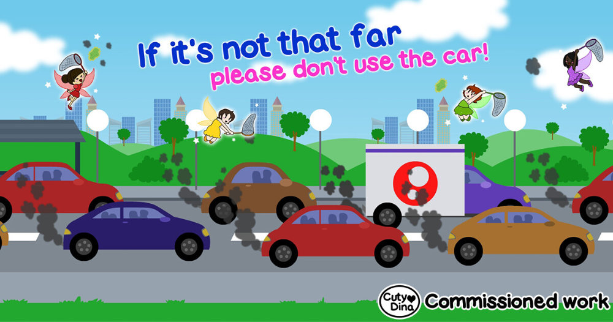
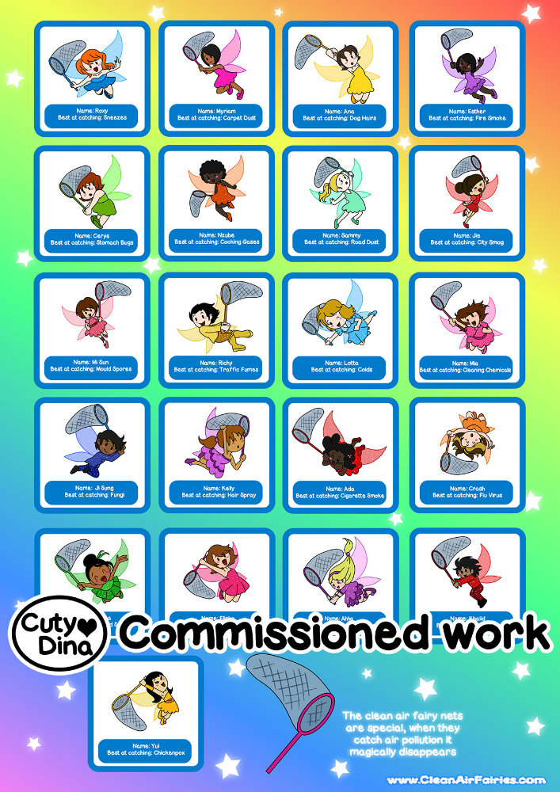
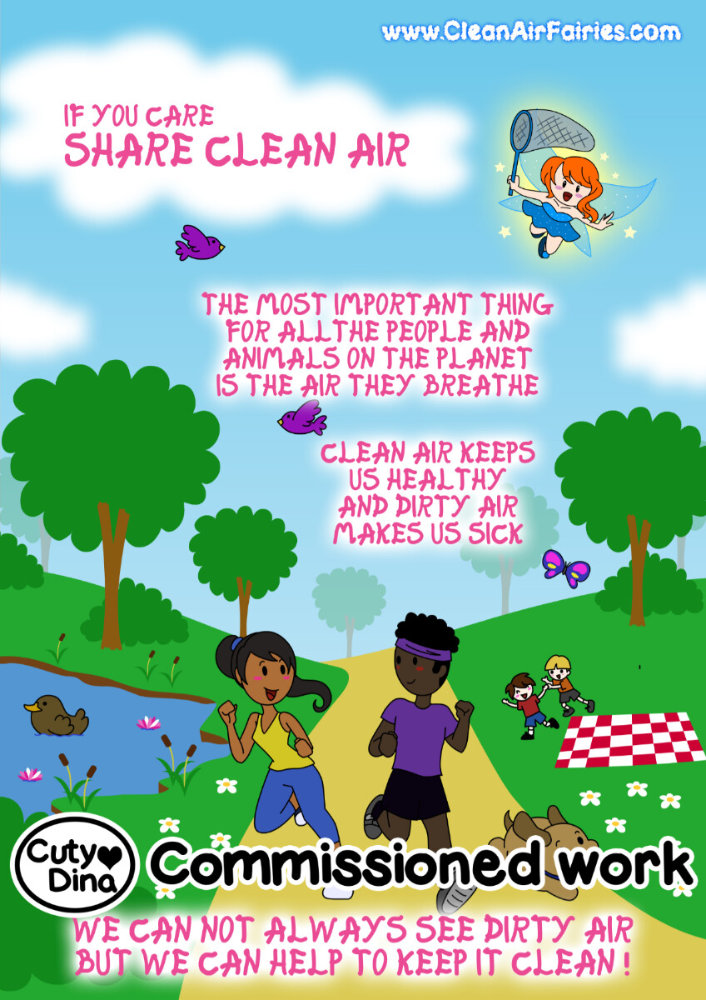
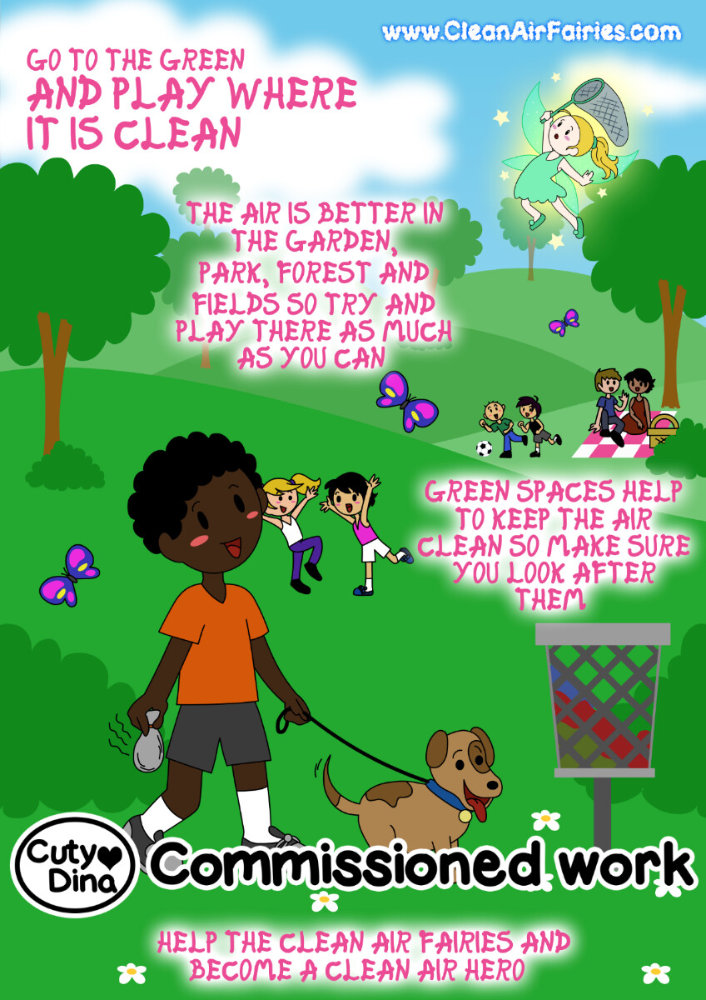

+++
title = "Clean Air Fairies"
date = 2017-06-24
draft = false
+++

Commissioned full project for [Clean Air Fairies](https://cleanairfairies.com/) Website, with the purpose to educate children about caring for the environment. I worked from the design of characters, animations, storyboards, banners, etc.

### Website banners

> "CLEAN -Educating children on the importance of looking after their most valuable resource
> AIR -Helping children to learn from our mistakes so the future of mankind can breathe easier.
> FAIRIES -A fun, exciting and engaging way to deliver valuable messages"

### Animation Music Video 



### Posters and design

