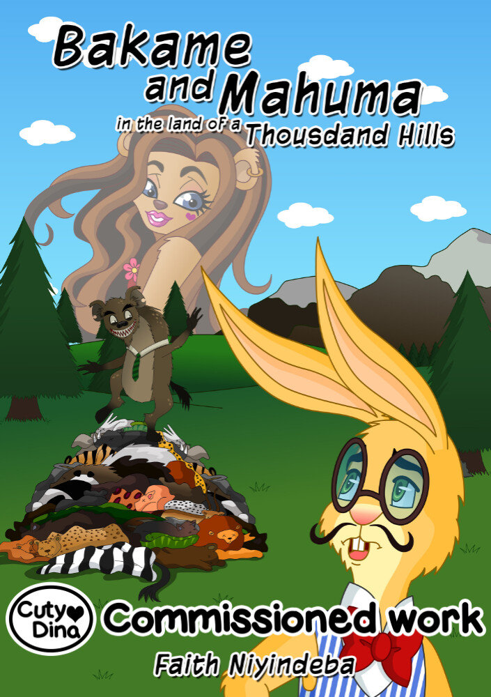
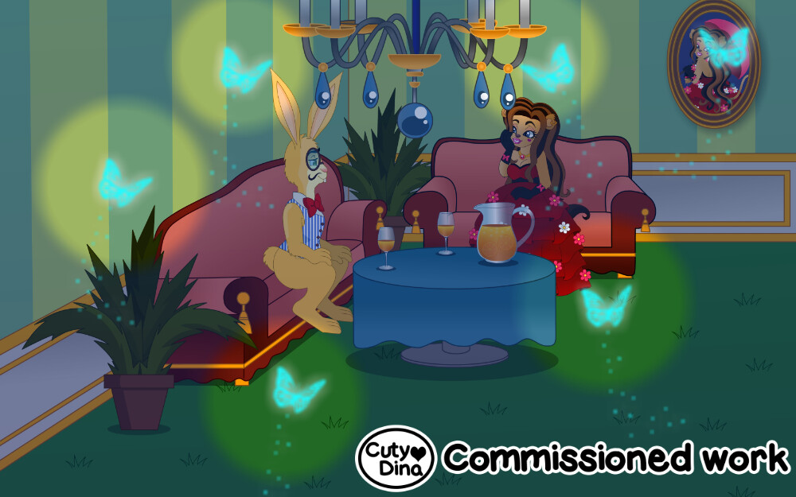
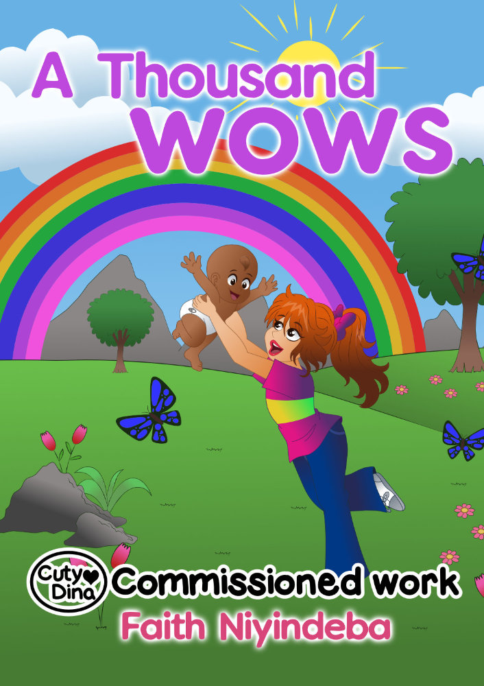

+++
title = " Faith Niyindeba Children's Books"
date = 2015-03-15
draft = false
+++

A writer who gave me the one I had the pleasure of working with. She liked reading her stories before doing the illustrations. An interesting way of narrating. These are some of the works I did for her.

### Bakame and Mahuma 

My first youth novel that I have been commissioned to illustrate. A style that I liked to try, with anthropomorphic animals and a world full of fantasy, an interesting story in which I chose the important points that needed a colorful illustration. 

> "Mahuma is taken miraculously into the Inner Land and thought his days ends in down below the big water. He is rescued by lesser stranger beings and taken back to the outer world where he belongs. He and Bakame sign a business partnership to sell animal skins; that brought a lot of money to the country and into their own pockets. Unfortunately Bakame life changes and he quits the skin business which he thought is 'immoral'...

### Look inside

### A thousand Wows

Commissioned Children's Book Cover and inside illustrations. I really love the style i get in these illustrations. 

> "When eleven-year-old Eleanor is found unconscious under the big tree in the yard by her mother Edith, she fears her daughter has had a terrible accident. But Eleanor is faking; she is not unconscious at all. Quite the contrary. Eleanor is very much okay, but has been doing a very naughty thing..

> Narrated in the author’s distinctive style and based on the tales and legends of her childhood in Rwanda, discover what Eleanor has been doing and what she has seen..."

### Look inside

