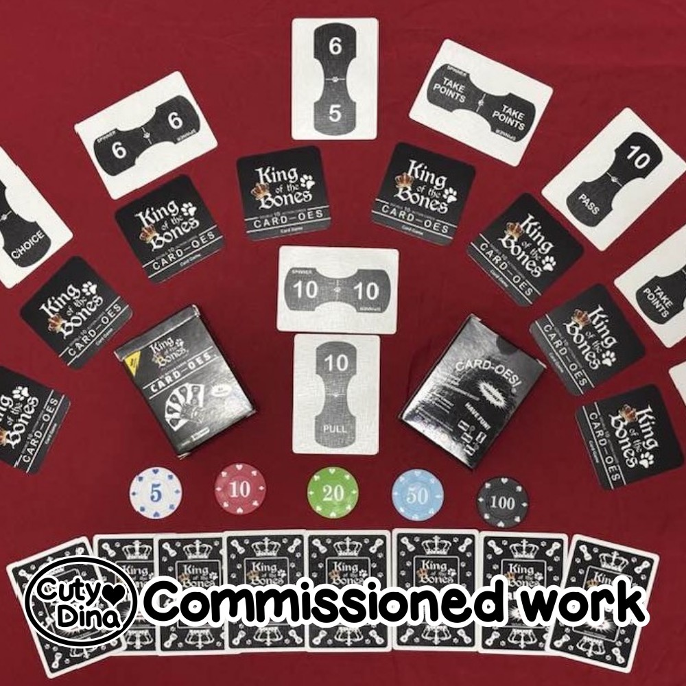
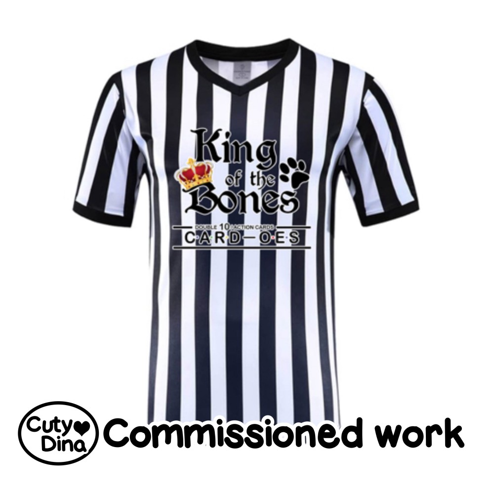

+++
title = "King of the Bones"
date = 2026-01-24
draft = false
+++

After several years working on this project, it has finally seen the light. I must admit that it was a challenge returning to work on Blender, but in the end I enjoyed playing with angles and lighting in some of these renders for the promotional images.

This project is still growing, and I hope to be able to share more about it soon.

[Facebook](https://www.facebook.com/profile.php?id=61583838188418)

[Website](https://www.card-oes.net/)

[Buy now](https://www.amazon.com/dp/B0FFRFVN41)

### 3D Renders for BoardGame

### Actual BoardGame

### Collectibles

