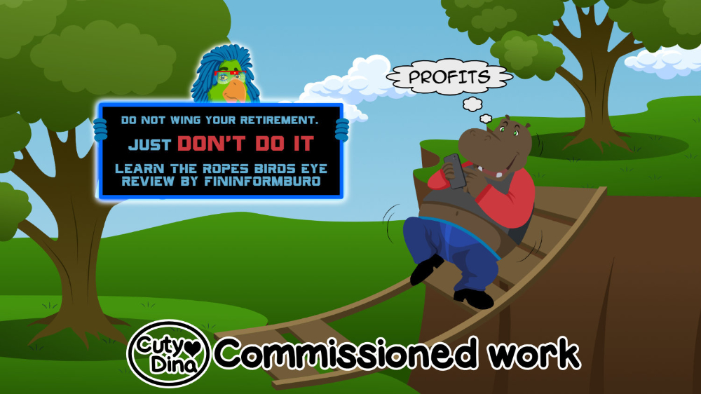
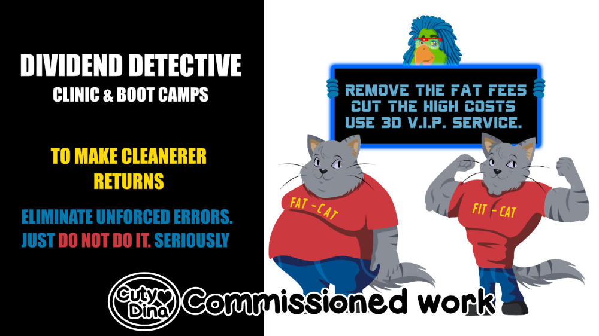
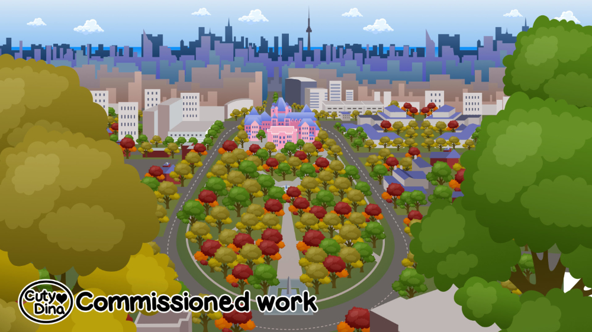
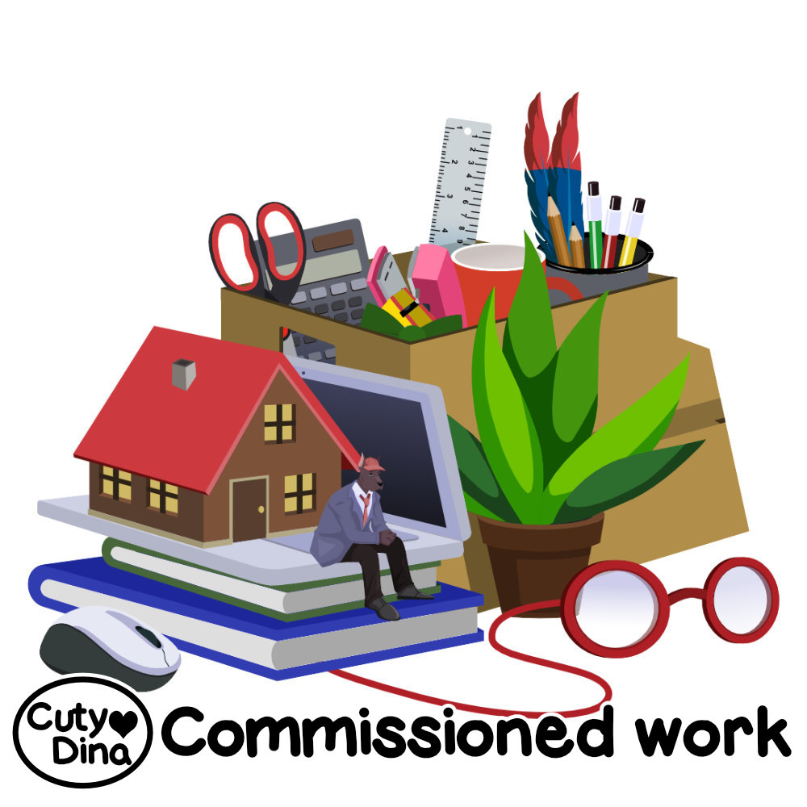
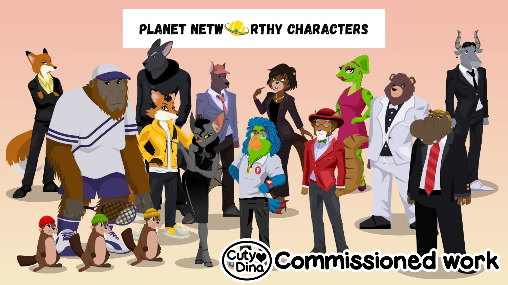
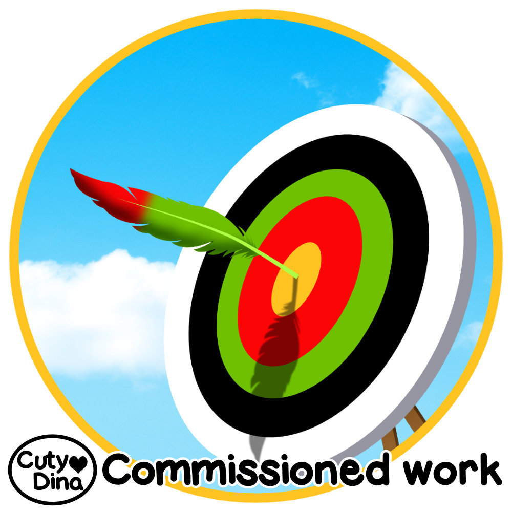
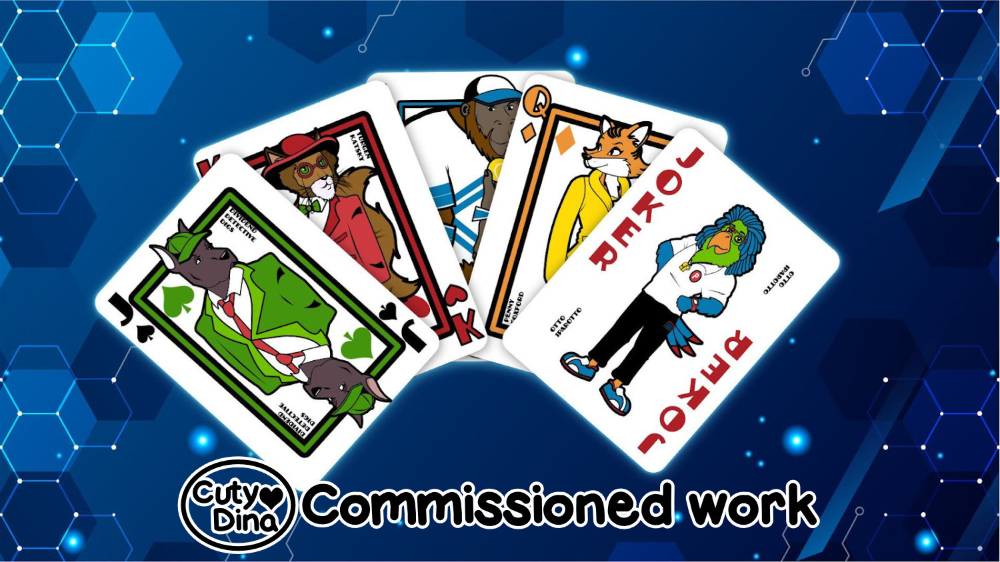
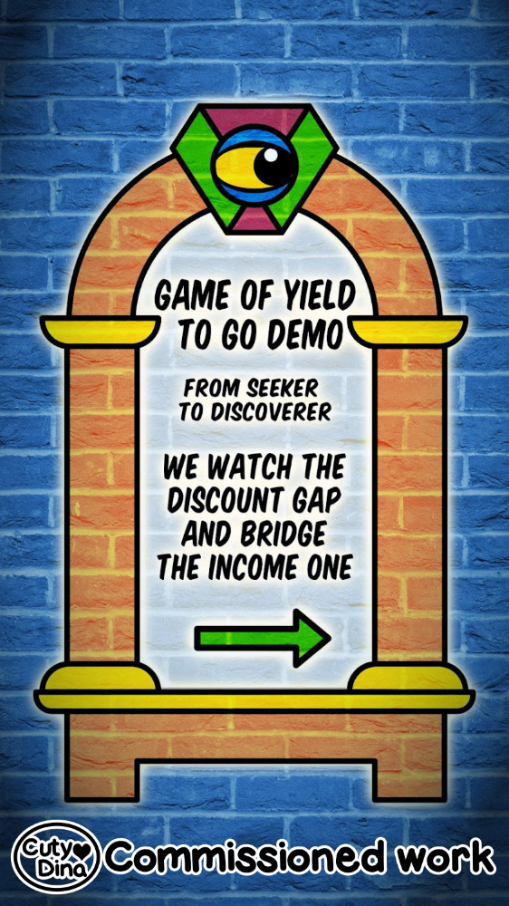

+++
title = "Pensionizer"
date = 2023-04-07
draft = false
+++

It took me a while to publish things related to this project. Just after a long time, it has finally come to light and therefore I can now share some examples of the work I have done regarding this company. I have been working on this project for over a year now and I must say that it is one of the most ambitious projects I have been lucky enough to work on. I hope all goes well with this project. Here are some works related to it.

 

 

 

### Animations





