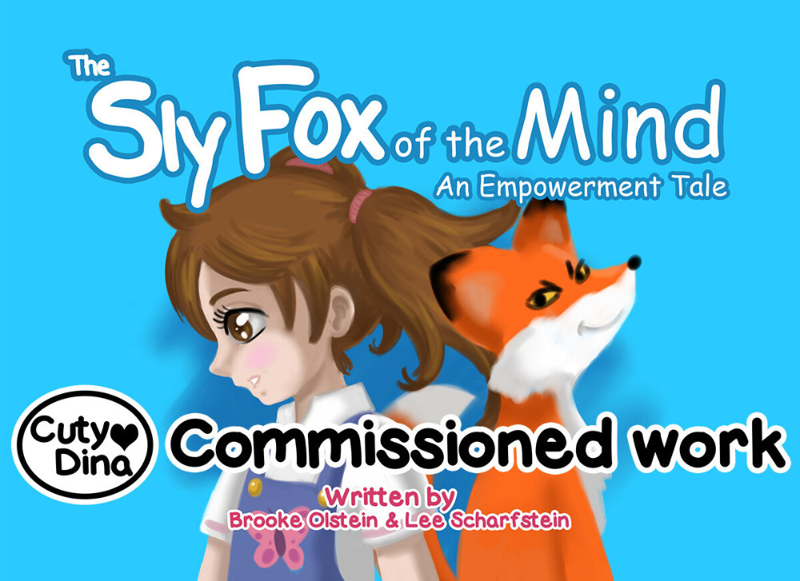

+++
title = "The sly fox of the mind"
date = 2016-06-06
draft = false
+++

An interesting book about bad feelings on children's. I decided to use a different style for illustrate this one, something childish and with free color strokes.

> "The Sly Fox is the book I will buy as gifts for my family and friends this year. It gives young girls the tools they need to build self-esteem with simple exercises that create awareness around negative feelings and then teaches them how to set those feelings free..."

[Buy now](https://www.amazon.com/Sly-Fox-Mind-Brooke-Olstein/dp/1533166552)

### Look inside

  

    
  

  

    
  

  

    
  

### Update
 After some years after making this cute book, this book was reading by Sarah Ferguson at her youtube chanel! I'm so happy to see my work becoming known.

