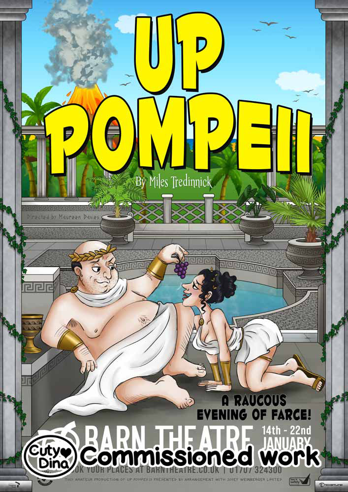

+++
title = "Uppompeii"
date = 2021-10-23
draft = false
+++

My first commission for a play. I must admit it was challenging to try a completely different style than what I have commonly used, but I also love a challenge and this one helped me experiment with new techniques and ways of working.

> "The play is set in the ancient roman town of Pompeii just before Vesuvius is about to erupt. All the characters have been given latinised names suggestive of their character. Lurcio, is the head slave to the bumbling Senator Ludicrus Sextus, his wife Ammonia, their promiscuous daughter Erotica and virginal son Nausius. At the beginning of the play Lurcio tries to deliver the prologue..."
  
[Barn Theatre Website](https://www.barntheatre.co.uk/productions_events/2021-2022/up-pompeii/)
