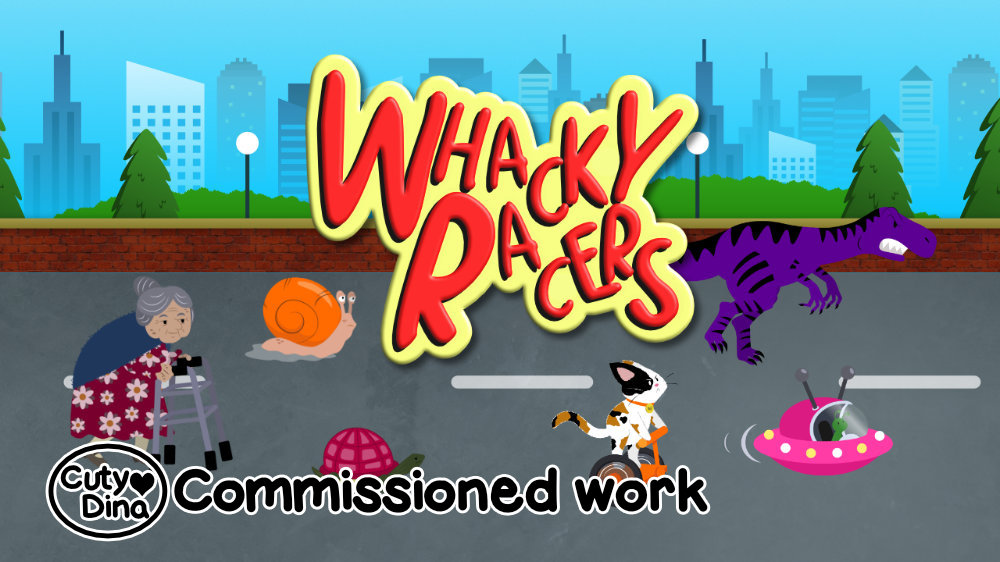
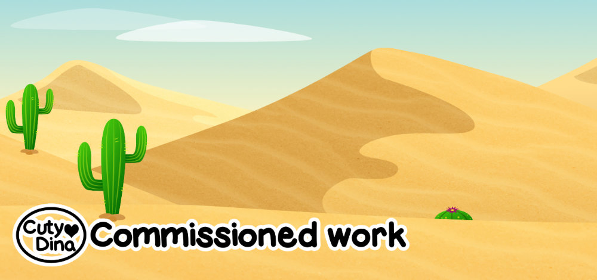
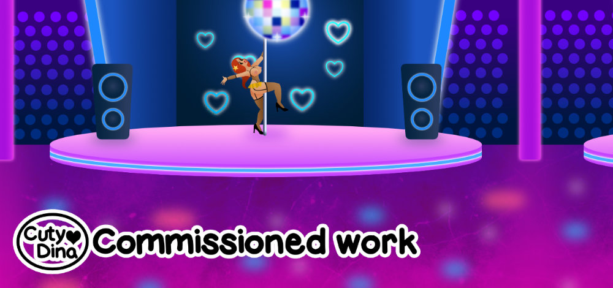
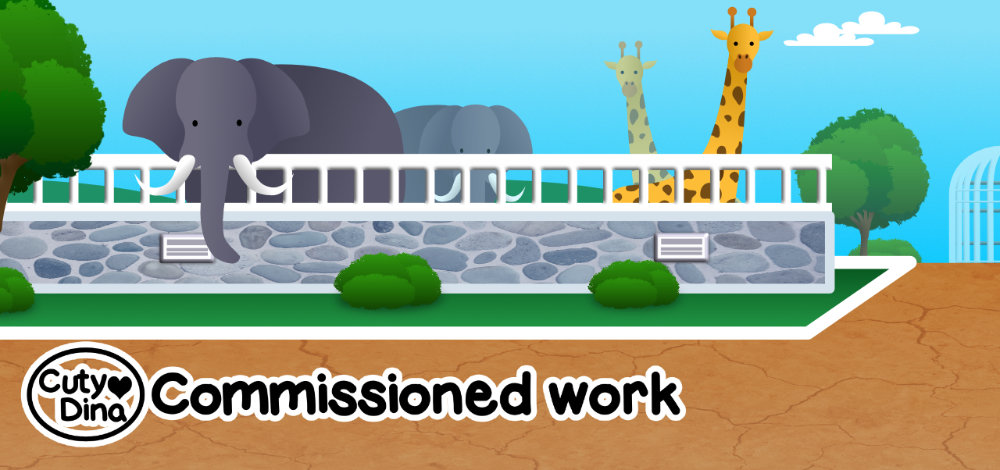

+++
title = "Wackyracers"
date = 2021-04-27
draft = false
+++

Commissioned work by [Mark Haskins](https://apps.apple.com/ch/developer/mark-haskins/id1519995547?l=en) for a minigame included in his App. This was my first time working on animations for videogames. I had to create sprites for each character for this racing game. In addition to the design of scenarios based on different places and themes, this project helped me a lot to understand how to organize for the creation of a video game. I can't help but say that every project I work on helps me learn something new.

[Get the App](https://apps.apple.com/ch/app/games-night/id1523317720?l=en)

### Backgrounds
I also worked on some background designs for this game. The originals were much longer and were cyclical, which is a challenge when making an illustration, since it must start and end in the same position to give the sensation of infinity. Anyway, here are some of my favorites created for this project, not complete,
since the originals are quite long.

