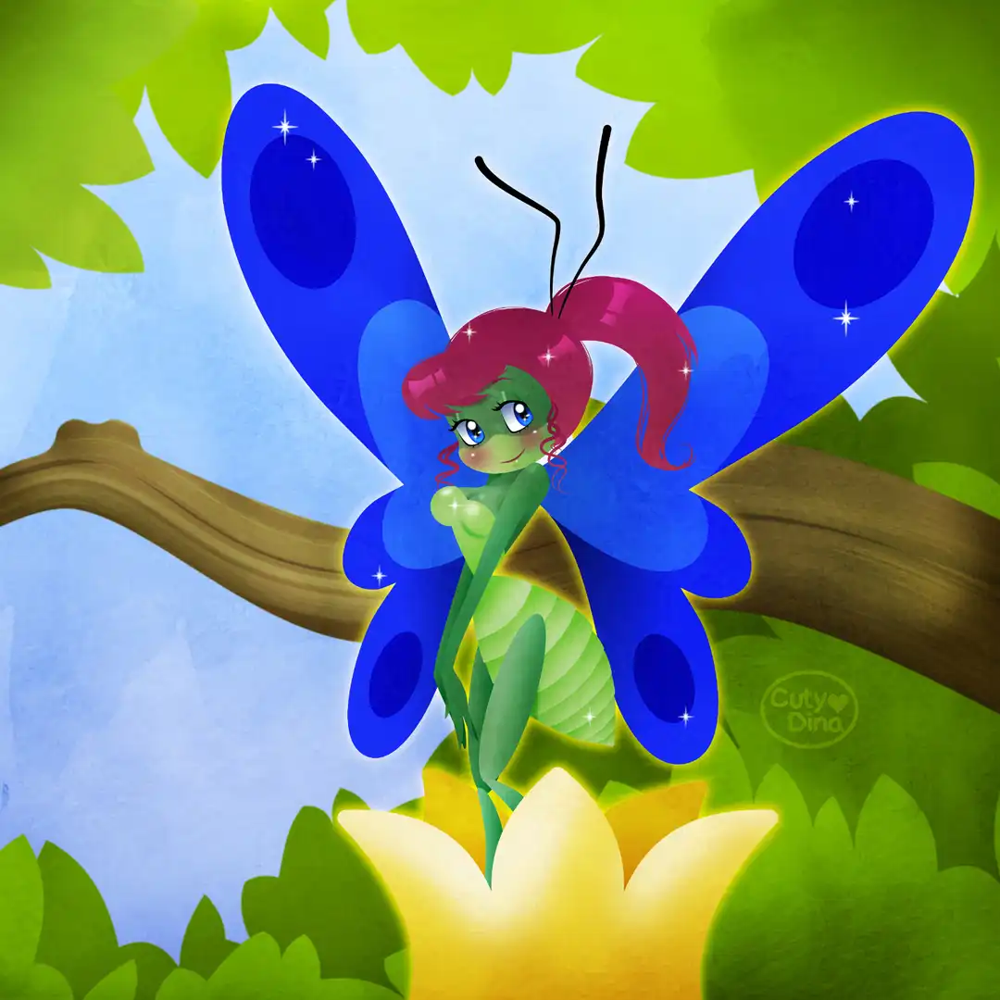
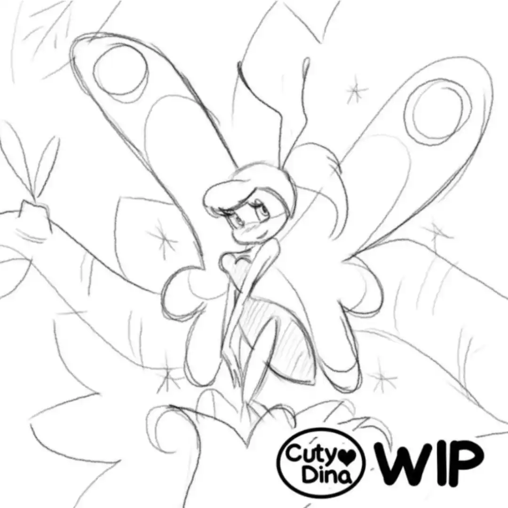
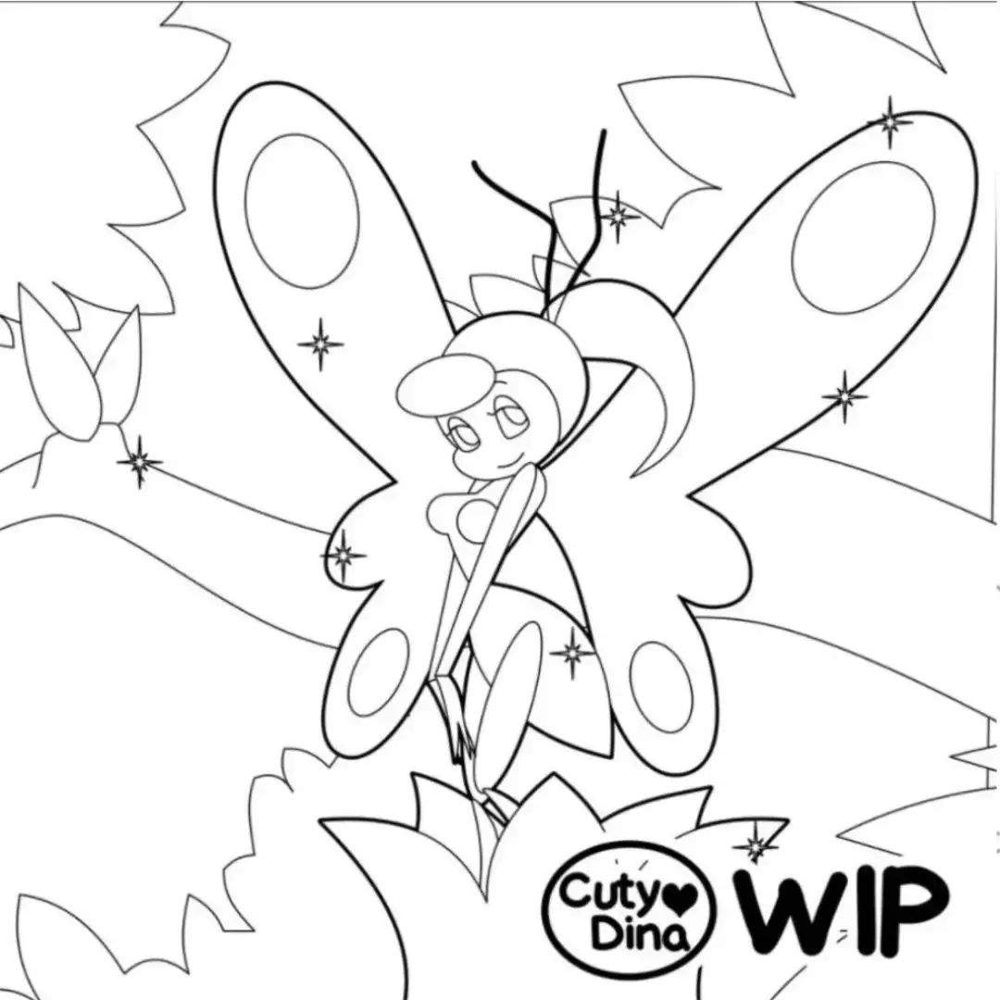
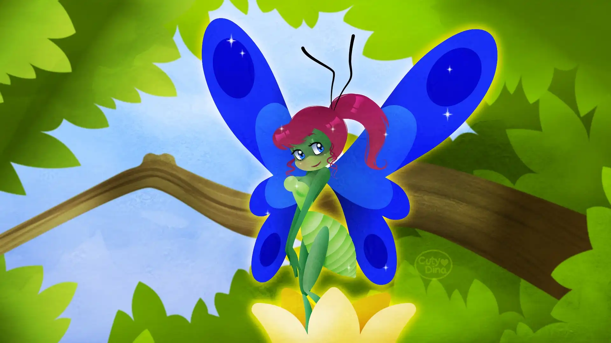
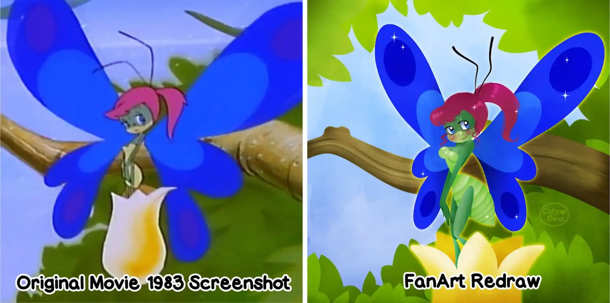

+++
title = "Caty Caterpillar FanArt"
date = 2022-01-12
draft = false
+++

FanArt of one of my favorite movies from when I was a child. Since I was little it always fascinated me the design of this character, especially at the end of the movie when she becomes a butterfly. Cute and colorful movie for children, but with amazing songs and designs. Vectorial with some effects, as always, made in Affinity Designer.

### Step by Step

  

### Desktop Wallpaper

### Original VS FanArt

