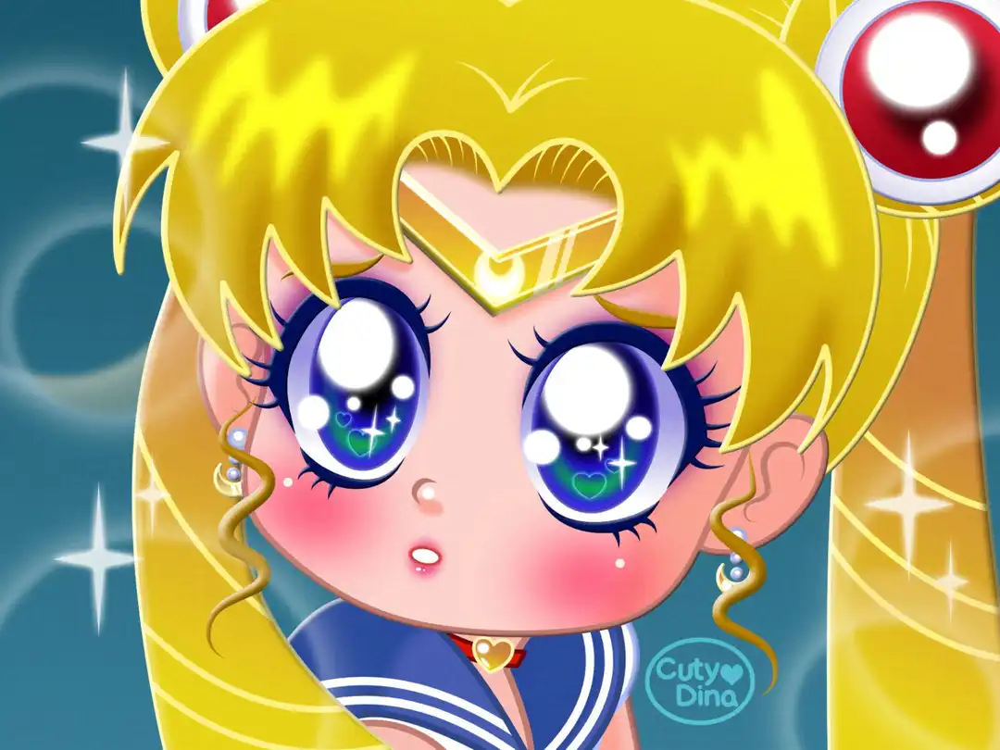
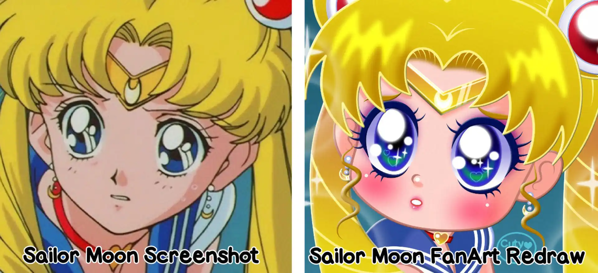
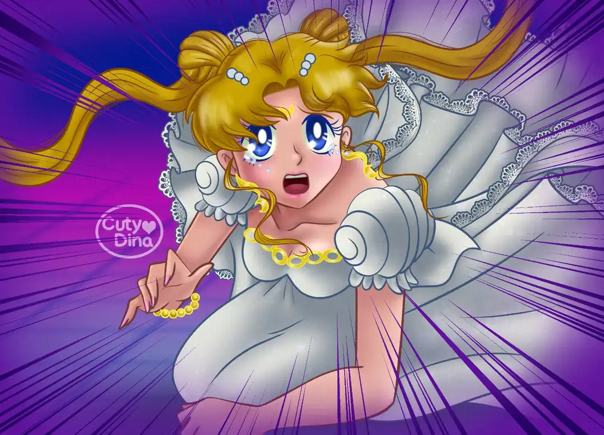
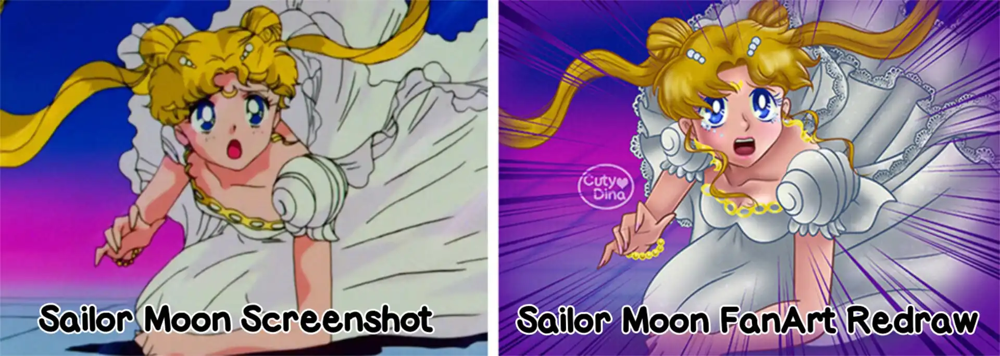
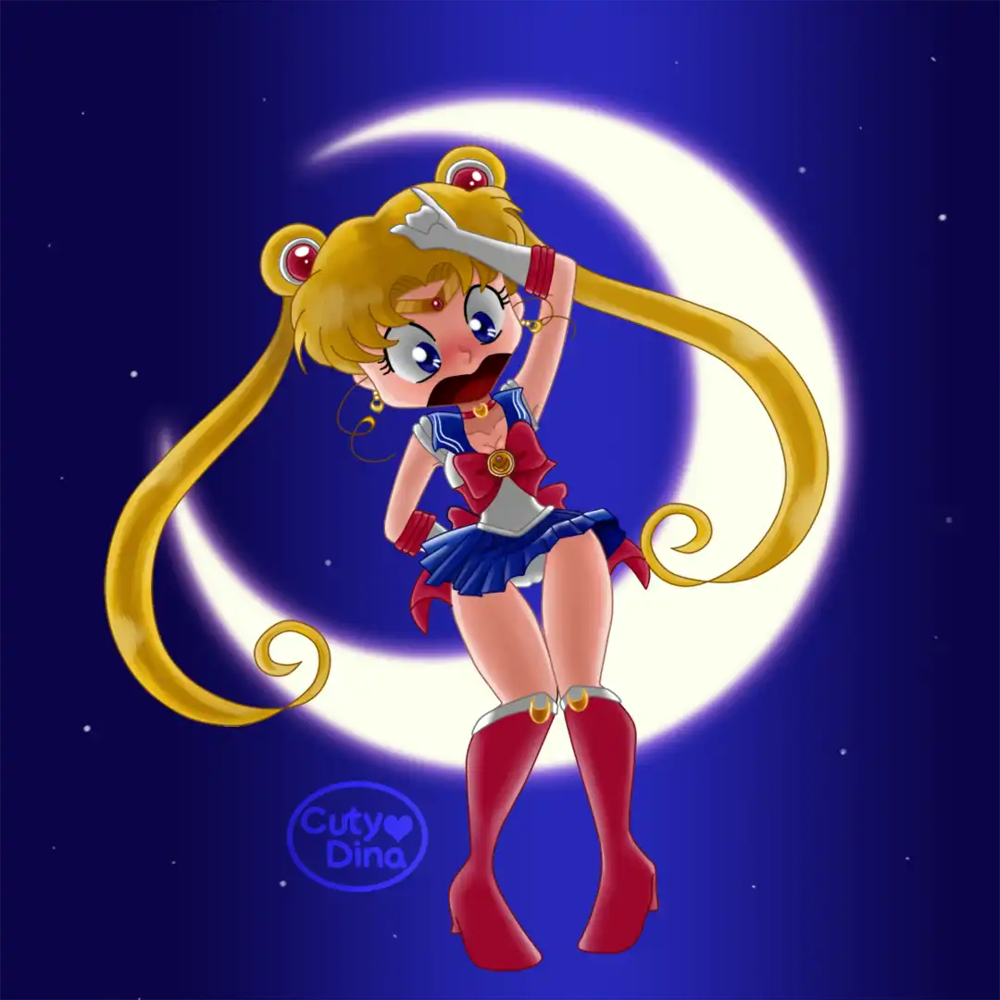
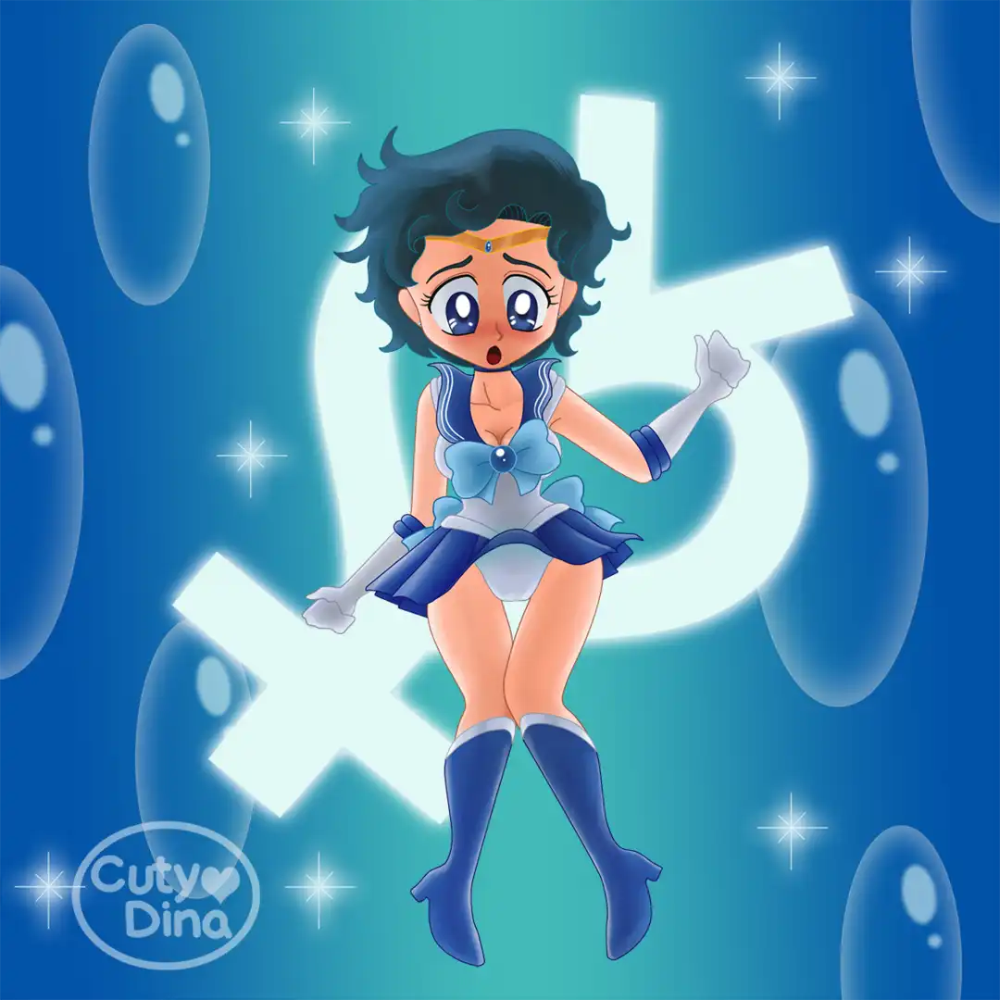

+++
title = "Sailor Moon FanArts"
date = 2020-05-20
draft = false
+++

Sailor Moon has been an anime that greatly influenced my childhood and adolescence, I'm quite fond of it. That's why, the day the **#SailorMoonRedraw Challenge** came to social media I think, why not? I love this anime series and I have always liked their characters and drawing style. And as always, I've used this drawing challenge to try new effects with Affinity Designer. 

 

## Original VS Redraw

 

Also I do this one at 2019, when the **#SailorMoonRedraw Challenge** started, but still wasn't such a trend as now. This time I just pick up a screenshot with a lot of emotions and redraw it, I really love to draw facial expresions and try to transmit emotions with my illustrations.

 

## Original VS Redraw

 

## Oldies Sailor Pinups

I really enjoy doing this fanarts in the past. Was fun make sailor scout in their presentation pose. 

 

 

