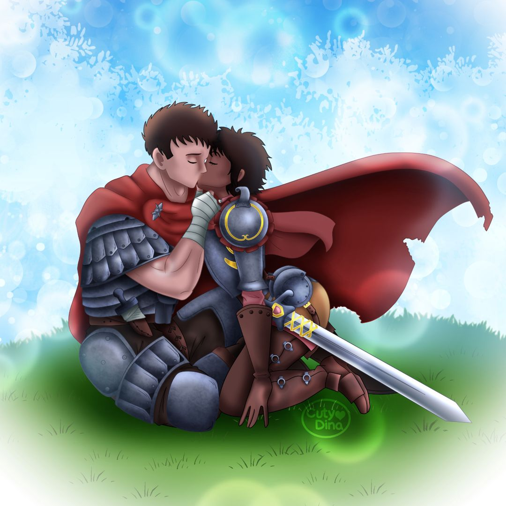

+++
title = "Berserk FanArt"
date = 2022-05-21
draft = false
+++

My husband has been a fan of this manga since it first came out in Spain. **Berserk** has been a worldwide phenomenon in the genre of shonen setting in a Medieval Europe with a dark fantasy world. Manga was written by Kentaro Miura, who unfortunately passed away a few days ago and that made my husband very sad, since he has followed his work since the begining. So I offered him to do a fanart to honor one of his favorite authors, and he asked me to recreate this mythical scene in the manga, which is the first kiss between **Casca and Guts**, one of his favorite couples in the anime world.

### Timelapse


