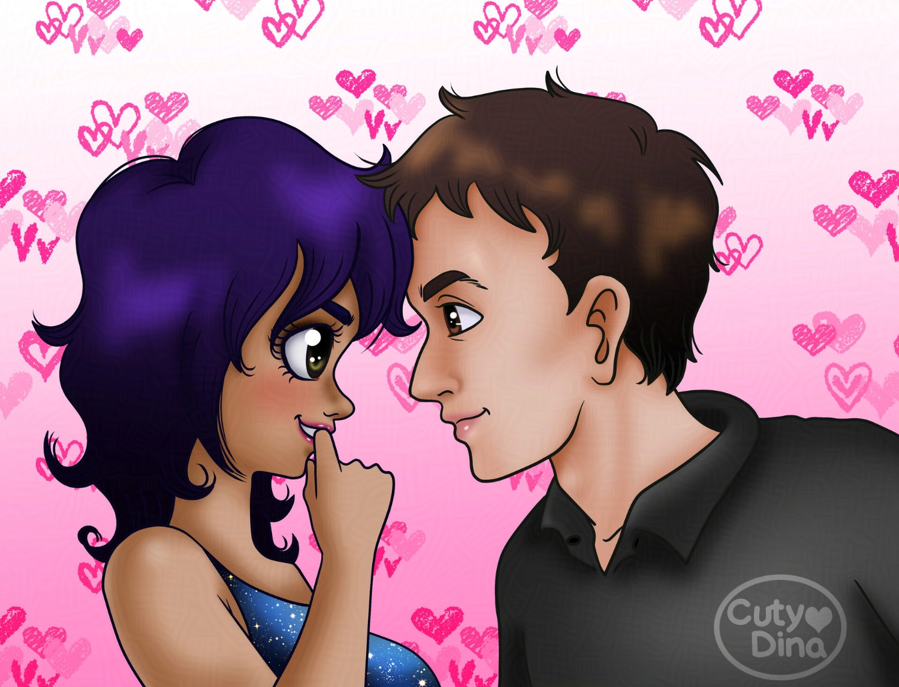
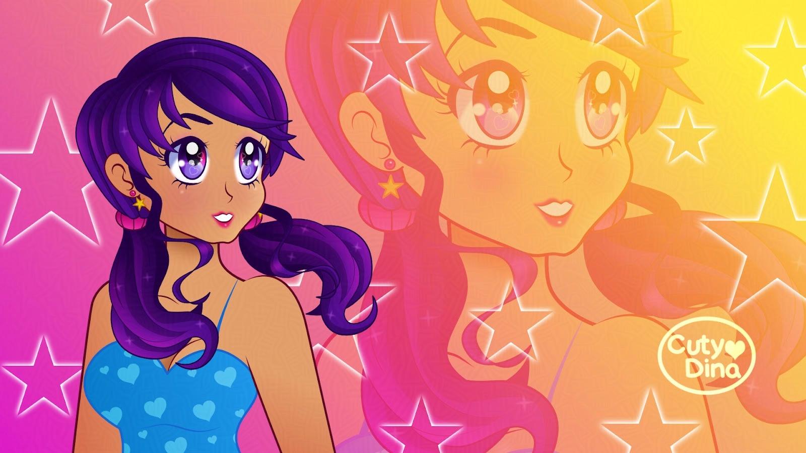
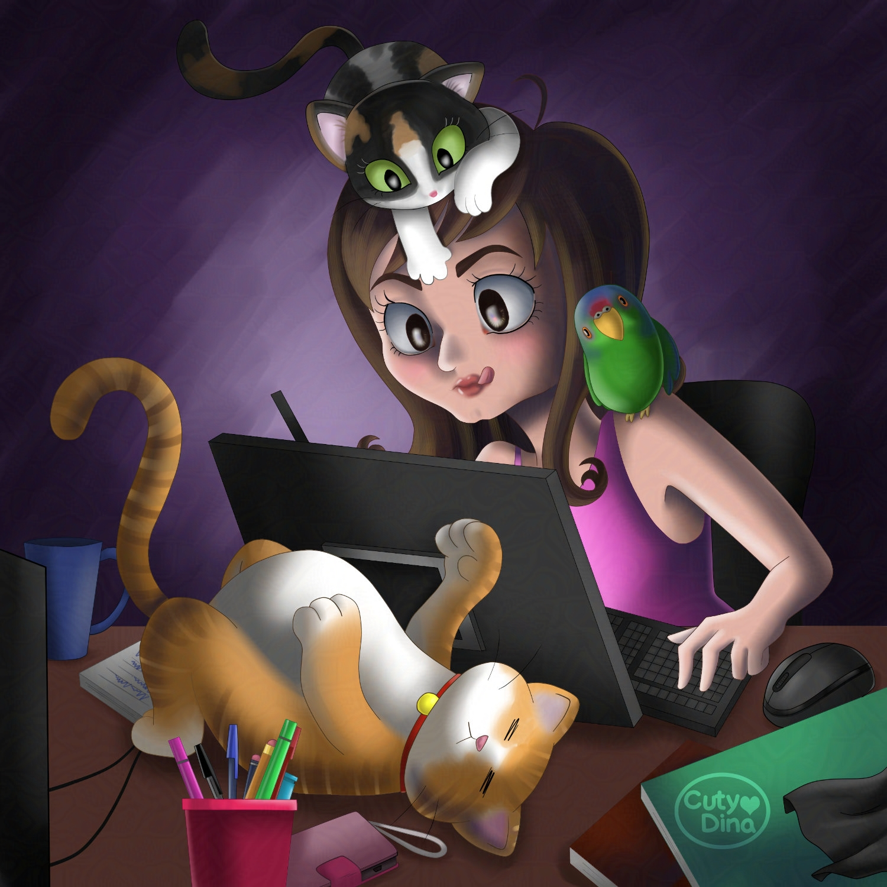
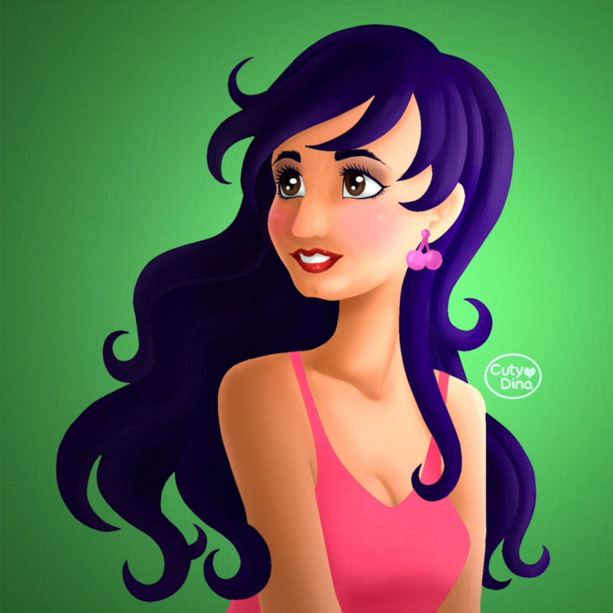

+++
title = "Cartoon Portraits Collection"
date = 2020-06-25
draft = false
+++

Some cute avatars I made a time ago. These ones are the ones I like the most.

2021: I'm a little cheesy today... Suddenly I really wanted to do a cartoon portrait of me and my beloved husband. I know how hard it is to find that right person in this sea of people. And the truth is that there is not a day that I am not grateful to have found someone like him to share my life with.

2020: Cute Kawaii wallpaper made with **Affinity Designer**. This drawing was made for testing the Affinity tools, and I have to admit that I didn't miss anything from Adobe ones. However, the main origin for this character was to use it in **Adobe Character Animator**, which helped me a lot to learn how to use this software well, but in the end I decided to use it only to create this wallpaper. Since as I said, I have decided to stop using Adobe due to its excessive fees and I’m dedicating more to learning OpenSource programs. Although I must admit that the live streaming of **Adobe Character Animator** is pretty cool.

2016: Who says pets are a nuisance? I adore mine, although sometimes they ask me attention while I'm working, but who cares, the love they give me is immeasurable. That's why I decided to create this illustration using my recent Bosto tablet surrounded by my lovely pets, and I don't know, for a change, I changed the color of my hair, although I think I'll still prefer my usual purple hair.

2013: I think it is important to see how one evolves as an illustrator over the years. And in this illustration I decided to test some new techniques that I have learned. Using **Paint Tool Sai**, which I have always liked due to the ease of shading and illustrating the old-fashioned way. In short, a digital self-portrait with a cartoon touch, and I really loved the result.

