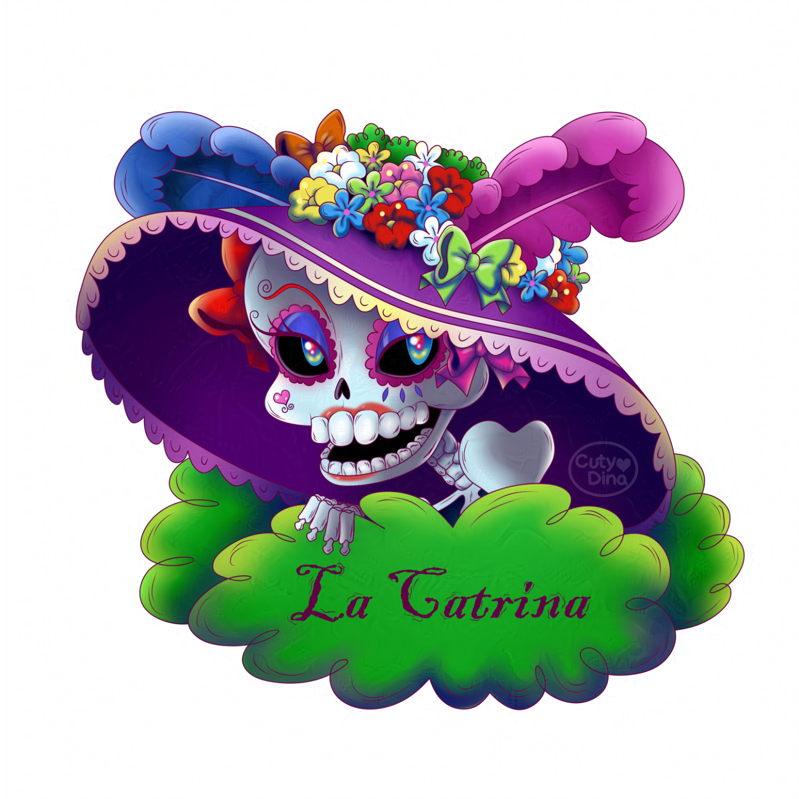
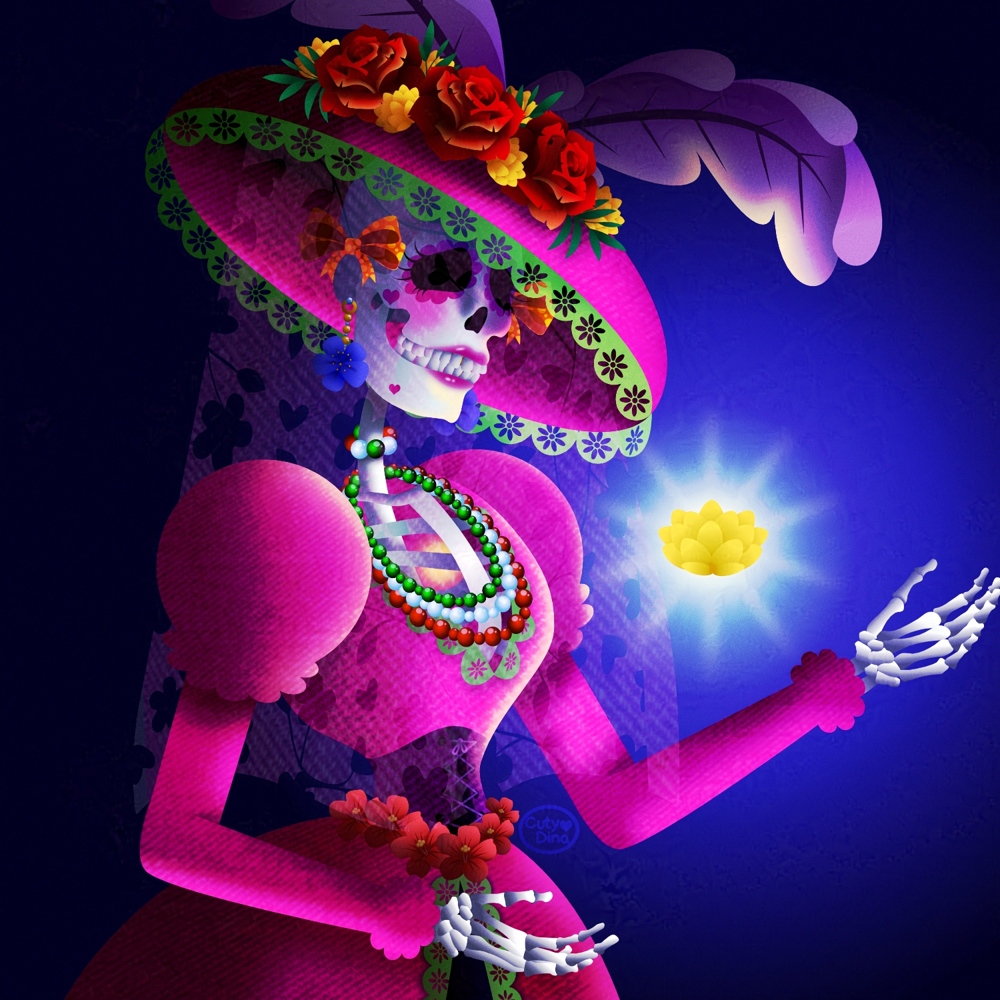

+++
title = "La Catrina"
date = 2022-10-22
draft = false
+++

**2018**: This month I wanted to do something more Mexican related. As a Mexican, I must admit that I rarely do things related to my culture, that's why I decided this year to make an adaptation of Catrina for this Día de Muertos. This Catrina is based on the original **Catrina** from [José Guadalupe Posada](https://www.biografiasyvidas.com/biografia/p/posada.htm).

**2022**: I haven't uploaded illustrations for a long time; with so much work I haven't had time to dedicate myself to illustrating, or rather, I've been dedicating myself to many things. Anyway, despite the [#affinitober](https://affinityspotlight.com/article/the-best-of-affinitober-2022/) right now, which is about daily drawings, I decided to make a Catrina. I love that it can be very detailed and colorful; that's something I love about Mexican culture.

This time it took me a while to add shadows and textures. I hope you like it; I was trying to do some light study, but I know this is not my main skill. Anyway, I hope you like it.

