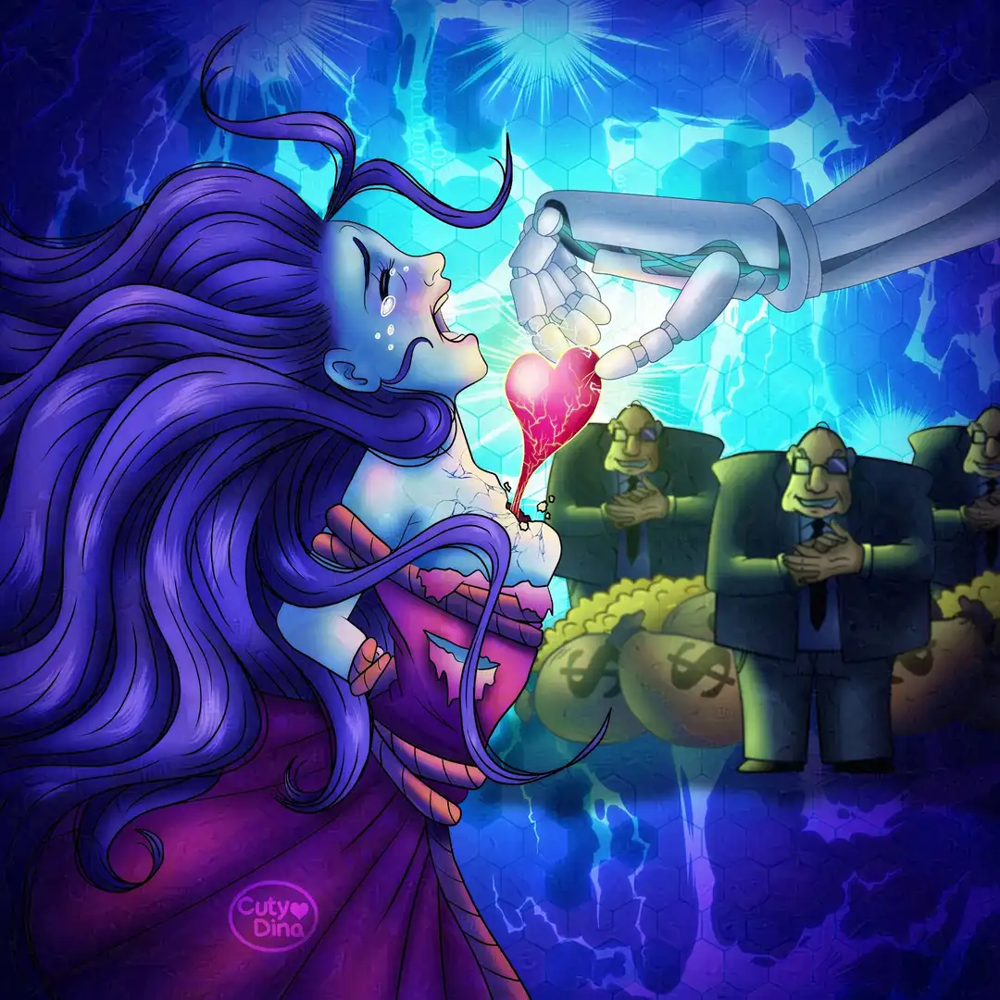

+++
title = "Fighting against AI"
date = 2024-01-28
draft = false
+++

They have been difficult times since the appearance of the famous "AI" in our lives. Thousands of jobs are on the brink of collapse and unfortunately there is no defense for the working class. Although the sector that has hurt me the most and has been the famous *“art”* created by this abominable tool. I may be old fashioned but I will never accept that type of content. Since trying to replace something as valuable and unique as art seems to me, as I have said before, a complete abomination. We can automate stuff, we can use it to do repetitive work and dangerous for humans, but using to trying supplant human soul I think there is no forgiveness to that.

From "writing" books or stories, to trying to *"compose"* music, to *"drawing"* art and even *"create"* animations, it has been something that has really plunged me into a very deep sadness since last year. Fortunately I still work and I love my job, but my desire to create new content with the amount of horrible things that have happened in recent years has been waning. Just these days, following the news about this sector, I discovered [Nightsade](https://nightshade.cs.uchicago.edu/) and [Glaze](https://glaze.cs.uchicago.edu/), I'm going to apply this tool in my art while i can, since it is not fair that a machine feeds from artist souls for just a few businessmen hungry for money, destroying what little remains of humanity today.
  
Àlso, I really appreciate my clients who still believe in real art and I'm grateful I still have work and I really enjoy doing it. But I'm so sad for new artists who maybe will not be capable to have an opportunity because people prefer using a machine instead of real human art. 

Anyway, thats why I think this idea came to my mind. I will start applying [Nightsade](https://nightshade.cs.uchicago.edu/) and [Glaze](https://glaze.cs.uchicago.edu/) to my job. I think as artists we need to defend our art and our way of living. Its incredible that every day everything becomes more complicated and more damaging to the good of a few pockets.  

And I know that I am just another number in this society, one more human, but hey, if I can do nothing more than contribute a small grain of sand to poisoning this tool of evil, I am going to do it.

## Time-lapse
Also, I exported the Time-lapse on [ClipStudioPaint](https://www.clipstudio.net/). I haven't done any modifications, want to keep all the details so you can see how my creative process works. Start creating and modify in the process, decide each line, colors, and adds, that's the magic of human art.<i class="heart-animation"></i>


