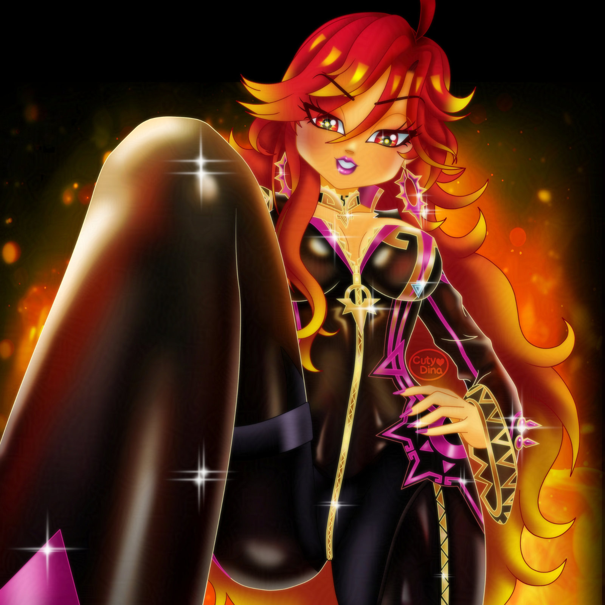
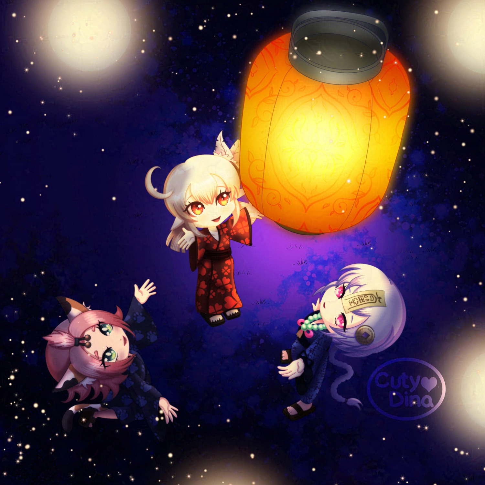

+++
title = "Genshin Impact FanArts"
date = 2024-07-24
draft = false
+++

### Mavuika FanArt
Sometimes my fanart or illustrations ideas came from requests from my husband. Like this one, this time the character is **Mavuika** from [Genshin Impact](https://genshin.hoyoverse.com/en/). My husband fall in love with the character and immediately asked me for a fanart. However, I struggled a lot with the fabric texture, I must admit that I still have a hard time handling certain kind of fabrics, especially latex. But well, the main change I did here was the internet joke that the character looks too much as **Sunset Shimmer** from Equestria Girls, so I draw Maviuka with the same colors as Sunset Shimmer. I like the result, the only thing was the fabric... but I try it. Anyway, I hope you like it. 

 
  
#### Time-lapse



### A sea of lights

Lately I have started with this great game made by [MiHoYo](https://www.hoyolab.com/genshin/). And the truth is that I have loved the character designs and their beautiful landscapes. So I decided to participate at a contest they did for the game event called *"A sea of lights"*, which consists of the Japanese tradition of launching lanterns into the sky with wishes on them. . Hope you like it.

 
