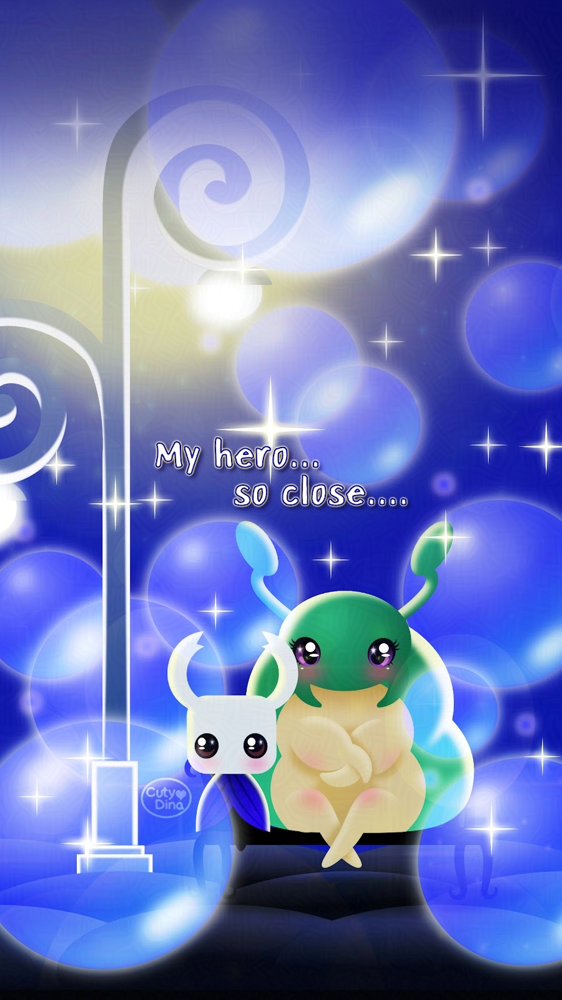
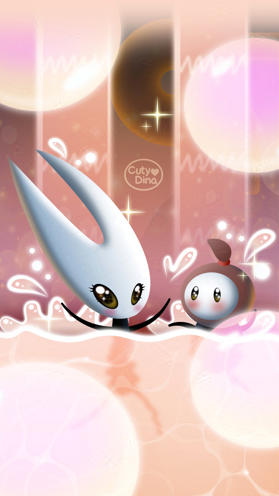
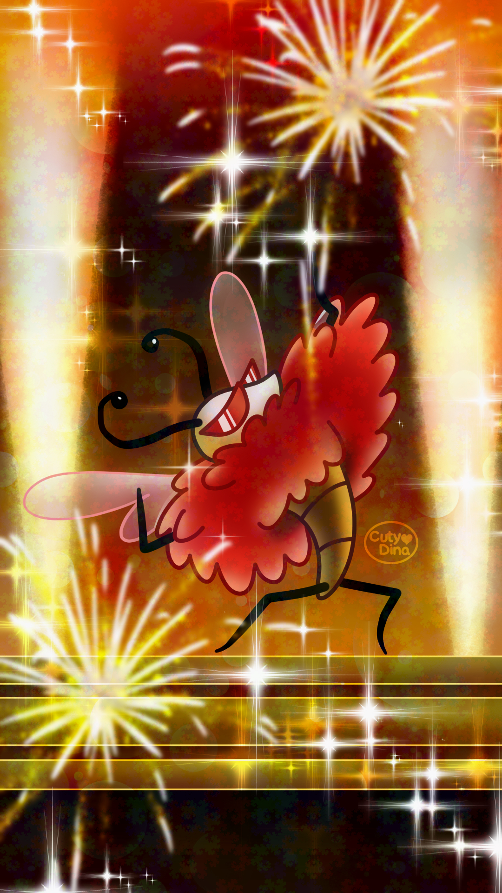

+++
title = "Hollow Knight FanArts"
date = 2025-10-10
draft = false
+++

### Bretta and the knight

I have to say that one of my favorite hobbies is video games. However, I don't always find a game that gets me so hooked. But this one had something special, perhaps because of its adorable designs and its melancholic appearance or perhaps because of its gameplay that was more similar to the games of yesteryear. A mixture that I must say that I fell in love with. And, despite having an unconventional narrative, I ended up totally getting into its environment.

However, I must say that the story that I liked the most in this game is  Bretta, who I must say became one of my favorite characters. A simple but adorable story. A small caterpillar that at the moment of being rescued by the knight becomes our number one fan, as well as falling deeply in love with us. I've always been a fan of unusual love stories, and I think that's why I was so captivated by this one.

Anyway, here I leave this last fanart related to one of my favorite scenes, giving a more colorful and romantic touch to the scene, just to give it a more personal touch.

 Also, I decided to animate this one. I really enjoy give more life to my illustrations, so this time I decide to animate it on OpenToonz, also practicing the effects and stuff the software have. I really love that software. This was the result. Hope you like it. 

  



 
   

### Hornet and Sherma

New fanart from Silksong, with Hornet and Sherma. Will do animation later as I do with HollowKnight one. 

  


 

### TROVIOOOO!!!

An extra fanArt made for my husband. He became a big fan of this character. 

 

