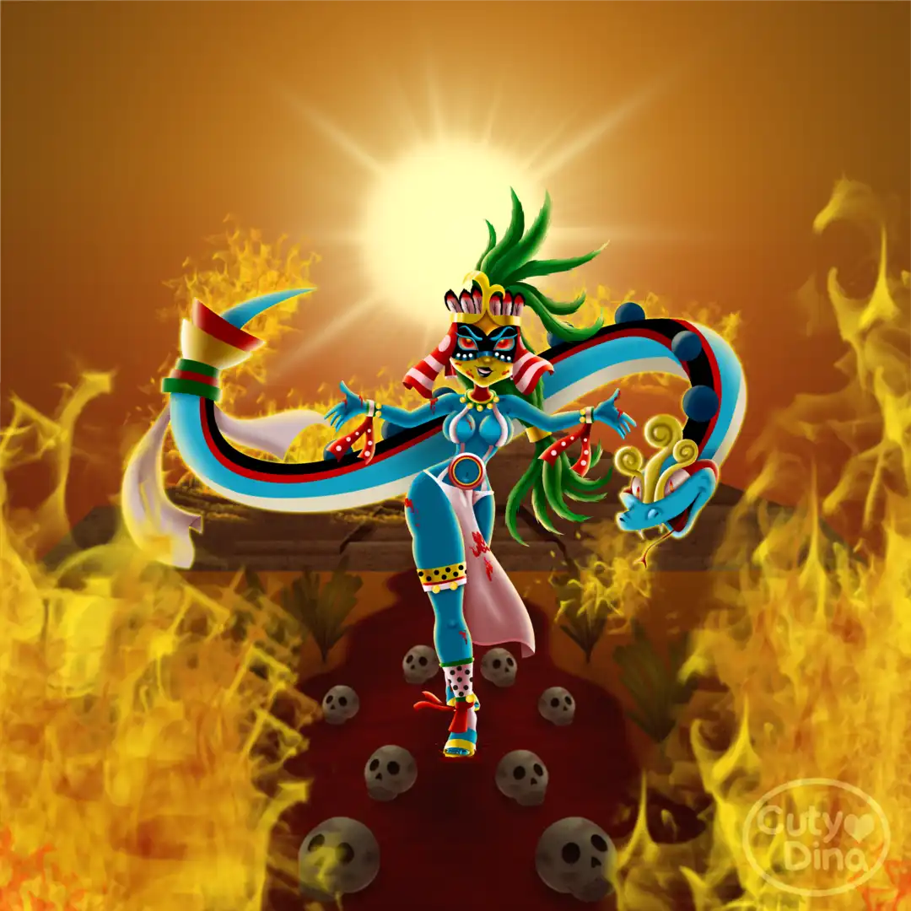
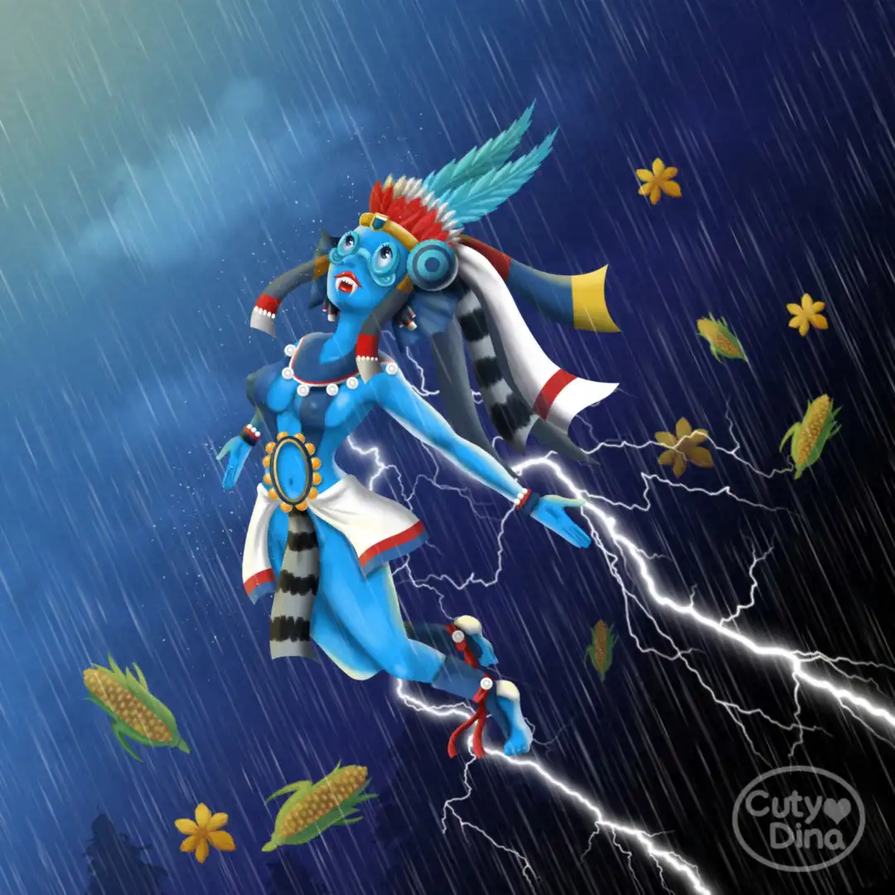

+++
title = "Mexican Gods Pinups"
date = 2018-06-25
draft = false
+++

Some ideas about gods of Mexican culture in Pinup style. I took their most common characteristics and humanized them in cute girls, for the background I took their descriptions as gods as a reference.

### Huitzilopochtli

Pinup based on the **God of Mexicas** that symbolizes the perpetual struggle between the sun and the moon through the firmament as the solar god. Also known the **God of Fire**, war and human sacrifices.

### Tlaloc

Pinup based on the **Aztec God Tlaloc**. God of rain, being well known for its ability to dominate the water and provide the vital liquid or also called **Earth Liquor** that contributed to the growth of corn crops.

