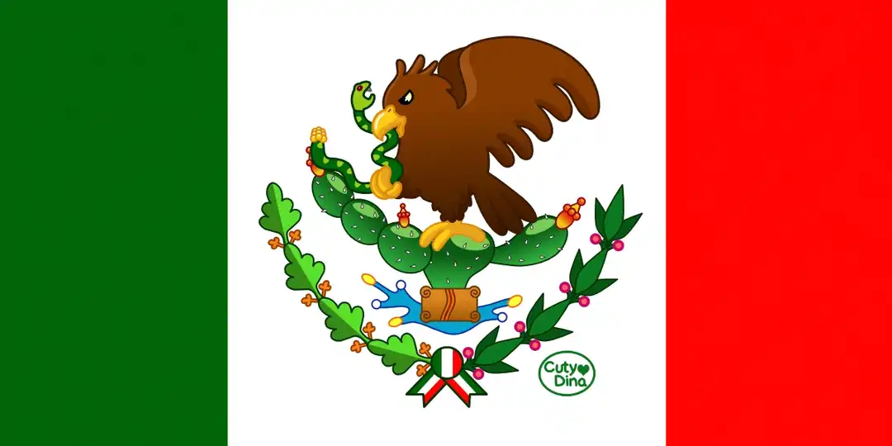

+++
title = "Mexican Flag"
date = 2013-06-25
draft = false
+++

Vectorial mexican flag design. The logo is based on the history of pre-Hispanic Mexico when Tenochtitlan was founded, represented with an eagle devouring a snake on a cactus. Also the colors have meaning for this flag, **GREEN** as hope, **WHITE** as unity and **RED** as the blood of the fallen soldiers in the battle for independence.

 