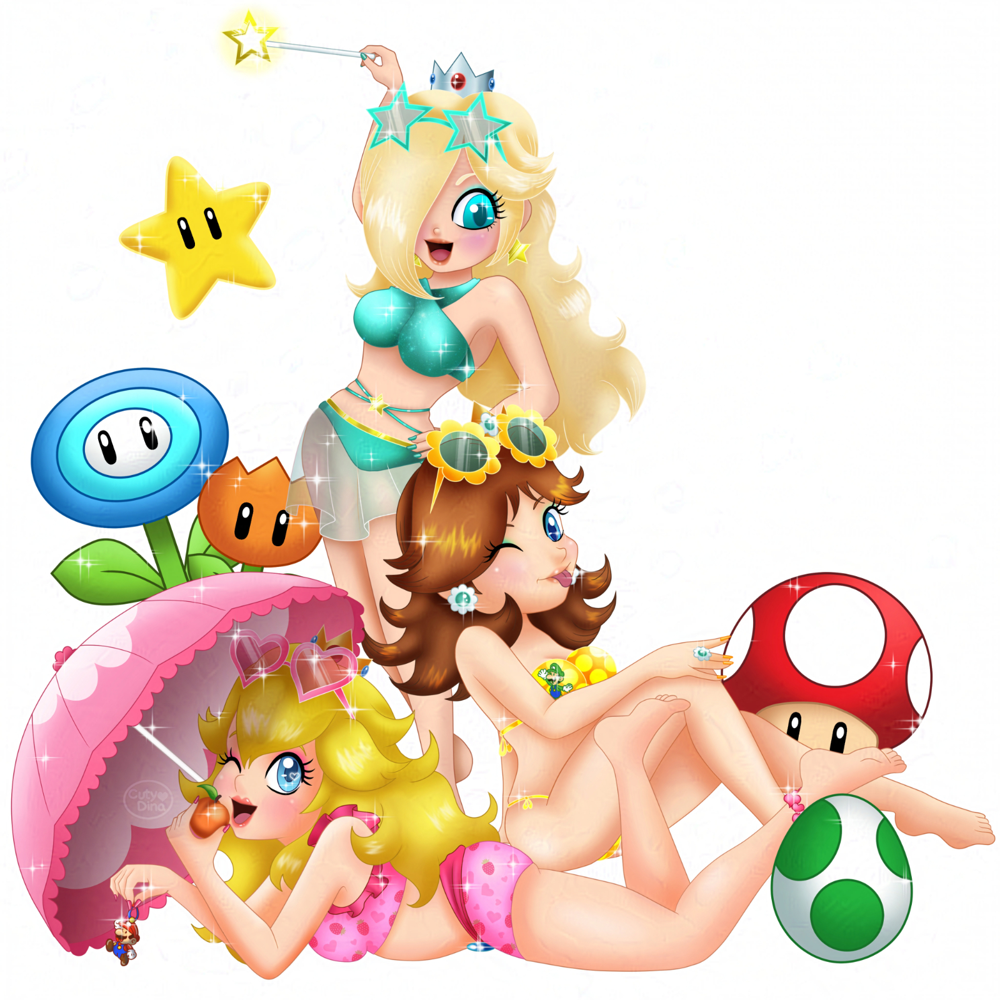
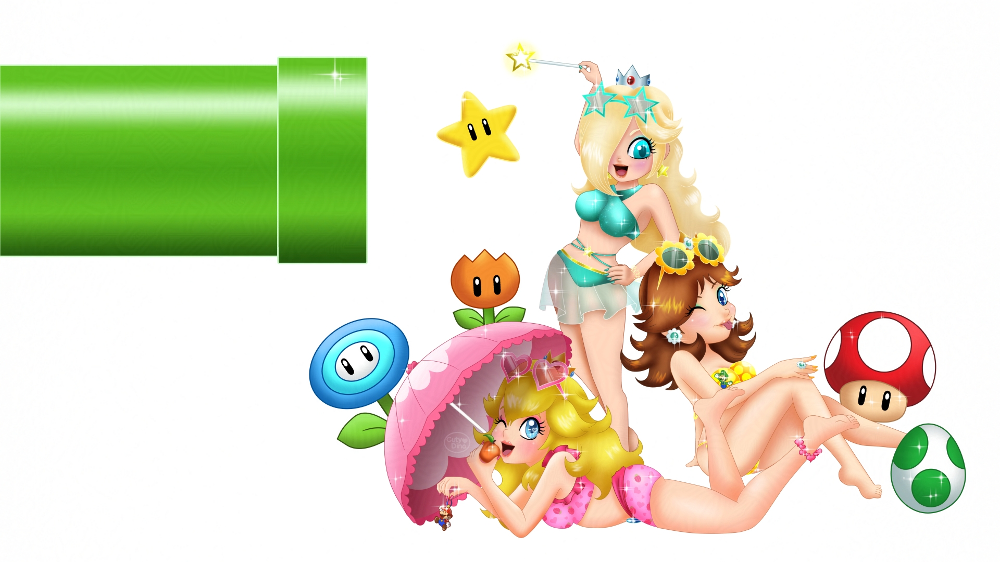
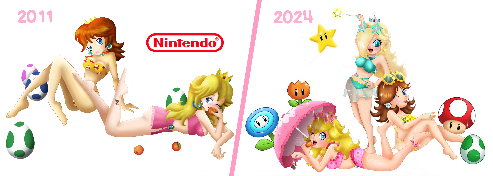
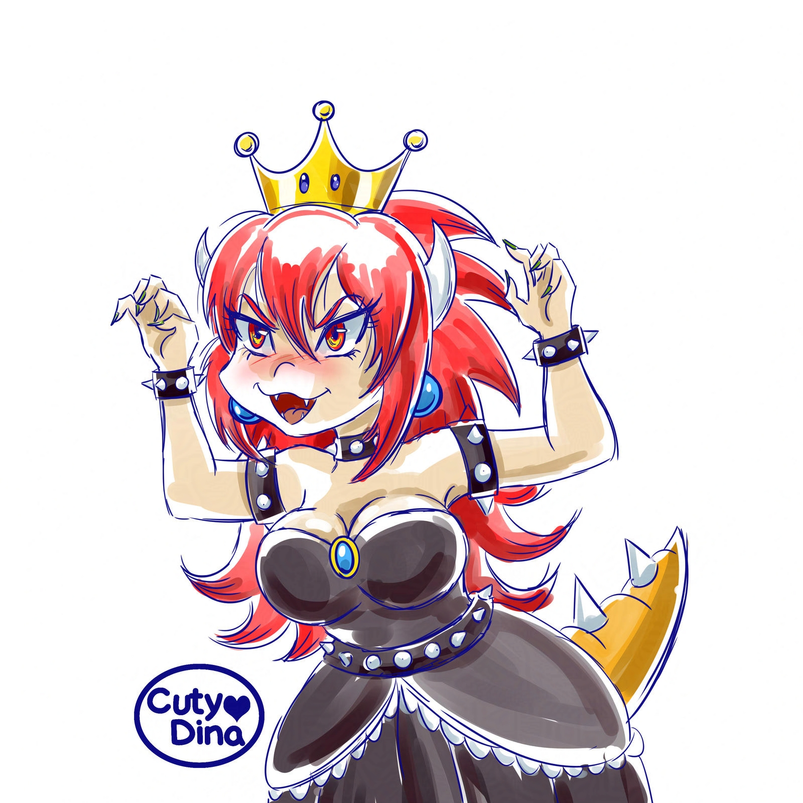
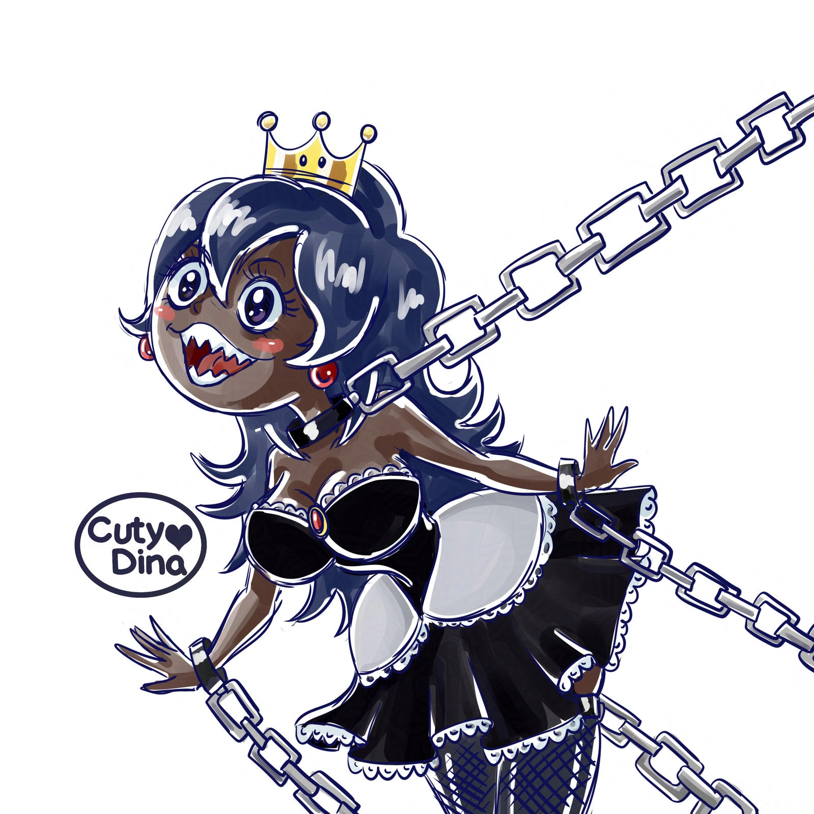
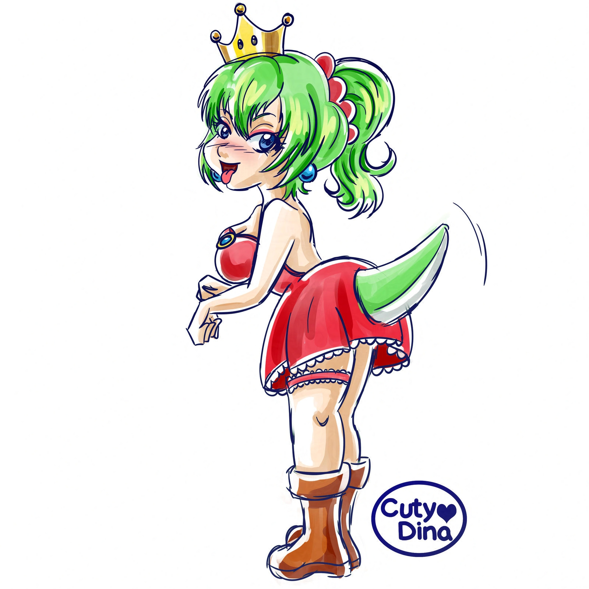
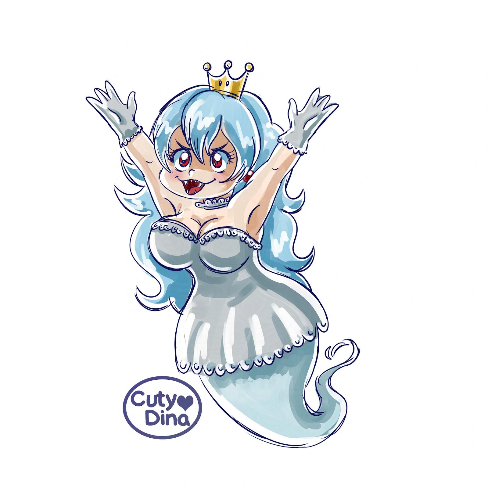

+++
title = "Nintendo FanArts"
date = 2024-04-12
draft = false
+++

After some time not doing anything digital, I decided to draw again on my tablet. Sorry for some issues in the image, but in these times, we need to poison everyting we upload, since there a a lot of ai thieves on the internet. Anyway, this is a redraw of an old drawing of mine I did long time ago. Enjoy.

 

### Time-lapse



### Desktop Wallpaper

 

### Before and after

And suddenly this concept became a trend. I have always loved the **Super Mario Bros** saga, so I couldn't help but want to participate in this trend. I decided to use a quick style and more based on the manga style. I really love using new styles and trying different ways of coloring.

