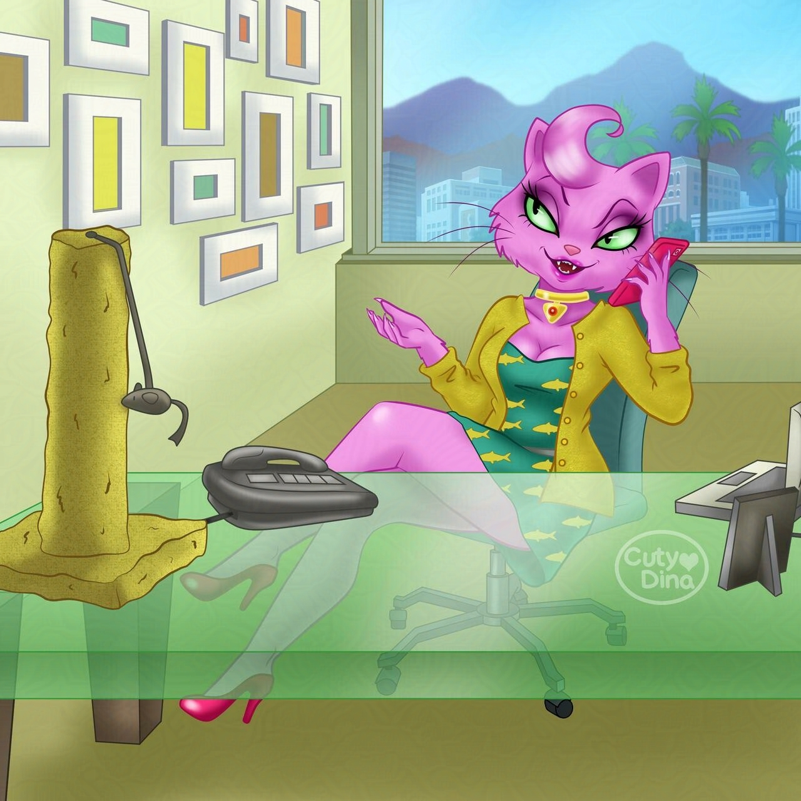

+++
title = "Princess Carolyn"
date = 2019-11-08
draft = false
+++

I have to admit that **Bojack Horseman** was a series that I loved from the beginning. Its acid humor and its complex story based on anthropomorphic animals seemed very original to me. So when my husband and I finally finished the last season, I decided to make a fanart of this series. Therefore I thought about which of these characters I had liked the most and I opted for **Princess Carolyn**, since I really liked its design and personality from the beginning of the series and it has been the one that has evolved the most throughout the series.

