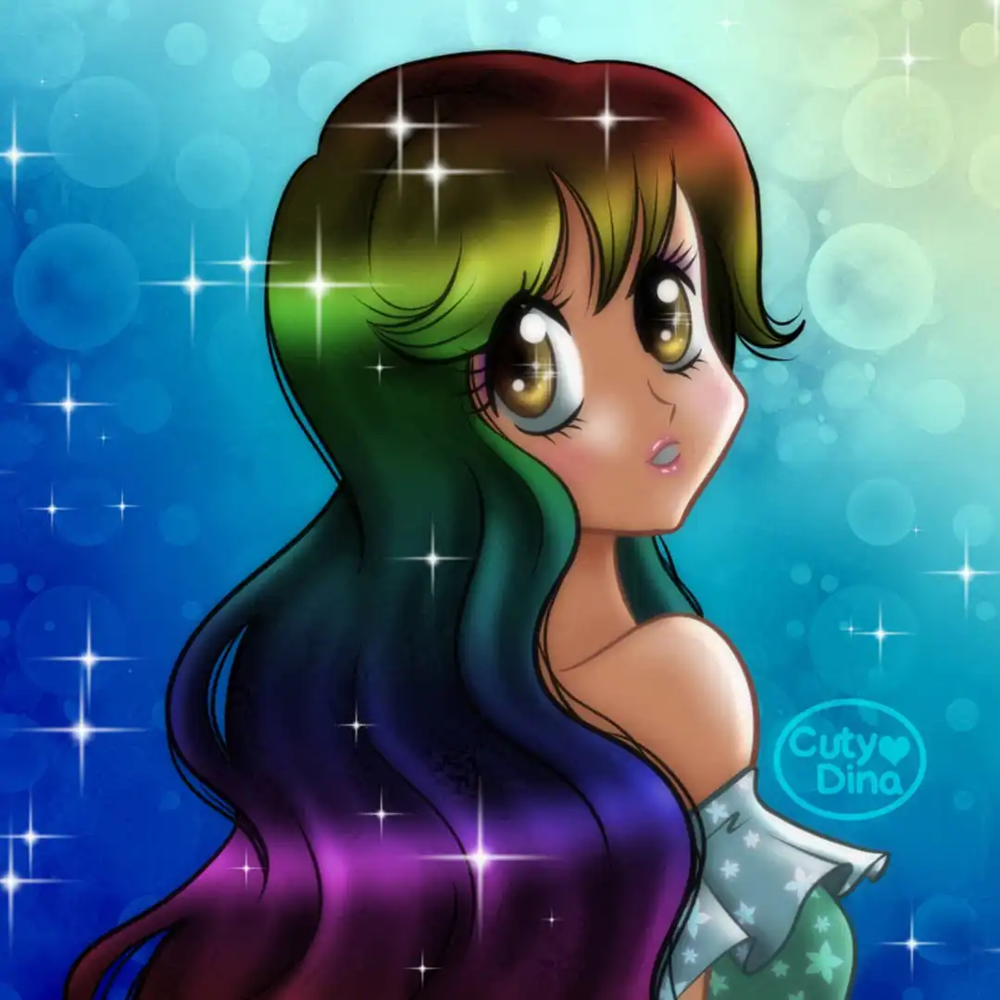

+++
title = "Rainbow hair"
date = 2021-01-11
draft = false
+++

Clip Studio Paint has just incorporated the **Time-lapse** feature in its program. And the truth is that I really wanted to try it, so I decided to activate it and draw the first thing that came to mind. And usually I end up drawing cute and colorful anime girls, but hey... the purpose of drawing is also to have fun, isn't it?

 

### Time-lapse

