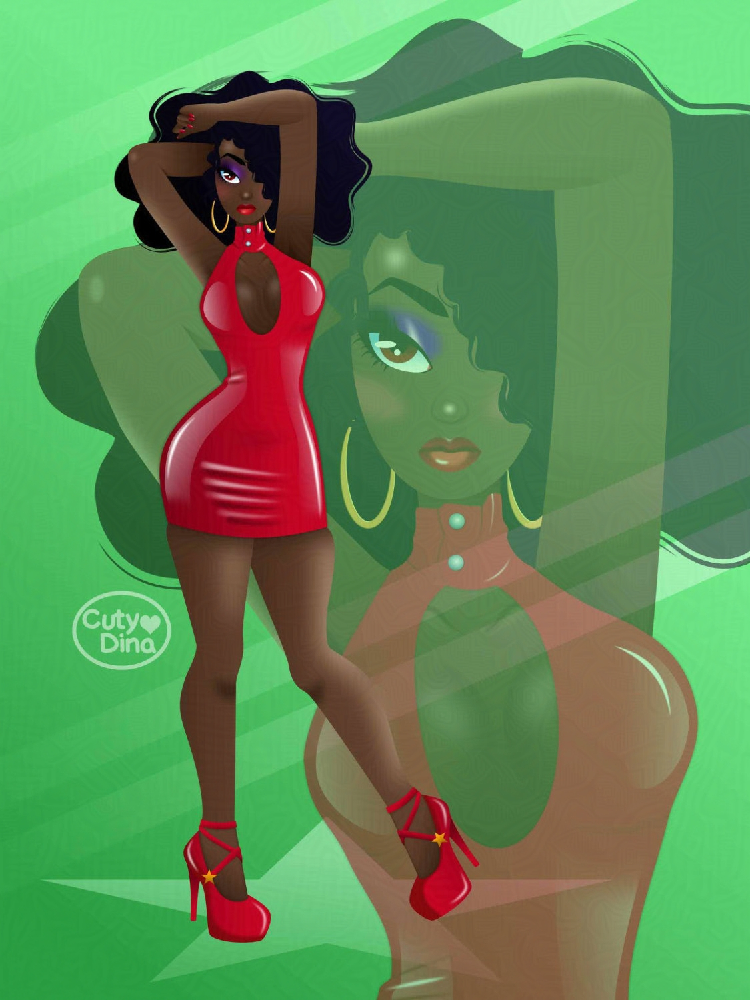
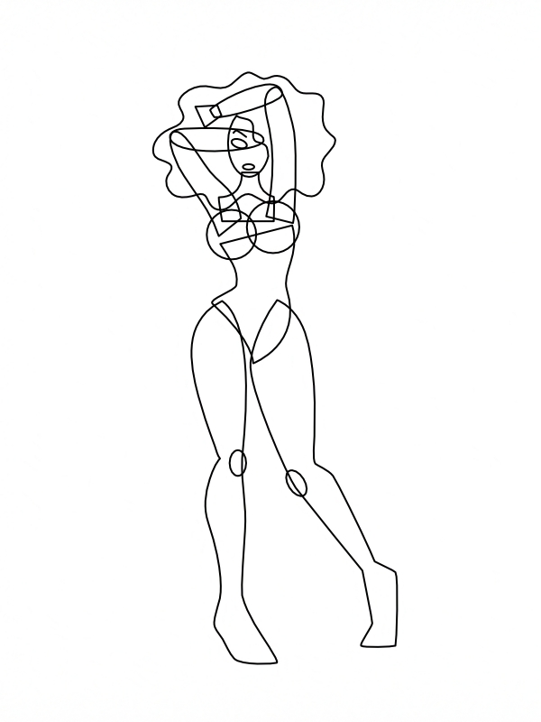
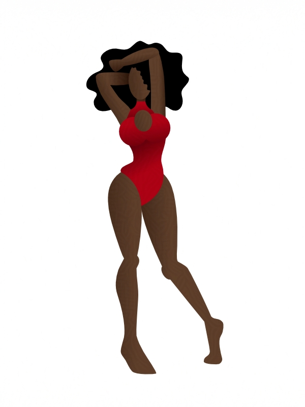
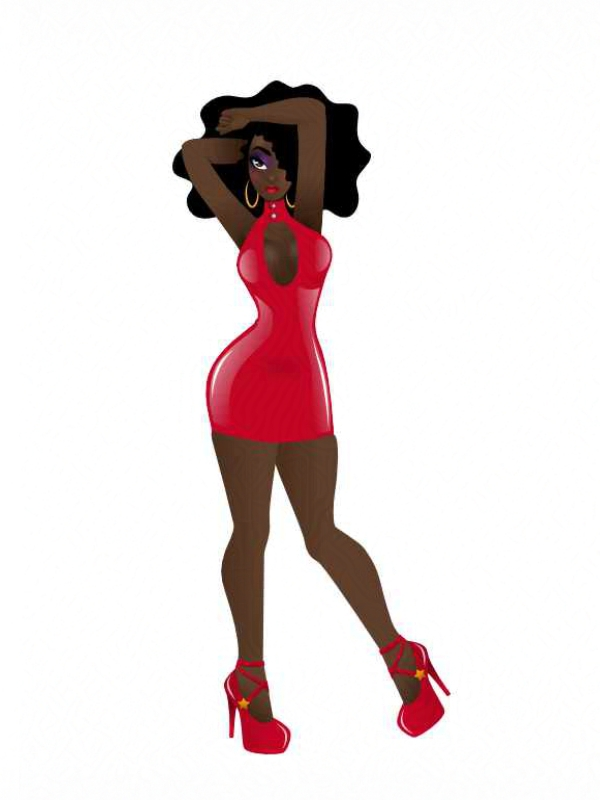

+++
title = "Red Latex"
date = 2020-10-05
draft = false
+++

Request from my husband. I always try to learn every time I try a new illustration, so with this illustration I decided to try a new way of drawing. Using the traditional drawing base, I decided to make the fit of the figure with vector geometric shapes, and from there I went on detailing each part of the body. I must admit that I liked the result and that it's a technique that I will continue to use in the future. I must admit that working with **Affinity Designer** has been a great discovery for me, and now I enjoy vector illustration more thanks to this software. In addition, the texture of latex is somewhat complicated, however thanks to it's tools and the appropriate references, I found the texture I was looking for for clothing. 

## Step by Step

From geometrical shapes, to gradients and adding details and effects. Although vector illustration has a different way of creation, it still needs a strong base of drawing and composition, since just as in digital and traditional we sketch with figures to polish the detail, here we create the figures directly and with help from the nodes we mold and color the shapes, playing with effects, gradients and line weights. 

