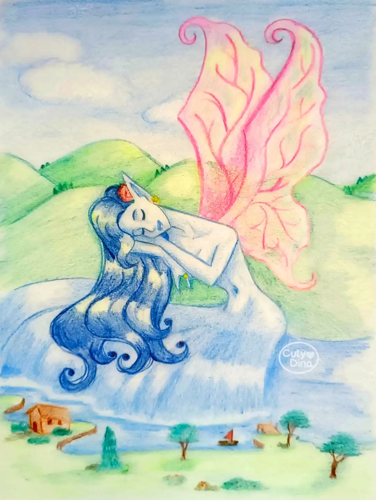
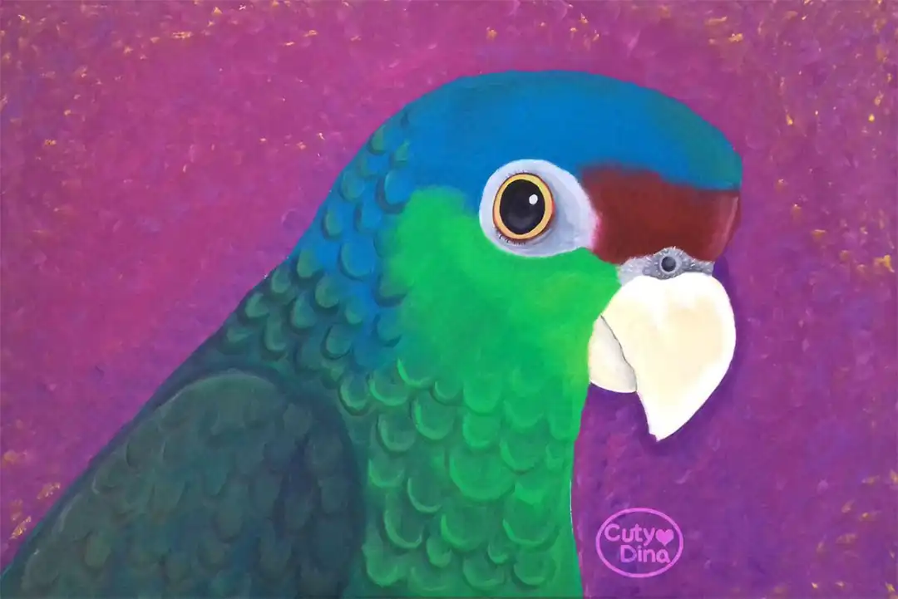
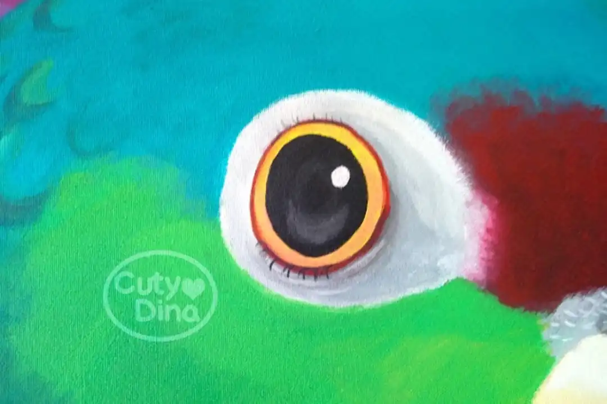

+++
title = "Traditional Drawings"
date = 2023-09-21
draft = false
+++

Some traditional drawings I've been working on lately, of which I've been uploading the processes on my [Tiktok](https://www.tiktok.com/@cutydina) and [Youtube](https://www.youtube.com/@CutyDina) account. In principle I wanted to vary the Digital a little, although each technique has its particular way of creation, the traditional one has always had something special. Although I must admit that the lack of Ctrl+Z is an aggravation that makes me suffer many times. But hey, it's always good to go back to the roots, and as I've always said, anyone who knows how to draw knows how to draw with any material or technique, whether digital or traditional. <i class="heart-animation"></i>

## Canvas Painting

### Shinning Tree

In this first one, I have to admit that I've always been fascinated by paintings based on the cosmos. That's why I decided to do something with an astronomical touch and at the same time some nature on it. I don't usually draw landscapes, but this time I decided to make a simple one, with a big and shinning tree at the center. I really enjoyed mixing colors and effects with acrylic. his painting has ended up as a decoration in my living room. 

 

**Material:** Acrylic on Canvas 

**Size:** 80 x 120cm

 

### Rika Portrait

Continuing with the plan of decorative canvas, and as the queen of my home, I decided to make a huge portrait of my lovely pet Rika. She rules the house, so I decided to make a portrait to suit her. Now is part of my room, watching us while we sleep. 

 

**Material:** Acrylic on Canvas 

**Size:** 80 x 120cm

