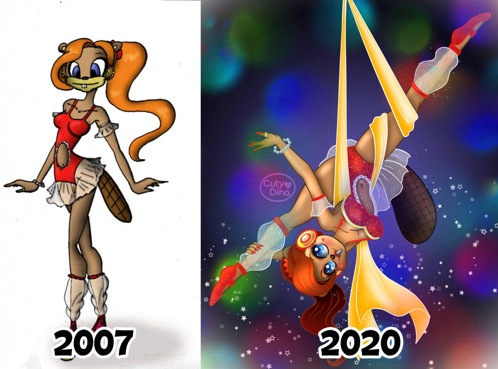

+++
title = "Trapezist Beaver"
date = 2020-05-17
draft = false
+++

I have always loved anthropomorphic animals, and there was a time when I started studying art that I made several sketches with this concept. One day I wanted to redo a character from this era and I found this little beaver, and I decided to redo it with the knowledge of digital art that I have been acquiring throughout this time. This illustration is made with **Clip Studio Paint**, a software that allows you to illustrate almost the same as doing it by hand, that's why I love it .

 

### Before and after

