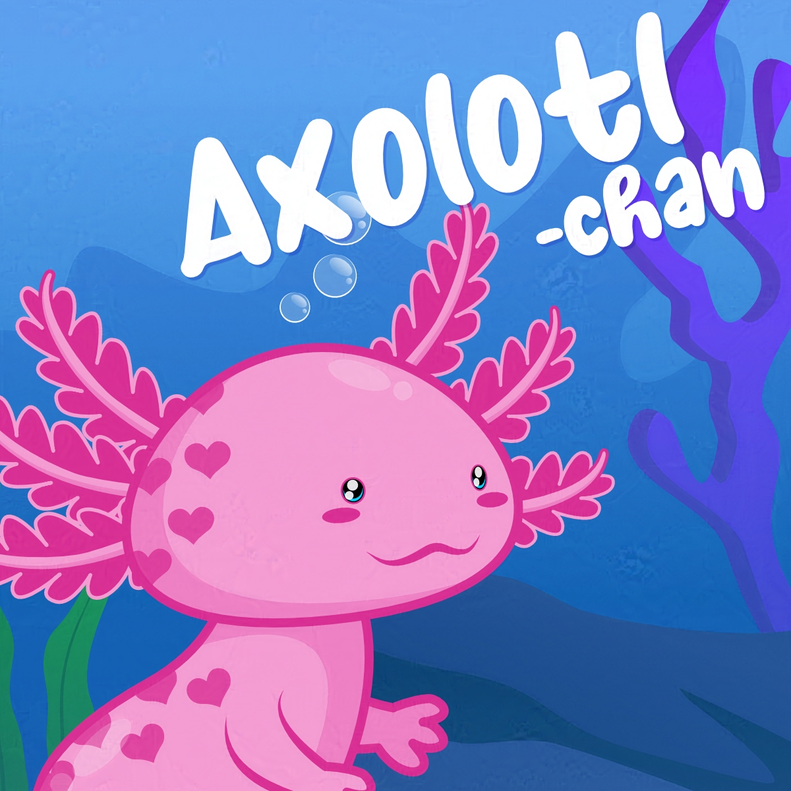
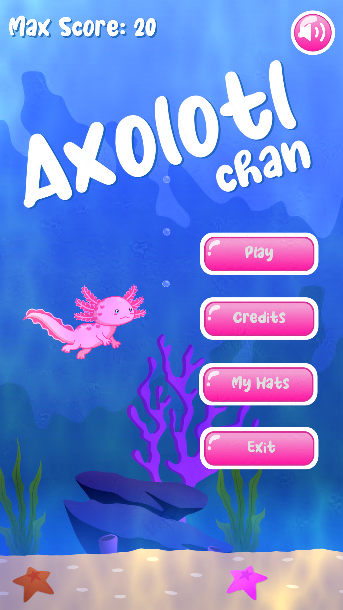
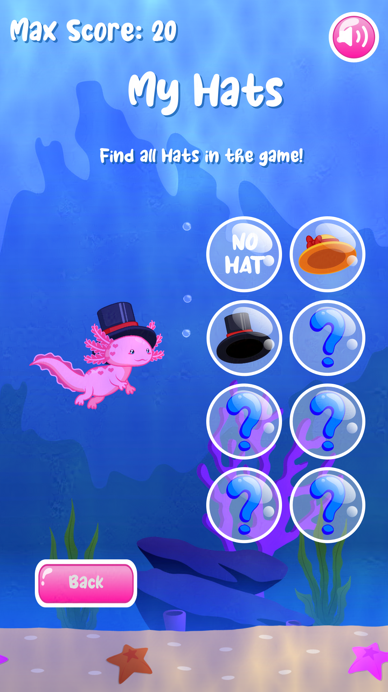
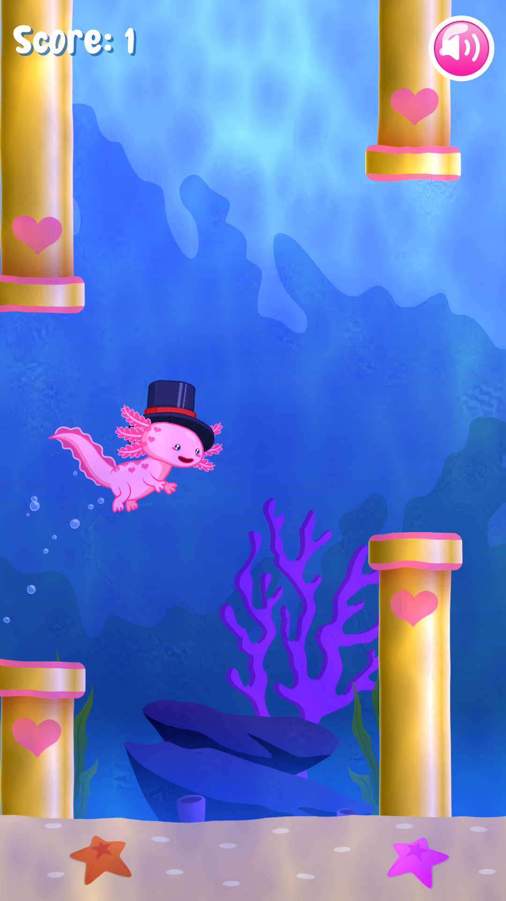

+++
title = "Axolotl-chan"
date = 2025-03-24
draft = false
+++

After a long time of coding, I finally get to publish my new version of Axolotl-Chan! I have been testing in Godot for a while now, and I decided to add some cute hats to my cute Axolotl. Remember you can play it for free at GooglePlay.

> "You are a small and adorable ajolote swimming in the sea and jumping obstacles. Try this flappybird style game where you will slap Axolotl-chan. And don't forget to get all the collectible hats!"

[Download for Free](https://play.google.com/store/apps/details?id=com.CutyDinaGames.AxolotlChan)

### Trailer


### Screenshots

  

    
  

  

    
  

  

    
  

