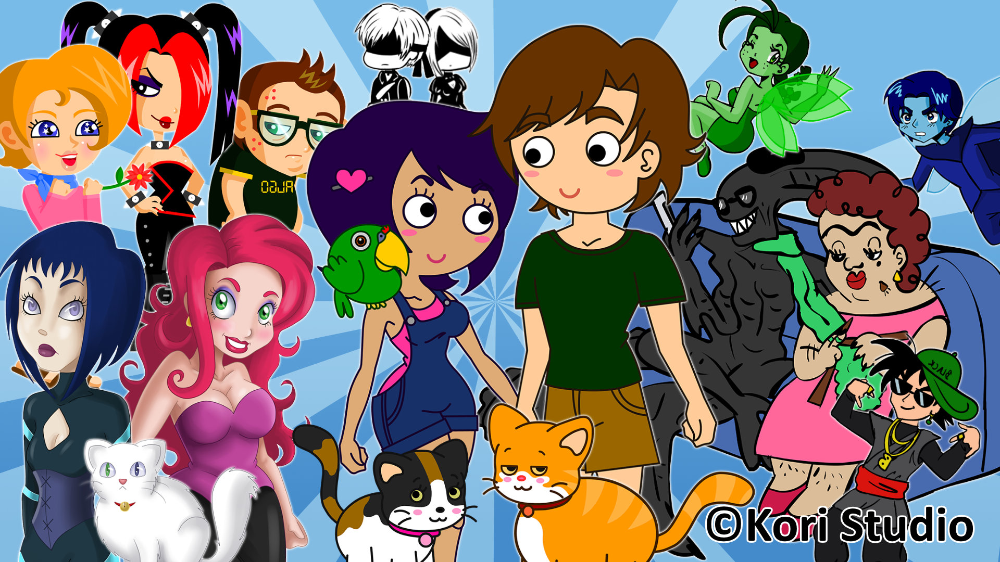
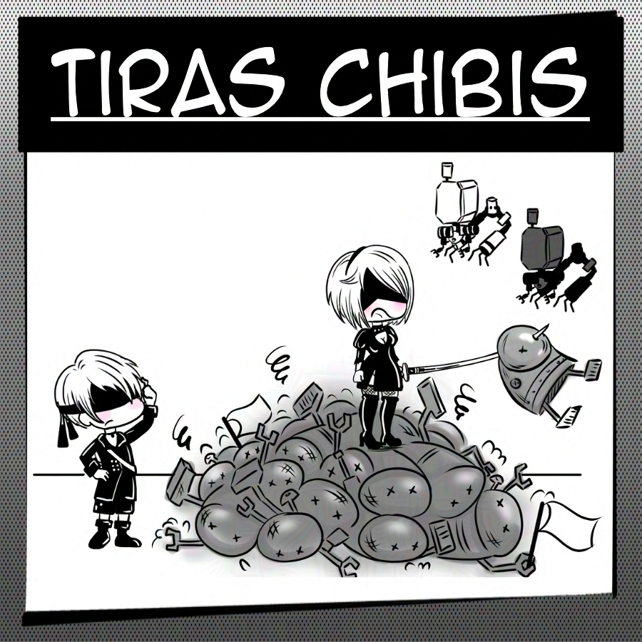
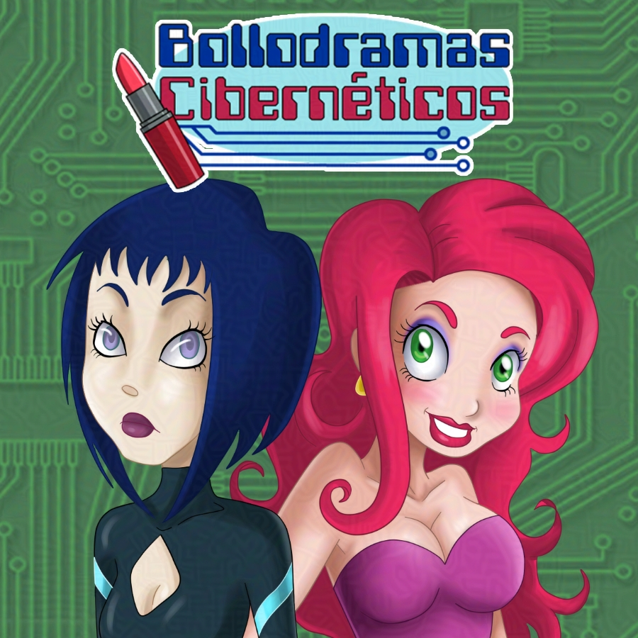
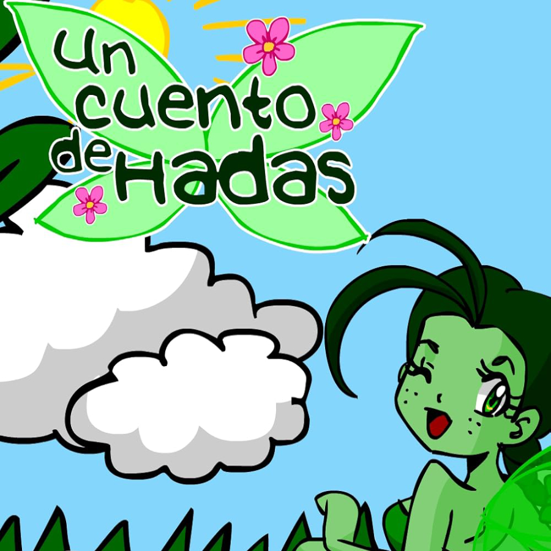
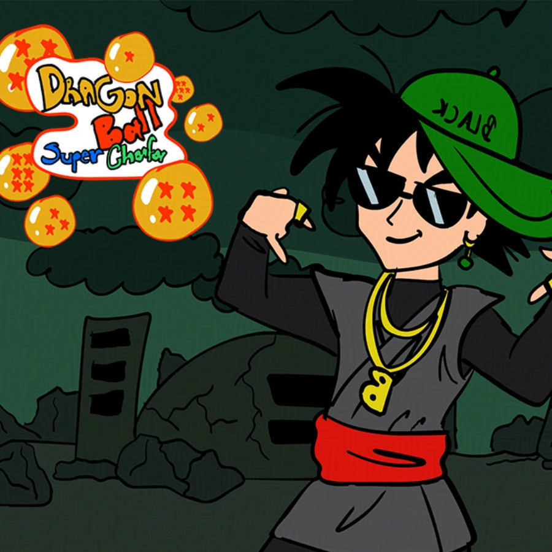
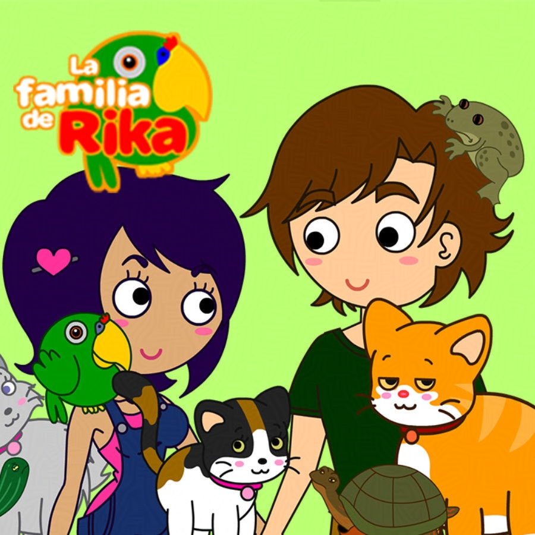
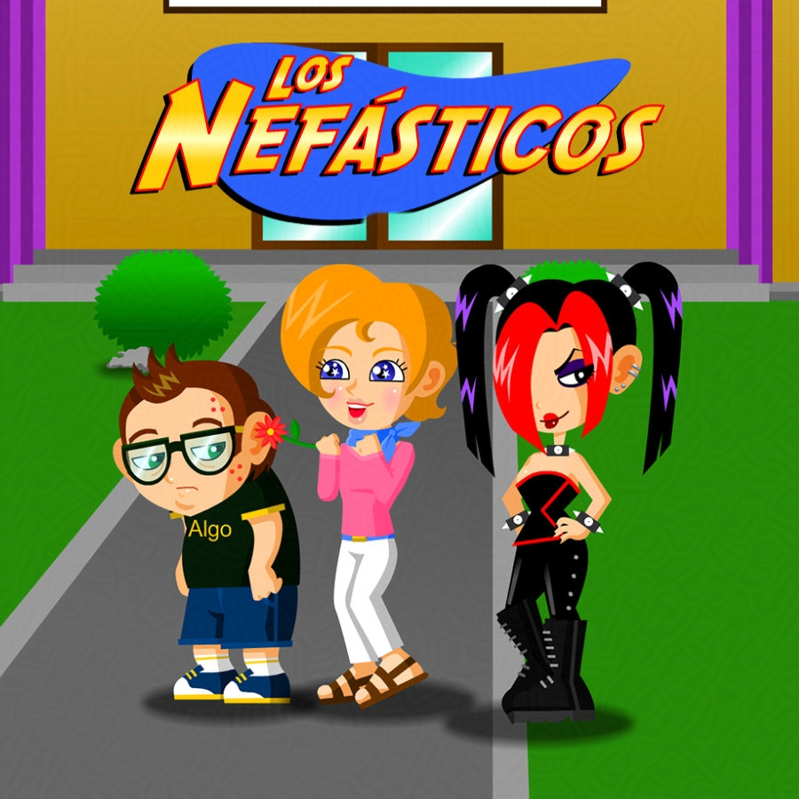
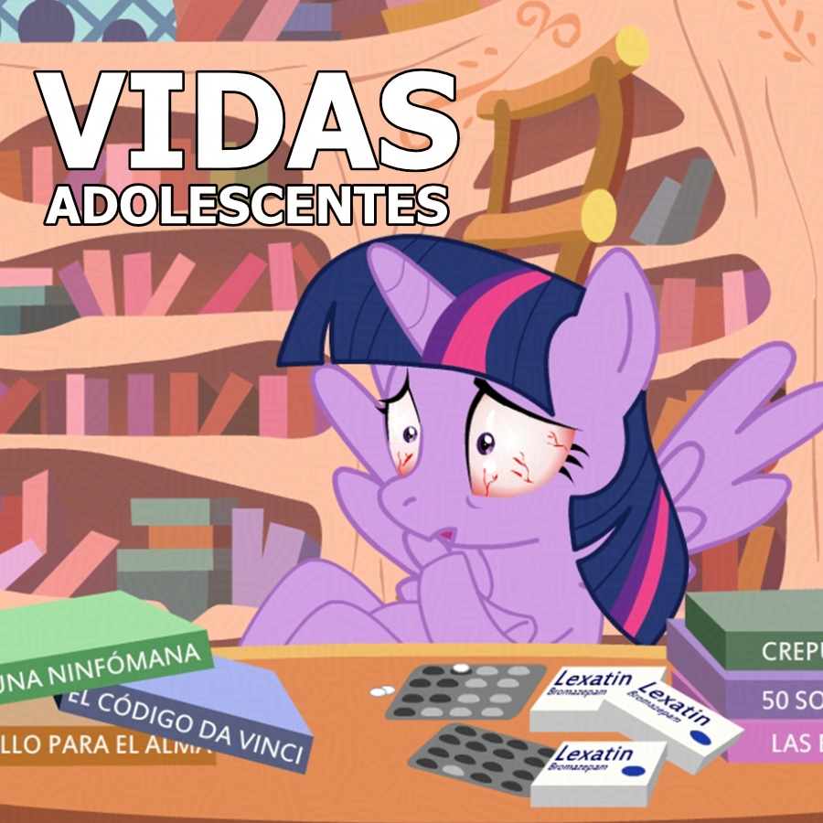
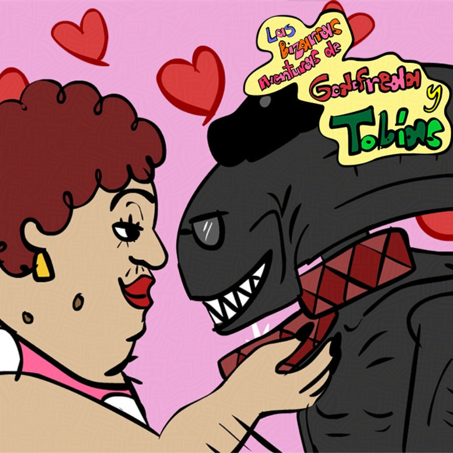
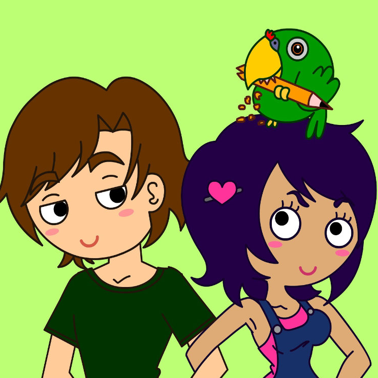

+++
title = "KoriStudio"
date = 2022-09-11
draft = false
+++

It's been years since I haven't touched such a delicate topic. After some years trying to making my creative studio work, I have finally decided to say goodbye to this trademark I have bought in the past.

These last days I've been thinking what I was going to do with it, and I realized that making products on my creative studio website it really didn't give me any income. Also, it have been like I was dragging a corpse wherever I go. It's not that I don't enjoy making new content, but I'm tired to make it in that account. It's complicate thinking in new products and just upload relate content. So I decided do a kind of merging between **KoriStudio** and **CutyDina**.

When I started this project, my return to Colima was just beginning. So I had to think of a way to undertake after so many years of absence in my homeland. I started looking for spanish/latin clients, but that clients never came, maybe one or two in the last 11 years, but not enough to continue trying to create a reputation for the brand that I acquired 10 years ago.
 
It's funny... I spend some months thinking for a good name for my trademark name, also i made a lot of logos samples to get to the logo I wanted. I also paid for copyright in that moment for the trademark. However it didnt work as i expected. I know that it is something very common in business models, and taking into account the factor of the oversaturation of artists and audiovisual content in the market, it is complicated, since hundreds of works and products are published every day, and only those who really know how to sell themselves or n outstanding job are the one that can live by their own art.
 
In the meantime I started working as a freelancer, and fortunately I started finding clients in other countries, mainly USA and United Kingdom. So my projects in Spanish weren't really helping me create clients or more renown, so I started translating all of them into English, but that didn't work either. I needed to invest too much in publicity and in giving time that I didn't have due to my new job as a freelance illustrator. So I decided to make a pause to KoriStudio for some years. I thought about making more complex projects, I also strated to learn Unity and started building some videogames. But same issue as before, work didn't let me, first I needed to have enough income to survive, and that gave me only a few weeks off, but then came a long streak of work and I had to put aside my projects and in the end I lost track of what I was doing.  
  
Years passed and I now I get it. I was dragging a trademark without success. Even my children's books were alone in this abandonded trademark . Also, I decided to open a brand page on LinkedIn, but it was so empty that I could hear crickets cracking around that page.Finally, after some meditation, I dedided that it was time to give KoriStudio a proper ending. And I decided to link all products to this website, my working freelancer website. So now, those porducts will no longer be products, it will became part of my portfolio. Now if you look for those projects, you can see that all this abandoned projects are now part of my work-life, translated in english so can be easly understandable.

Here you can read all the webcomics I've done in the past with **KoriStudio**'s name. I enjoyed a lot with this cute strips, because they were written by my husband, so it was very fun to create content togheter, but now he has a lot of work and can't dedicate himself to write more about them. He also helped me to write some other stuff, such as **The Liar Princess** **Sonna Chronicles**, so we still work togheter but in a different way.

  

    

      
      

        This product is currently offline.
      

    

  

  

    

      
      

        This product is currently offline.
      

    

  

  

    

      
    

  

  

    

      
      

        <a class="card-link link-light" href="https://youtu.be/0-94coF2Mv4?si=DhlDTgw6BYvbck4a" target="_blank">Watch online</a>
      

    

  

  

    

      
      

        <a class="card-link link-light" href="https://youtu.be/NO4QyEUvVkE?si=6ilRgKJtwjYm9mfb" target="_blank">Watch online</a>
      

    

  

  

    

      
      

        <a class="card-link link-light" href="https://youtu.be/2RxGA0JFEtA?si=BnNvtlYQcEvXA23-" target="_blank">Watch online</a>
      

    

  

  

    

      
      

        <a class="card-link link-light" href="https://youtu.be/CA1Rrt4RxfM?si=BexGGRsW2804xRHj" target="_blank">Watch online</a>
      

    

  

  

    

      
      

        <a class="card-link link-light" href="https://youtu.be/iv21aIFdzTs?si=j7M02q3rK0kG-WqC" target="_blank">Watch online</a>
      

    

  

 Rika's Family comic is now offline but [Rika's Adventures](https://play.google.com/store/apps/details?id=com.CutyDinaGames.RikasAdventures) is now available for download at GooglePlay. In other subject, we enjoyed a lot creating this few [Webseries](https://youtube.com/playlist?list=PLbRwHKPM-9Uw6Nao0X588VxZTIRjp6APJ&amp;si=QT_MrywwGsNe9CNh) and uploading them to Youtube, but unfortunately it wasn't as successful as we hoped for. But you can watch online with english subtitles, our main language is spanish so you can hear it in their main language too.

I also started with new projects! **My life in doodles**, **Sonna Chronicles** and some **Time-lapses** at my [TikTok](https://www.tiktok.com/@cutydina.com)</a> and [Youtube](https://www.youtube.com/@CutyDina) channel. Maybe I will do some animations in the future, but only my free time will say. I never have been a popular person, so it have been complicate for me to make me hear at social networks, but well, I don't lose hope that one day they will be useful for something. I know I'm a hopeless dreamer, but I really enjoy making new art and new projects, so besides my low traffic, I enjoy drawing and trying to do new stories and art.  
  
Anyway, I just want to write this small post to saying goodbye to this part of my life, to start new porjects focused on myself, not a trademark. Hoping you enjoy all my new work and feel free to follow on any of my social networks.