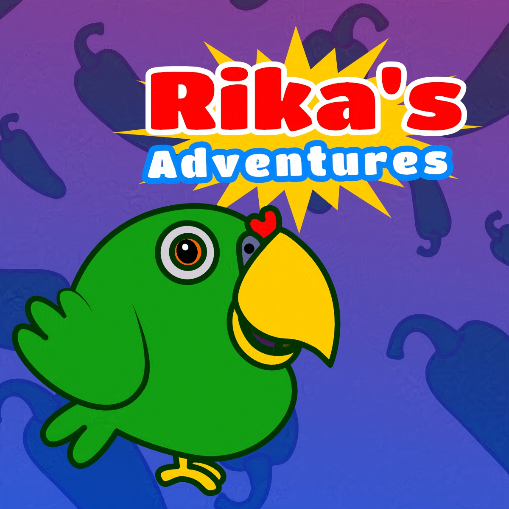

+++
title = "Rika's Adventures"
date = 2024-10-11
draft = false
+++

Videogame based on my parrot mascot Rika. Besides, in the past, with <a href="https://www.cutydina.com/2022/09/about-kori-studio.html" target="_blank">KoriStudio</a> I created some comic strips based on it, so I update the concept and create an adventure based on this old comic.

> "Rika is a parrot who wants to eat a cake that was left in the kitchen. You have to help Rika by investigating her surroundings, solving puzzles, and making decisions to achieve her goal."

[Download for Free](https://play.google.com/store/apps/details?id=com.CutyDinaGames.RikasAdventures)

**MIGRATION TO GODOT STARTED**: Since Unity is giving me headaches with new updates with AC and Editor, I decided to migrate it to Godot. Google Play force me to update versions for newer permissions and stuff. So if game have issues with gameplay, thats the reason.

### Trailer


### Screenshots

  

    
  

  

    
  

  

    
  

