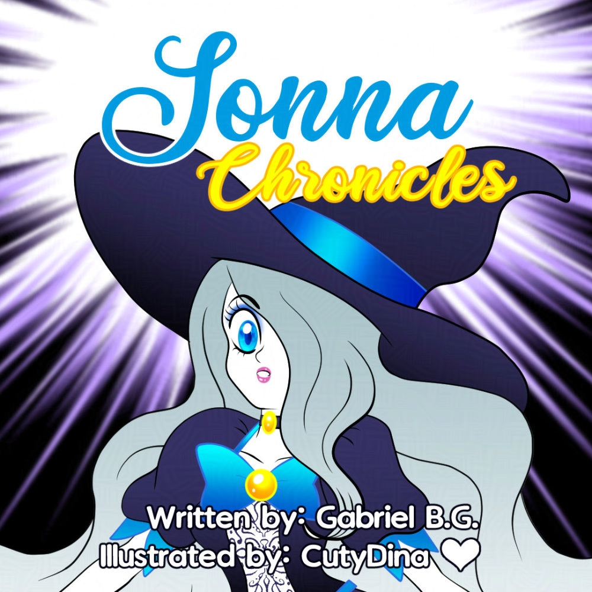

+++
title = "Sonna Chronicles"
date = 2021-02-27
draft = false
+++

My husband and I decided to create this project last year, but now I took it and decided to start it. The script by him and and illustrations by me, a story that tries to explain what is depression feel like. Hoping you like it and follow it through **Webtoons**.

> "We all have an inner abyss, in which our internal demons try to sink us as much as possible ... Can she be able to get out from the abyss, or will she fall even deeper?" Story by Gabriel B.G. and Drawings by CutyDina."

[WebToons English](https://www.webtoons.com/en/challenge/sonna-chronicles/list?title_no=606812)

[WebToons Spanish](https://www.webtoons.com/es/challenge/las-cr%C3%B3nicas-de-sonna/list?title_no=798307)

 ## UPDATE

After some time deciding what to do with this comic, I decided to use as a base to make a videogame on Godot. Soon more news about this new project.<i class="heart-animation"></i>