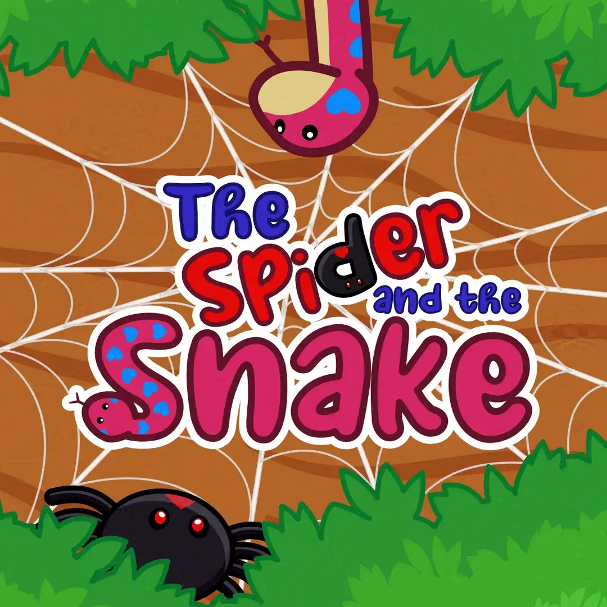
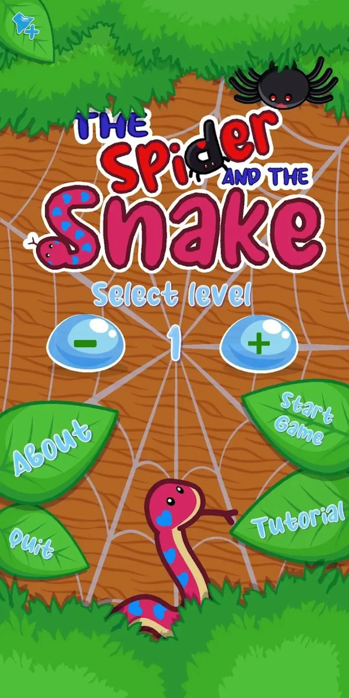
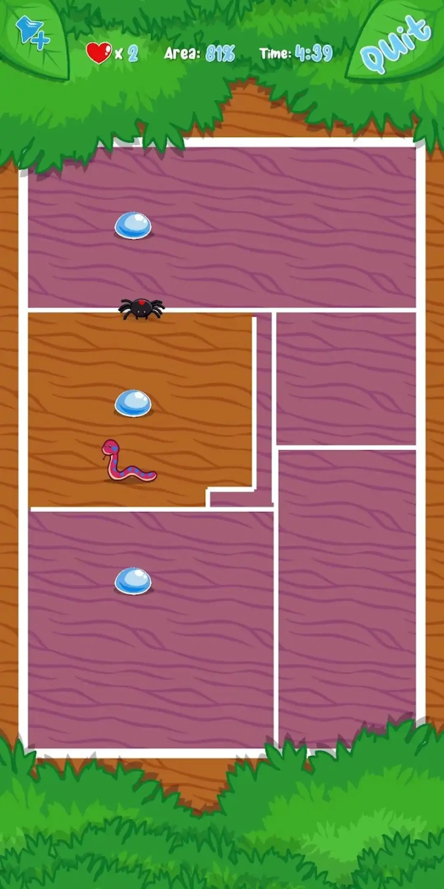
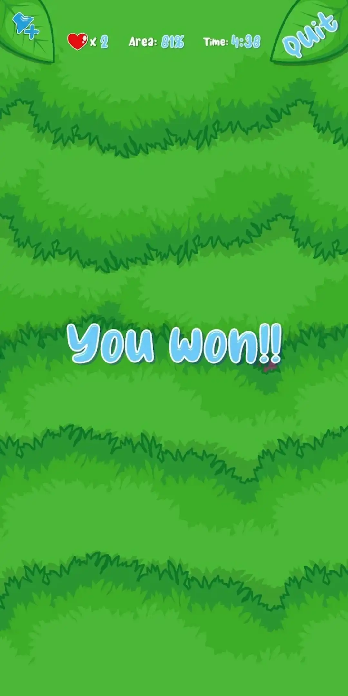

+++
title = "The Spider and the Snake"
date = 2023-01-19
draft = false
+++

After a long time, I finally manage to publish my first game! I remember playing this game long time ago, and I really like it! So, When I see the Asset on the Unity Store, I decide to make my own version of it! As always, adding cute and lovely details on the characters.

> "You are a tiny black widow spider playing against a claustrophobic snake. A remake of the retro Mamba Game in a cute way."

[Download for Free](https://play.google.com/store/apps/details?id=com.CutyDinaGames.TheSpiderAndTheSnake)

### Screenshots

