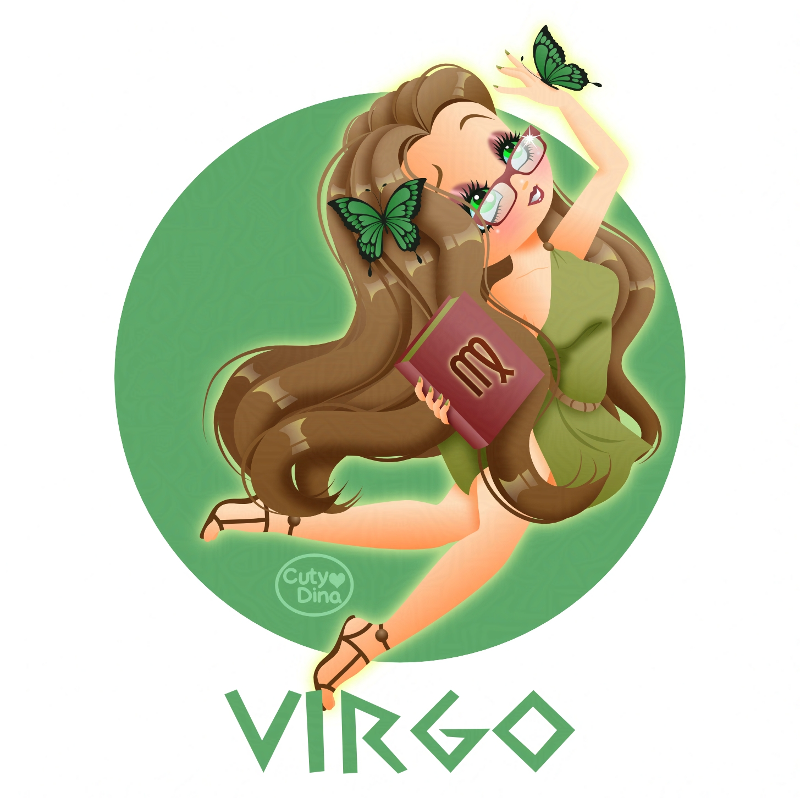
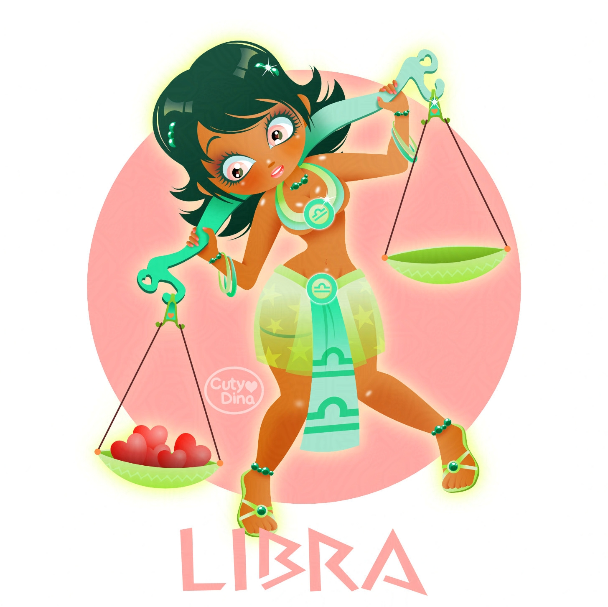
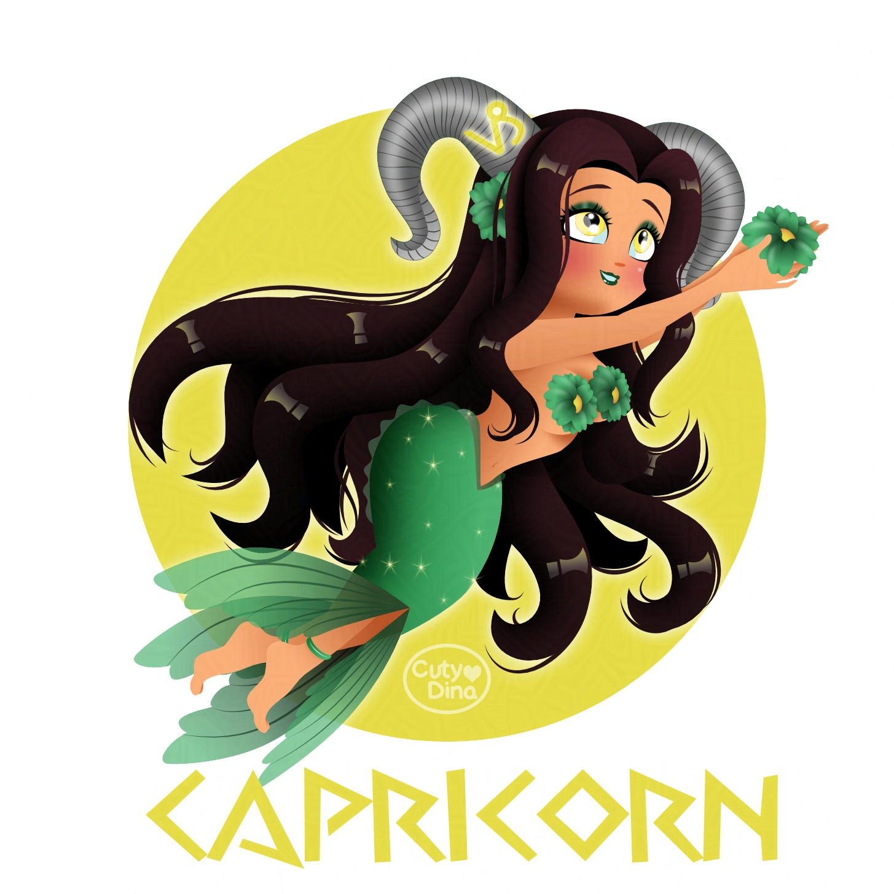
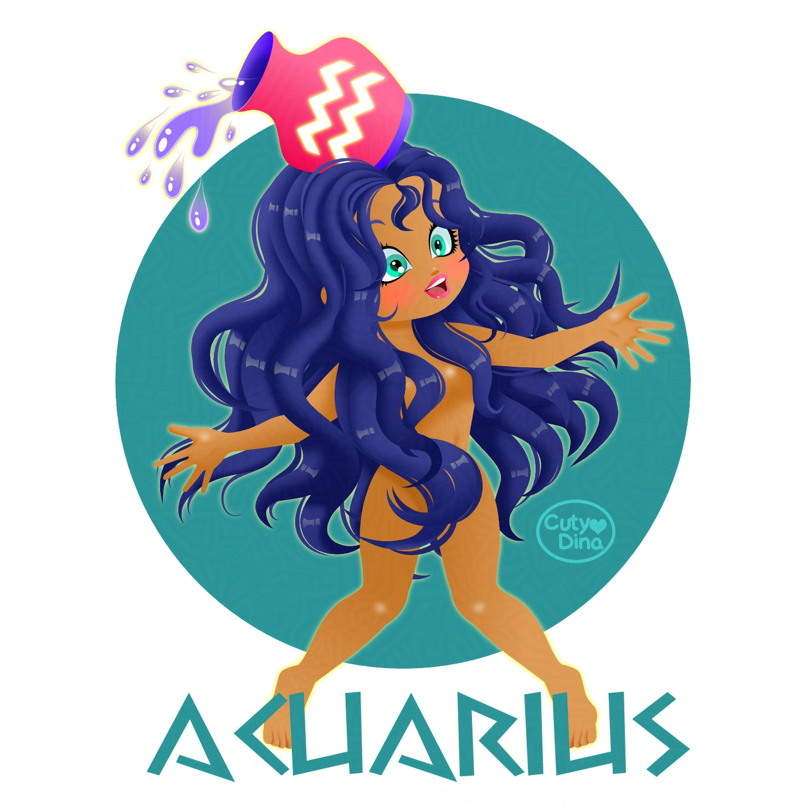
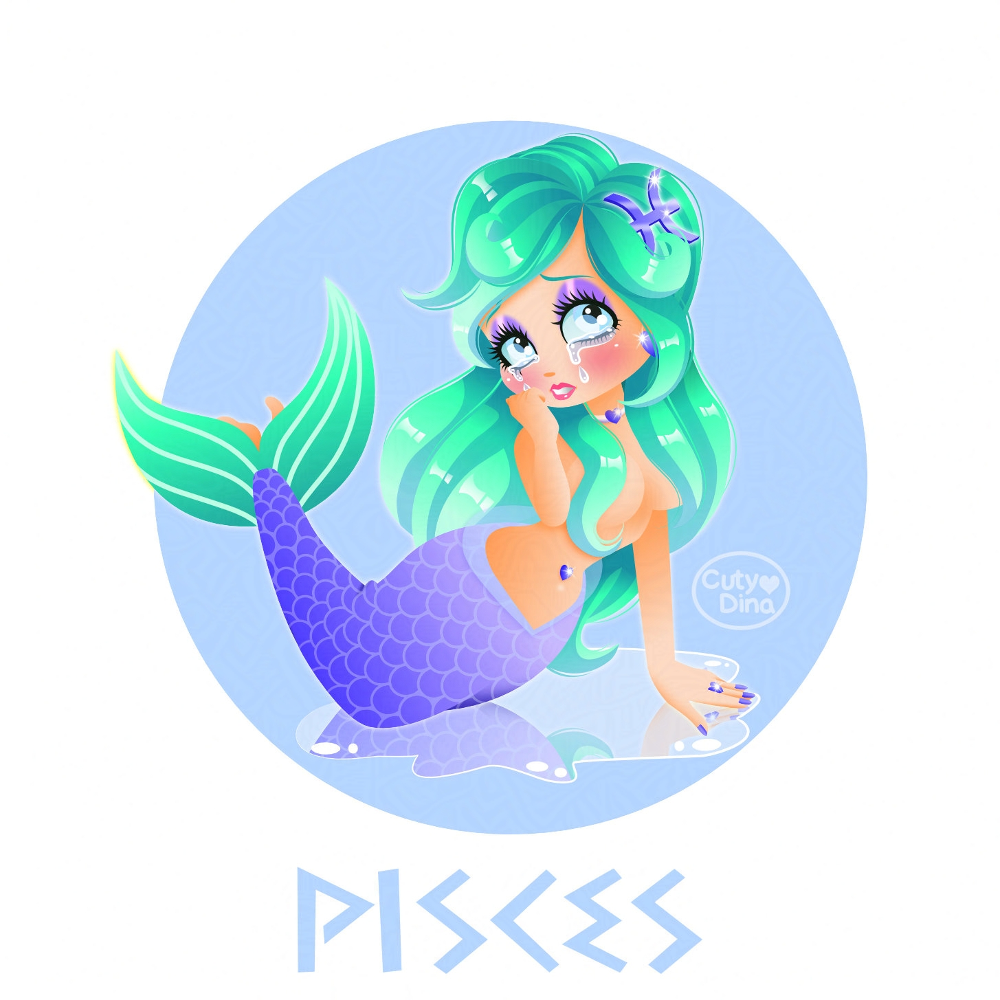
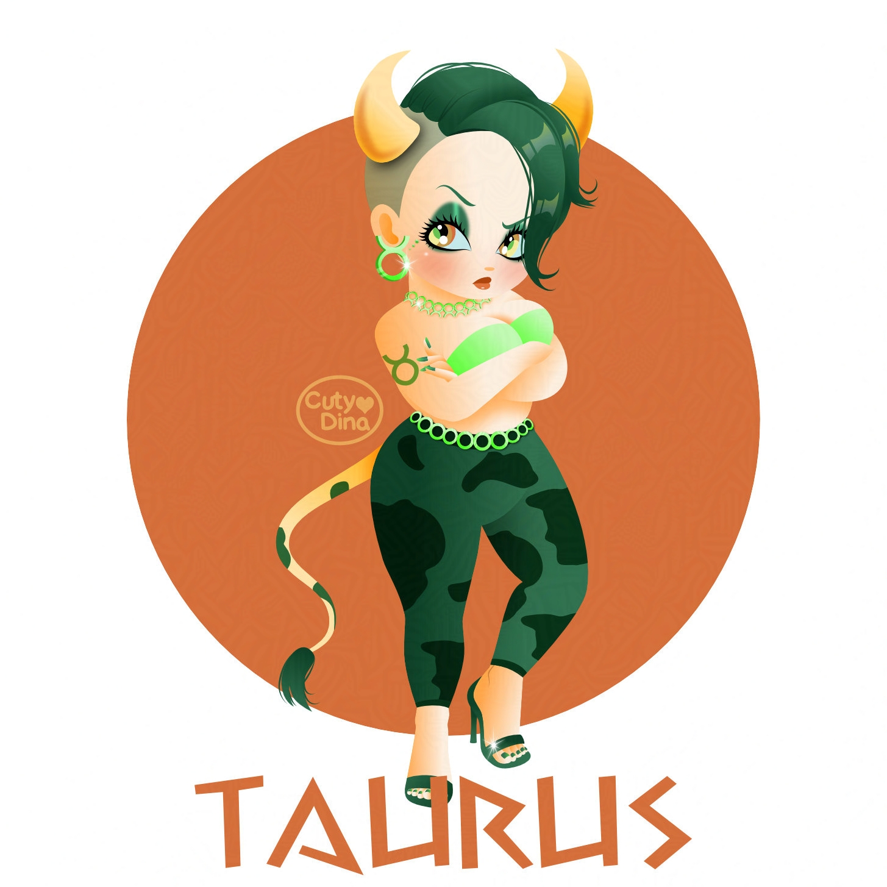
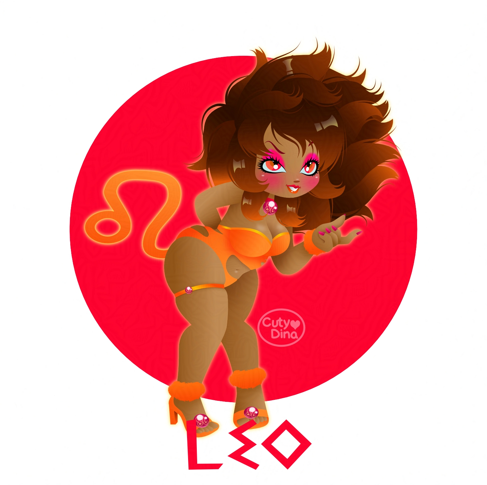
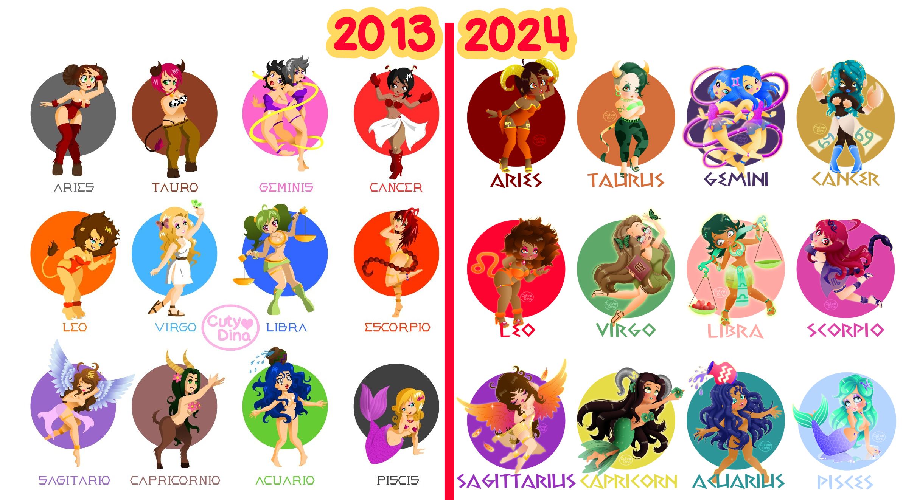

+++
title = "12 Zodiac Signs"
date = 2023-04-09
draft = false
+++

After a long time, I wanted to make a remake of my old Zodiac Signs PinUps, and I must say that they did not age well, so I decided to make a new version with the new techniques that I have learned in recent years. In addition to finally using the Affinity Designer to create them. I have also decided to create one in each season of its respective sign.

### Before and after

